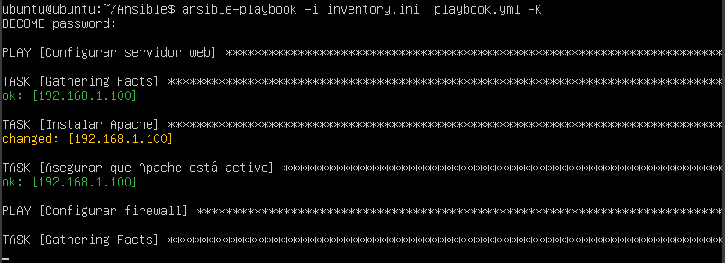
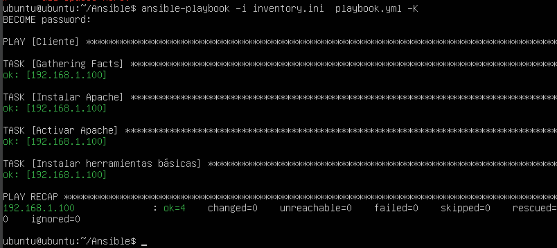
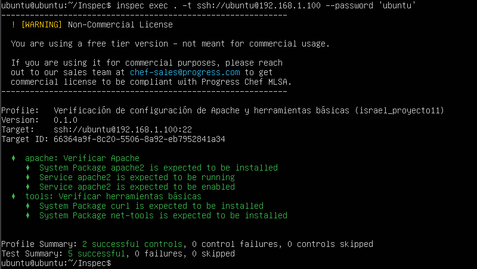
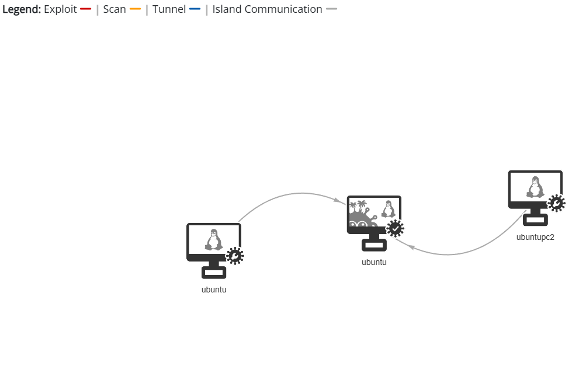
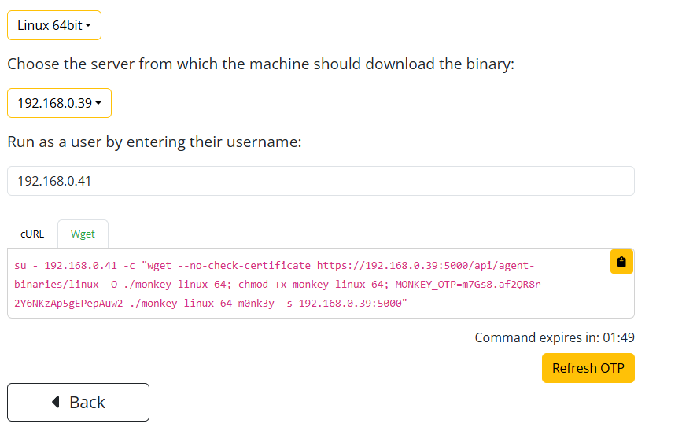
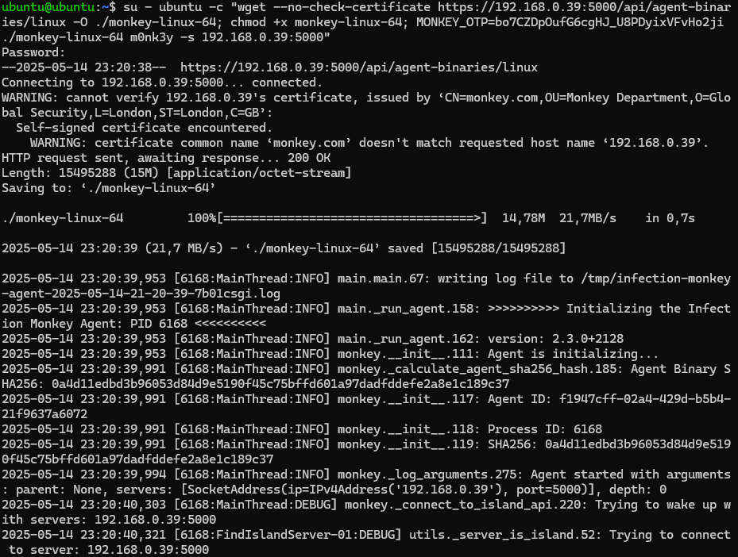
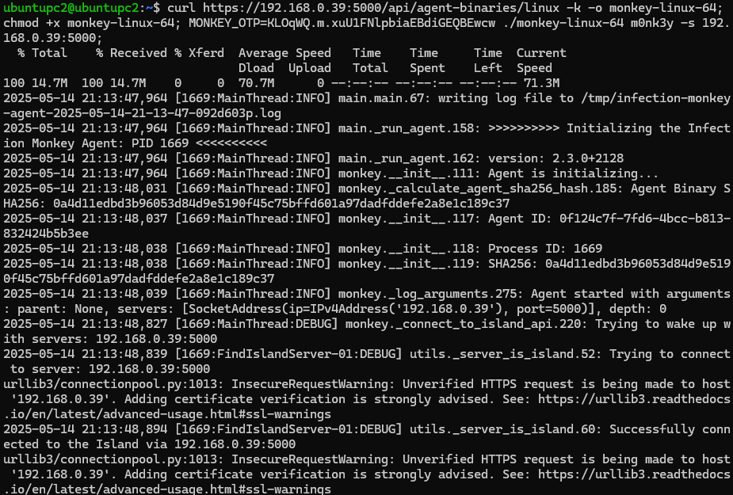

# Proyecto 11

## Enlace presentación

[Enlace presentación](https://www.canva.com/design/DAGndT49v_w/kW6wD-yveiJ28Q_WqSpQ6g/edit?utm_content=DAGndT49v_w&utm_campaign=designshare&utm_medium=link2&utm_source=sharebutton)

## Enlace automatización

[Ansible playbook](./Automatizacion/Ansible/playbook.yml)  
[Ansible inventory](./Automatizacion/Ansible/inventory.ini)
[Inspec control](Automatizacion/Inspec/controls/test_completo.rb)  
[Inspec.yml](Automatizacion/Inspec/inspec.yml)
[Main.tf](Automatizacion/Terraform/main.tf)  
[Outputs.tf](Automatizacion/Terraform/outputs.tf)  
[Variable.tf](Automatizacion/Terraform/variable.tf)

## Ansible prueba

## Inspec prueba

## Monkey Infection

