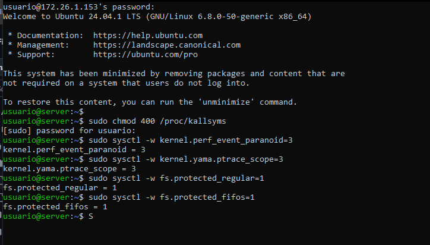
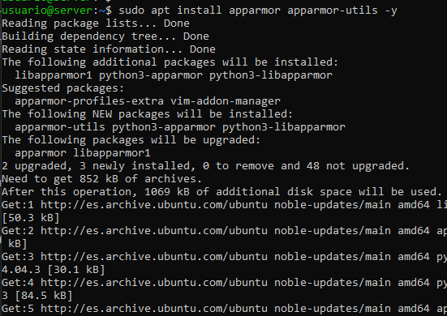
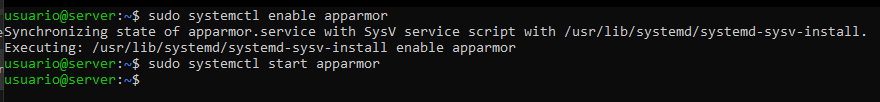
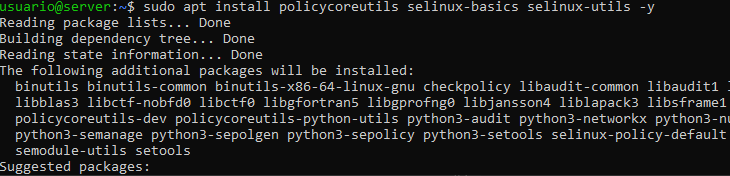
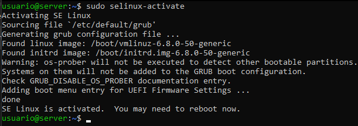
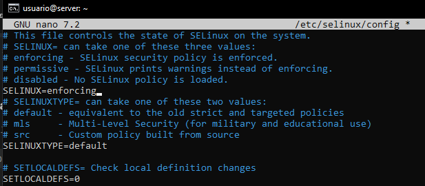

### Manual de bastionado para proteger el kernel en Ubuntu Server

Este manual se centra exclusivamente en la protección del kernel en Ubuntu Server mediante la implementación de medidas de seguridad que mitiguen la explotación de procesos y refuercen la configuración del sistema.

---

#### **Requisitos previos**
- **Sistema operativo:** Ubuntu Server instalado en una máquina virtual.
- **Acceso administrativo:** Usuario con privilegios de superusuario (`root`) o permisos mediante `sudo`.
- **Conexión a internet:** Para instalar herramientas y dependencias.

---
### **1. Reducción de servicios**

En Ubuntu Server aún haciendo la instalación reducida y sin instalar nada hay muchos servicios que no vamos a utilizar o son "inecesarios o poco importantes".   
Para ver que servicios activos o inactivos tenemos en el sistema pondremos el siguiente comando: 
```bash
systemctl list-units --type=service --all
```
En la shell nos aparecerá el listado de todos los servicios que tenemos instalados en el servidor. 

Tras una ligera búsqueda por internet y preguntar a CHatGPT cuáles pueden considerarse servicios "innecesarios" hemos recogido una tabla con los que hemos clasificado. 

#### LISTA DE SERVICIOS
| Servicio | Definición |
|----------|------------|
| apport-autoreport.service | Servicio de reporte automático de errores. |
| apport.service | Generación automática de informes de fallos. |
| apt-daily-upgrade.service | Actualización y limpieza diaria de paquetes apt. |
| apt-daily.service | Descarga diaria de paquetes apt. |
| snapd.service | Demonio para el sistema de paquetes Snap; innecesario si no usas aplicaciones Snap. |
| plymouth-quit-wait.service | Espera hasta que finalice el proceso de arranque gráfico. |
| plymouth-quit.service | Termina la pantalla de arranque gráfico Plymouth. |
| plymouth-read-write.service | Indica a Plymouth que escriba datos de tiempo de ejecución. |
| motd-news.service | Muestra noticias en el mensaje del día; generalmente innecesario en servidores. |
| pollinate.service | Servicio para sembrar el generador de números pseudoaleatorios; puede no ser necesario. |
| thermald.service | Servicio de control térmico; puede ser innecesario en servidores virtuales o sin problemas. |
| unattended-upgrades.service | Servicio para actualizaciones automáticas sin supervisión; preferible controlar manualmente. |
| systemd-bsod.service | Muestra un mensaje de emergencia en pantalla completa; generalmente innecesario en servidores |

Para desactivar estos servicios, puedes usar el comando:

```bash
sudo systemctl disable nombre_del_servicio
```

Para servicios que no quieras que se inicien nunca, puedes usar:
```bash
sudo systemctl mask nombre_del_servicio
```

### **2. Reducción de protocolos**

Para poder eliminar protocolos que tengamos instalados en nuestro Ubuntu Server podemos utilizar el comando:
```bash
sudo apt purge nombre_protocolo
```
> Por ejemplo, aunque en la instalación mínima aunque no se marque OpenSSH durante la instalación, se instala por defecto en Ubuntu Server, pero queda desactivado. Para eliminarlo completamente usarios el comando `sudo apt purge openssh-server openssh-client`. 

También es importante la eliminación de protocolos inseguros como pueden ser FTP, TFTP, Telnet, RSH... Estos podríamos eliminarlos con els iguiente comando: 
```bash
sudo apt-get --purge remove xinetd nis yp-tools tftpd atftpd tftpd-hpa telnetd rsh-server rsh-redone-server
``` 
### **3. Reducción de aplicaciones**

También existe la opción de borrar aplicaciones y programas con sus configuraciones y archivos. Esto es importante debido a que podr´´iamos querer desisnstalar una aplicación innecesario en nuestro servidor y podrían quedarse configuraciones de dichas aplicaciones. 

Para eliminar un paquete usaremos el comando: 
```bash
sudo apt purge nombre_paquete
```

Con esto habríamos borrado el paquete y sus archvios de configuración. Además existe la opción de borrar las dependencias que estaban asociadas a este paquete con el siguiente comand.
```bash
sudo apt autoremove
```


### **4. Endurecimiento del kernel**

El kernel de Linux puede ser configurado para evitar accesos innecesarios y limitar la superficie de ataque.

1. **Configurar el acceso al archivo `/proc/kallsyms`**  
   Evita que usuarios no autorizados accedan a información sobre los símbolos del kernel:  
   ```bash
   sudo chmod 400 /proc/kallsyms
   ```

2. **Restringir el acceso al subsistema PERF**  
   Limita el uso de `perf` (herramienta de monitoreo de rendimiento del kernel) solo al usuario root:  
   ```bash
   sudo sysctl -w kernel.perf_event_paranoid=3
   ```

3. **Eliminar el acceso a `ptrace`**  
   Previene que un proceso observe o interfiera en otros procesos:  
   ```bash
   sudo sysctl -w kernel.yama.ptrace_scope=3
   ```

4. **Habilitar protección para FIFOs y archivos regulares**  
   Evita que usuarios no privilegiados manipulen archivos de sistema:  
   ```bash
   sudo sysctl -w fs.protected_regular=1
   sudo sysctl -w fs.protected_fifos=1
   ```

5. **Persistir las configuraciones de `sysctl`**  
   Añade las configuraciones anteriores al archivo `/etc/sysctl.conf` para que sean permanentes:  
   ```bash
   echo "kernel.perf_event_paranoid=3" | sudo tee -a /etc/sysctl.conf
   echo "kernel.yama.ptrace_scope=3" | sudo tee -a /etc/sysctl.conf
   echo "fs.protected_regular=1" | sudo tee -a /etc/sysctl.conf
   echo "fs.protected_fifos=1" | sudo tee -a /etc/sysctl.conf
   sudo sysctl -p
   ```

<<<<<<< HEAD
### **5. Protocolos de red innecesarios**
Ahora modificaremos el archivo `/etc/sysctl.conf`. Este archivo de configuración permite modificar parámetros del kernel en tiempo de ejecución sin necesidad de recompilar el kernel1. 
=======
   
---
>>>>>>> 5b583a04ca26a0aad4efb3c267a81cf704f7ad62

- Deshabilitar el reenvío de paquetes IP (si no es necesario):

<<<<<<< HEAD
 ```bash
   net.ipv4.ip_forward = 0
   net.ipv6.conf.all.forwarding = 0
=======
Los servicios que no son esenciales deben ser deshabilitados para minimizar el riesgo de ataques.

1. **Lista de servicios activos**  
   Verifica los servicios en ejecución:  
   ```bash
   sudo systemctl list-units --type=service --state=running
   ```

2. **Deshabilitar servicios innecesarios**  
   Por ejemplo, si no se utiliza `cups` (servicio de impresión):  
   ```bash
   sudo systemctl stop cups
   sudo systemctl disable cups
   ```

3. **Eliminar paquetes no requeridos**  
   Usa `autoremove` para eliminar paquetes instalados como dependencias que ya no son necesarios:  
   ```bash
   sudo apt-get autoremove
   sudo apt-get autoclean
   ```

---

### **3. Control de permisos y usuarios**

1. **Verificar permisos de usuarios y grupos**  
   Revisa las cuentas en el archivo `/etc/passwd` para identificar usuarios innecesarios:  
   ```bash
   awk -F: '($7 !~ /(\/nologin|\/false)$/) {print $1}' /etc/passwd
   ```

   Cambia el shell de usuarios innecesarios:  
   ```bash
   sudo usermod -s /usr/sbin/nologin <usuario>
   ```

2. **Deshabilitar cuentas innecesarias**  
   Por ejemplo:  
   ```bash
   sudo passwd -l <usuario>
   ```

---

### **4. Hardening de procesos**

1. **Namespaces**  
   Utiliza `unshare` para aislar procesos en sus propios espacios de sistema. Por ejemplo, para un espacio de red aislado:  
   ```bash
   sudo unshare --net /bin/bash
   ```

2. **AppArmor**  
   Habilita y configura AppArmor para restringir el comportamiento de aplicaciones:  
   ```bash
   sudo apt install apparmor apparmor-utils
   sudo aa-status
   ```
   
   Para restringir un servicio como NGINX:  
   ```bash
   sudo aa-enforce /etc/apparmor.d/usr.sbin.nginx
   ```

   
   
---

### **5. Actualización del sistema**

Mantén el kernel y los paquetes actualizados para aplicar los últimos parches de seguridad:  
```bash
sudo apt-get update && sudo apt-get upgrade -y
sudo apt-get dist-upgrade -y
>>>>>>> 5b583a04ca26a0aad4efb3c267a81cf704f7ad62
```

- Protección contra ataques de spoofing:

 ```bash
   net.ipv4.conf.all.rp_filter = 1
   net.ipv4.conf.default.rp_filter = 1
```

- Ignorar pings ICMP (para evitar ataques de inundación):

 ```bash
  net.ipv4.icmp_echo_ignore_all = 1
```

- Habilitar protección contra ataques de SYN flood:
 ```bash
   net.ipv4.tcp_syncookies = 1
```

- Deshabilitar el uso de ICMP redirects:
 ```bash
   net.ipv4.conf.all.accept_redirects = 0
   net.ipv6.conf.all.accept_redirects = 0
```

- Protección contra ataques de desbordamiento de buffer:

 ```bash
   kernel.randomize_va_space = 2
```

Después de realizar todos los cambios guardaremos y ejecutaremos `sudo sysctl -p`


### **6. Activar SELinux**

SELinux (Security-Enhanced Linux) es un módulo de seguridad para el kernel de Linux que proporciona un mecanismo para implementar políticas de control de acceso obligatorio.

Para activar SELinux deberemos seguri los siguientes pasos:

- Instalar los paquetes necesarios de SELinux
```bash
   sudo apt install policycoreutils selinux-basics selinux-utils -y
```


- Una vez descargado los paquetes activaremos SELinux
```bash
   sudo selinux-activate
```


- Editar configuración de SELinux en el archivo `/etc/selinux/config` donde tendremos que configurar los siguientes parametros:

```bash
SELINUX=enforcing #Activa completamente las políticas de seguridad de SELinux en el sistema.
SELINUXTYPE=default
```
    


- Una vez acabado ya podremos reiniciar el sistema. 

### **7. Activar AppArmor**

AppArmor es un sistema de control de acceso obligatorio (MAC) para Linux que proporciona una capa adicional de seguridad al sistema operativo.

- Descarga de los paquetes necesarios. 
```bash
   sudo apt install apparmor apparmor-utils -y
```


- Activaremos AppArmor

```bash
   sudo systemctl enable apparmor
```


Podremos hacer archivos de configuración como por ejemplo para apache:

```text
/usr/sbin/apache2 {
  # Permisos básicos de lectura
  /etc/apache2/** r,
  /var/www/** r,
  /usr/lib/apache2/** r,

  # Deniega escritura y otros permisos
  deny /var/log/** w,
  deny network,
}
```

### **8. Configuraciones de seguridad adicionales**

#### **8.1 ClamAV**
ClamAV es un antivirus de código abierto diseñado específicamente para sistemas Unix/Linux. Aunque los virus son menos comunes en sistemas Linux, ClamAV puede ser útil para escanear archivos, especialmente en servidores que manejan archivos de usuarios o correos electrónicos.

- Instalamos los paquetes y sus dependencias:
```bash
sudo apt install clamav clamav-daemon

```
- Actualizamos la base de datos de virus:

```bash
sudo freshclam

```
- Iniciamos CLamAV:

```bash
sudo systemctl start clamav-daemon

```

- Configuramos crontab para que programar escaneos en el sistema:

```bash
sudo crontab -e

```
   Y añadiremos la siguiente linea: 
```text
   0 2 * * 0 clamscan -r /home --move=/var/quarantine
```
#### **8.2 Implementación de Linux Kernel Lockdown**

Linux Kernel Lockdown es una característica de seguridad que restringe ciertas operaciones del kernel que podrían comprometer la integridad del sistema. Para habilitarlo:

- Editamos el archivo de configuración del GRUB:
```bash
sudo nano /etc/default/grub
```

- Añadimos el parámetro lockdown=confidentiality a la línea GRUB_CMDLINE_LINUX_DEFAULT:
```text
GRUB_CMDLINE_LINUX_DEFAULT="quiet splash lockdown=confidentiality"
```

- Actualizamos la configuración del GRUB:
```bash
sudo update-grub
```
