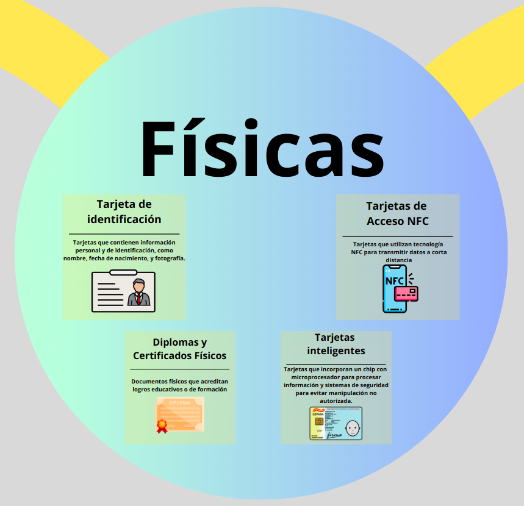
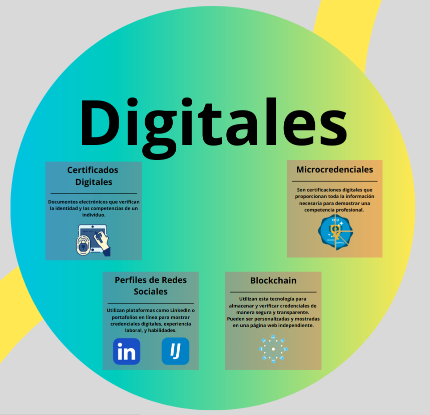
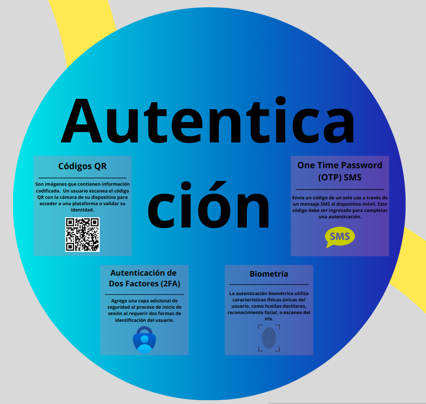
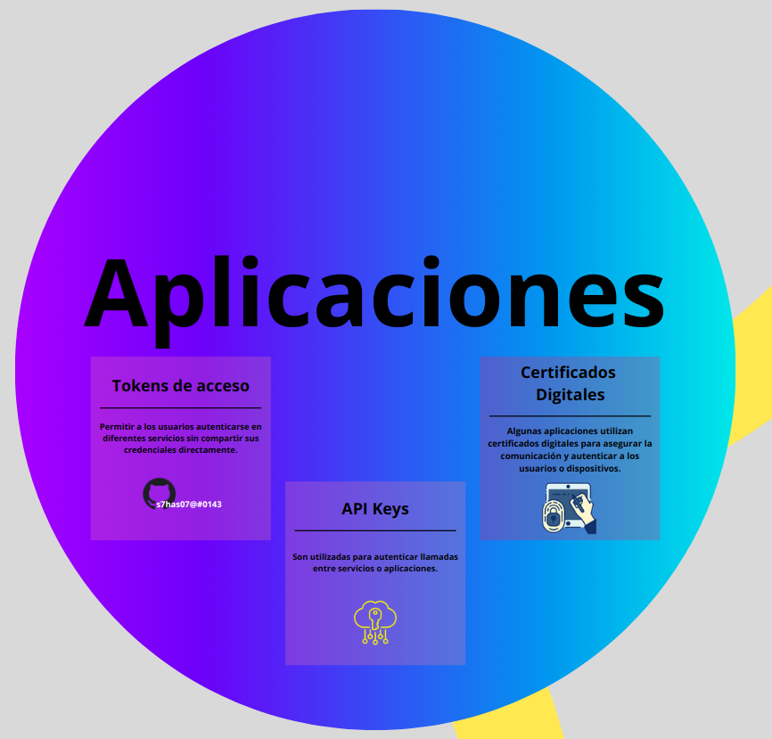

# Tipos de credenciales más utilizados

Para un vistazo más detallado, hacer clic [aquí](https://www.canva.com/design/DAGZpMGmk5g/JTf7r5AWpK2lm-0JeFix7A/edit)

## Físicas

Utilizan dispositivos físicos o elementos tangibles que se usan para identificar la identidad de una persona. Estas credenciales están asociadas a mecanismos de control de acceso y pueden incorporar tecnologías como chips, códigos de barras o bandas magnéticas para aumentar su seguridad.
Hemos encontrado estos 4 ejemplos de credenciales físicas:
  

- Tarjeta de identificación
- Tarjetas de acceso NFT
- Diplomas y certificados
- Tarjetas inteligentes

## Digitales

Hemos encontrado estos 4 ejemplos de credenciales físicas:
  

- Tarjeta de identificación
- Tarjetas de acceso NFT
- Diplomas y certificados
- Tarjetas inteligentes

## Autenticación

Hemos encontrado estos 4 ejemplos de credenciales físicas:
  

- Tarjeta de identificación
- Tarjetas de acceso NFT
- Diplomas y certificados
- Tarjetas inteligentes

## Dominio y genérica

Hemos encontrado estos 4 ejemplos de credenciales físicas:
  

- Tarjeta de identificación
- Tarjetas de acceso NFT
- Diplomas y certificados
- Tarjetas inteligentes

## Aplicación

Hemos encontrado estos 4 ejemplos de credenciales físicas:
  

- Tarjeta de identificación
- Tarjetas de acceso NFT
- Diplomas y certificados
- Tarjetas inteligentes
