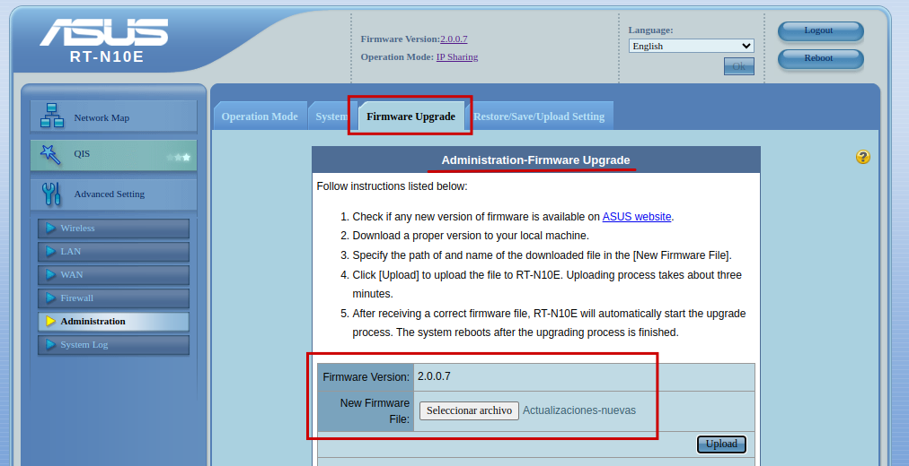

# GUÍA HARDERING DE UN ROUTER

**Creado por:** Alejandro Seoane

## Introducción

En este trabajo buscaremos un emulador de un router, en este caso nos hemos decantado por un emulador del router [Asus RT-N10e](https://www.wisp.pl/al/demo/RT-N10E/opmode.htm) y realizaremos una guía de hardering del modelo.

## Índice

1. [Cambiar la contraseña predeterminada](#1-cambiar-la-contraseña-predeterminada)  
2. [Actualizar el firmware](#2-actualizar-el-firmware)  
3. [Configuración red wifi](#3-configuración-red-wifi)  
4. [Desactivar servicios que no se utilizan](#4-desactivar-servicios-que-no-se-utilizan)  
5. [Configurar el firewall](#5-configurar-el-firewall)  
6. [Monitoreo del router](#6-monitoreo-del-router)  

## 1. Cambiar la contraseña predeterminada

Es importante cambiar la contraseña del router debido a que estos normalmente vienen con una contraseña predeterminada para que se pueda acceder a el y configurarlo. Es importante que la cambiemos para fortalecer la seguridad del router.

Utilizaremos una contraseña robusta siguiendo las reglas de utilizar mayúsculas, minúsculas, números y símbolos para crearla.

## 2. Actualizar el firmware

Verificaremos si hay actualizaciones del firmware del router disponibles.
Si vemos alguna es esencial instalar la última versión para corregir posibles vulnerabilidades.

## 3. Configuración red wifi

En la configuración general del wifi hemos realizado 2 modificaciones que se pueden ver en la imagen:

    1. Hemos modificado el SSID predeterminado del router.
       Pondremos el SSID en oculto para que si hacen un escaneo no salga nuestro Wifi, por lo que solo podrás conectarte a él si te sabes el SSID.

    2. Hemos habilitado el cifrado WPA2 con AES para proteger el tráfico de la red.
       Le hemos agregado una contraseña robusta.

## 4. Desactivar servicios que no se utilizan

Apagaremos servicios que no utilicemos o sean innecesarios.

- Dejaremos desconfigurado el acceso por WPS
  

- Dejamos desactivado Virtual Server debido a que como no lo estamos usando este servicio puede exponer puertos a Internet.

 

- Dejaremos desactivado DMZ debido a que no la estamos usando y una mala configuración de está puede exponer dispositivos que tengamos en nuestra red sin protección a Internet.

- Desactivamos DDNS ya que no lo usamos y puede ser un punto de explotación de los atacantes si lo tenemos mal configurado.

## 5. Configurar el firewall

Activaremos el Firewall. También vamos a activar algunas opciones que nos deja como son habilitar la protección a DoS y habilitar el acceso web a traves de la WAN.

El puerto de acceso lo dejaremos igual y dejaremos deshabilitado la opción de que nos puedan hacer ping desde WAN.

- Activaremos el filtro de URL, este es un filtro que comparará las URLs que los usuarios intentan acceder con la lista que le pongamos nosotros.

- Activaremos el filtrado de MAC que nos proporiona una capa adicional de seguridad.

- Activaremos el filtro de servicios en la red lo que proporciona la posibilidad de limitar el uso de aplicaciones o protocolos no autorizados en la red.

- Activamos el filtrado de IP la cuál controla el tráfico a través de las direcciones IP. 

## 6. Monitoreo del router

Aqui estaremos comprobando periodicamente los registros del router en busca de posibles actividades sospechosas u otras cosas. 

Como podemos ver tenemos diferentes apartados donde ver datos del router: 

- Podemos ver los logs del router directamente donde veremos información general sobre evntos del router. 

- En esta sección veremos información detallada sobre las asignaciones de direcciones IP por el servidor DHCP del router. 

- En este aparatado nos mostrará la tabla de enrutamiento del router, donde podemos ver las diferentes reglas y rutas que tiene configurado. 

