# Hardening PCWRT - Israel Valderrama

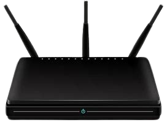

## Índice

+ Cambio de Credenciales
+ Actualización de Firmware
+ Seguridad de la red InalámbricaS
  + Configuración del cifrado y Configuración de SSID
+ Control de Acceso y Restricciones
  + Filtrado de MAC
  + Desactivación de servicios innecesarios
  + Configuración de Firewall
+ Monitoreo y Mantenimiento

## Cambio de Credenciales

Entramos en la siguiente página para iniciar sesión: <https://demo.pcwrt.com/cgi-bin/pcwrt/login> y ponemos la contraseña que nos dice que es `pcwrt`.

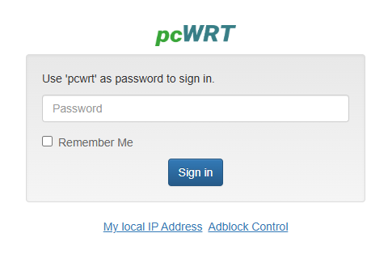

Una vez iniciado sesión nos Vamos a `Settings > System` y buscamos la opción de `Change Router Password` y ponemos una contraseña segura en mi caso le vamos a poner `Proyecto8.@`

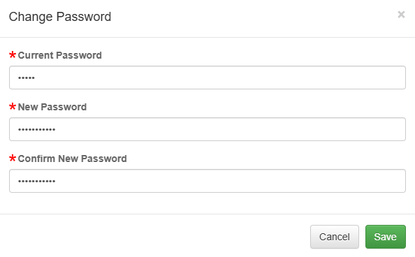

Es importante utilizar una contraseña fuerte que incluya mayúsculas, minúsculas, números y caracteres especiales. Además, es recomendable cambiar esta contraseña periódicamente para mantener la seguridad del router.

## Actualización de Firmware

Para la actualización de Firmware lo que hacemos es irnos a `Settings` y abajo nos aparece la opción de `Flash New Firmware` le damos a `Check for updates` y nos aparece la siguiente ventana para actualizar el Firmware, le damos a upgrade y se nos actualizará

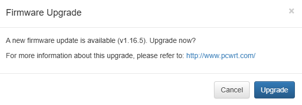

Es importante mantener el firmware actualizado, ya que las actualizaciones suelen incluir parches de seguridad y mejoras de rendimiento. Para ello activaremos la opción de actualizaciones automáticas para que este lo más actualizado posible.

## Seguridad de la Red Inalámbrica

### Configuración del cifrado y Configuración de SSID

Para la configuración del cifrado nos dirigimos a `Settings > Wireless` y ahí encontramos la parte del cifrado y deberíamos seleccionar `WPA3` pero como nuestro router no tiene esa opción la más segura que tenemos es `WPA2-PSK`. También hemos Ocultado el SSID y hemos utilizado distintos nombres de los que venían por defecto.

WPA3 sería la mejor opción ya que es más seguro que WPA2-PSK ya que tiene un cifrado mas fuerte y una mayor protección, pero nuestro router no nos permite esa configuración entonces hemos utilizado WPA2-PSK que es bastante seguro también.

Esta configuración sería para la de 2.4GHz:

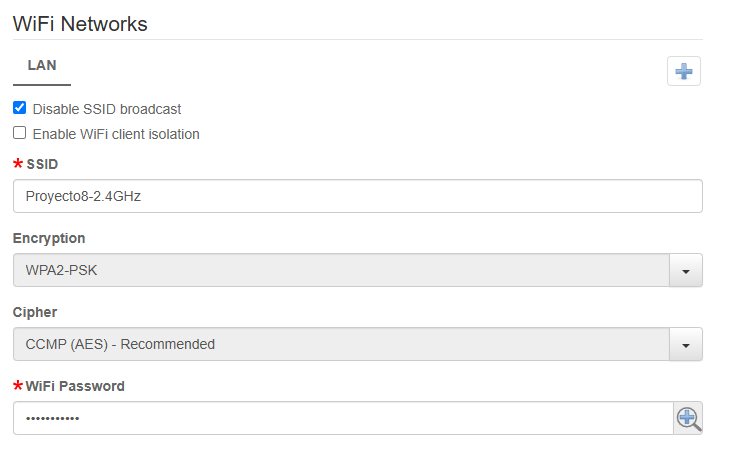

Esta configuración sería para la de 5.0GHz:

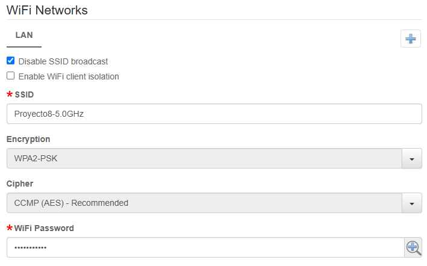

## Control de Acceso y Restricciones

### Filtrado de MAC

Para ello nos hemos metido en `Settings > Wireless` y donde Pone MAC Filter `Disable` lo ponemos en `Allowd listed MAC addresses only` para solo permitir los dispositivos que nosotros queramos. Esto lo deberíamos poner tanto en la configuración de 2.4GHz como en la de 5.0GHz.

El filtrado de MAC añade una capa de seguridad pero no es del todo seguro ya que se pueden falsificar las direcciones MAC. Es importante mantener la lista de MAC actualizada.

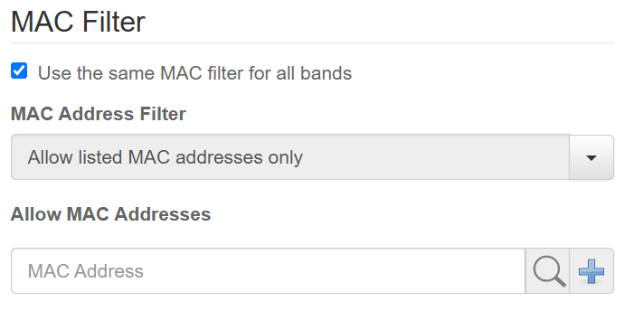

### Desactivación de servicios innecesarios

Ahora desactivamos UPnP para ello nos vamos a `Apps > UPnp` y lo desactivamos

UPnP lo hemos desactivado porque puede ser un riesgo ya que permite que aplicaciones abran puertos automáticamente.

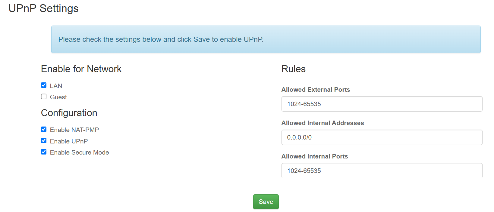

Y nos debería aparecer así

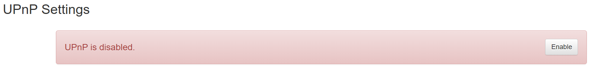

### Configuración de Firewall

Para ello nos vamos a `Network > Settings` Y donde pone `Port Forwards` añadimos una dirección. Lo que pasa que esto realmente lo que hace es permitir los puertos entonces para bloquearlos lo que hacemos es poner una dirección IP inexistente en la red para que bloquee el tráfico.

Esto de redireccionar a una IP inexistente es efectiva para bloquear los puertos.

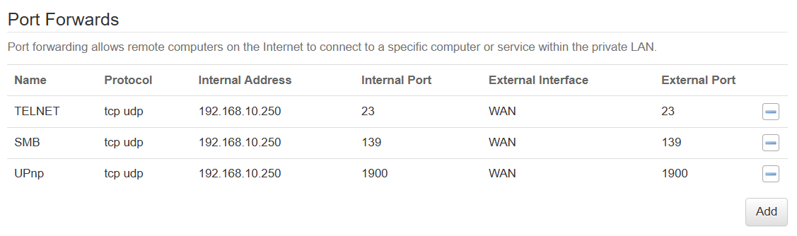

## Monitoreo y Mantenimiento

Para ello nos vamos a `Apps > Bandwidth Monitor` y lo que deberíamos hacer es revisar los dispositivos que están conectados.

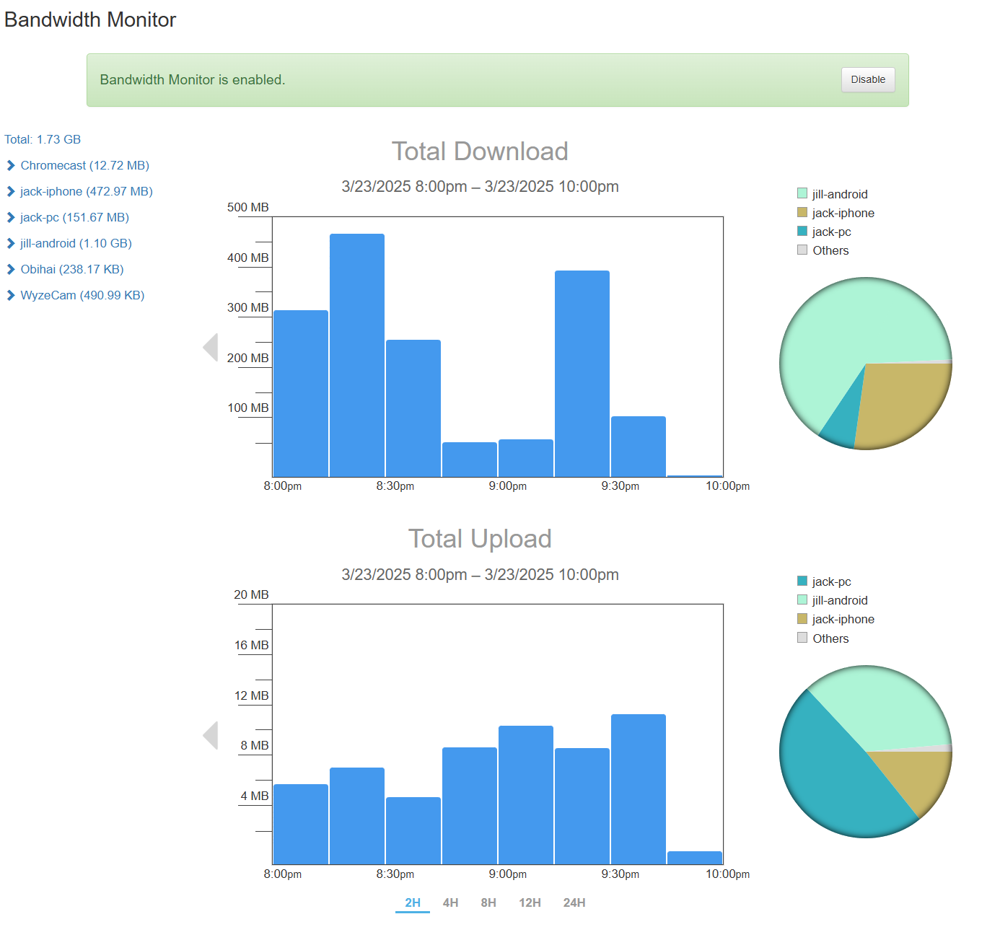

El monitoreo regular del ancho de banda puede ayudar a detectar actividades inusuales o dispositivos no autorizados en la red

Y para el mantenimiento lo que deberíamos hacer son copias de la configuración del router después de realizar cambios.

Además de hacer copias de seguridad, es recomendable revisar regularmente los logs del router y configurar alertas de seguridad si el router lo permite.
