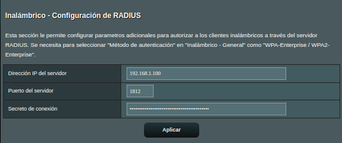
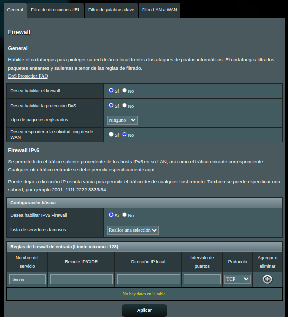
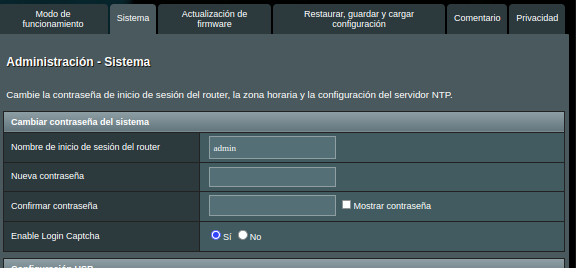
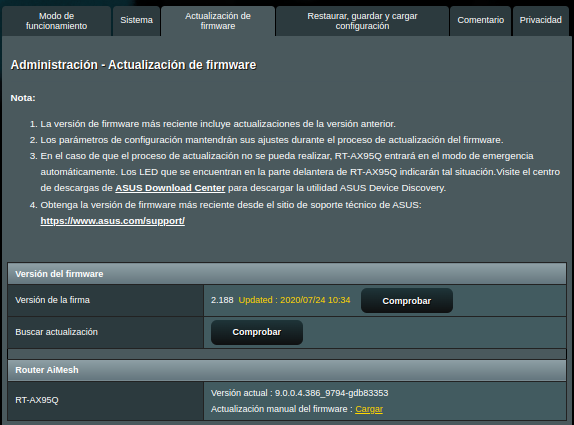
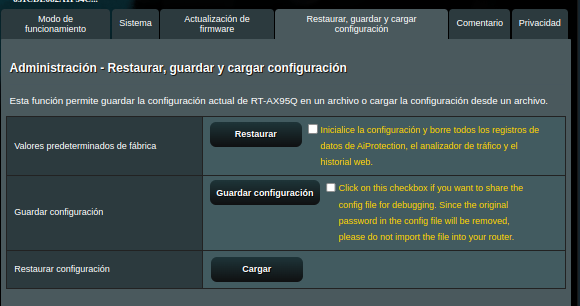

# Hardening a un router

## Introducción

En esta parte del proyecto se nos pide usar un emulador de routers reales y hacer una guía de bastionado.
He elegido el emulador online de [ASUS](https://demoui.asus.com/ES/) porque es accesible, completo y muy intuitivo.

## Antes de Empezar

Antes de entrar al lío, hay que tener claras unas medidas básicas de seguridad que deberíamos aplicar sí o sí en cualquier router:

**1. Actualizar el Firmware**

Tener el firmware al día es clave para corregir fallos de seguridad que ya se conocen. Nada nuevo, pero mucha gente lo pasa por alto.

**2. Cambiar las Credenciales por Defecto**

La mayoría de routers vienen con usuario y contraseña por defecto, y son tan conocidas que cualquiera podría entrar si no se cambian.

Aprovechamos y cambiamos también la contraseña del WiFi, que muchas veces arrastra el mismo problema.

**3. Desactivar Servicios Innecesarios**

Esto depende mucho del entorno, pero por lo general, hay cosas que sobran.
Por ejemplo, **AiCloud**, que sirve para compartir archivos desde un USB conectado al router. Si ya hay un NAS o carpetas compartidas, sobra completamente.

## Bastionado

Ahora sí, vamos con el recorrido completo por las secciones del router, viendo qué se puede reforzar y qué es mejor desactivar.

### Sección General

**1. Mapa de la red**

EAquí se ve lo típico: dispositivos conectados, estado general del WiFi, etc.

También nos deja tocar cosas importantes como el SSID, tipo de cifrado y contraseña.

**2. AiMesh**

Sirve para montar una red en malla usando varios routers ASUS.
No se puede desactivar, pero tampoco molesta. Si se quiere usar, basta con conectar otro router y asignarle IP.

**3. Red para invitados**

Crea una red separada, así que no representa mucho riesgo, pero puede afectar al rendimiento.
Viene desactivada por defecto, y así se puede quedar salvo que sea estrictamente necesario.

> Por defecto viene desactivado.

**4. AiProtection**

Funciona como IDS/IPS, detecta amenazas antes de que lleguen a los dispositivos. Tiene dos partes:

**4.1. Protección de red**

Dejar activado. Aporta bastante a nivel de seguridad.

**4.2. Control paterno**

Esto lo quitaría. No bloquea contenido realmente peligroso, solo páginas *adultas*, y encima consume recursos.

**5. Adaptive QoS**

Solo muestra estadísticas de ancho de banda. No afecta a la seguridad.

**6. Traffic Analyzer**

Permite ver qué dispositivos consumen más red y qué aplicaciones están usando.

**7. USB applications**

Si se puede, mejor desactivarlas. Son un punto de entrada físico que no siempre se controla bien.

**8. AiCloed 2.0**

Desactivamos todo: Cloud Disk y Smart Access. Si la empresa usa NAS, ya se accede por red, no por aquí.

### Configuración avanzada

**1. Wireless**

Si hay que dejar el WiFi activado, que sea con autenticación WPA2 Enterprise.
Y si hay un servidor RADIUS, se configura así:

**2. LAN**

Aquí se configura la IP del router, la máscara de red...

...y el DHCP. Si se desactiva, habría que asignar IPs a mano por MAC.

**3. WAN**

Permite que los dispositivos tengan internet. No hay mucho que pensar: activado.

**4. Alexa & IFTTT**

**Ni tocarlo.**
Abre la puerta a servicios externos que no pintan nada en una red segura.

**5. IPv6**

Aunque está en auge, todavía no está 100% implantado en todos lados. Mejor desactivado salvo que sea necesario.

**6. VPN**

Si hay teletrabajo, se puede activar para que se conecten desde fuera de forma segura.

**7. Firewall**

Sirve para bloquear tráfico entrante/saliente por IP o puerto.
El sistema de este router no permite filtrar todo lo que quisiéramos, pero sí podemos hacer redirecciones (port forwarding), útil por ejemplo si tenemos una VPN local.

> Ejemplo de redireccionamiento

También se pueden bloquear URLs concretas.

**8. Administration**

Aquí se gestiona el acceso al router, las actualizaciones y las copias de seguridad:

> Para las copias, se necesita activar temporalmente el USB.

**9. System Log**

Registro de eventos del router. Útil para revisar fallos, accesos y demás.

**10. Network Tools**

No se va a usar en esta práctica.

## Conclusión

Y con esto tendríamos el bastionado del router ASUS.
Obviamente, he configurado el router como yo lo veo más seguro, pero cada empresa tiene sus necesidades. Lo que para unos sobra, para otros puede ser imprescindible.
Esta guía sirve como punto de partida. A partir de aquí, lo suyo es adaptarlo según el entorno y lo que se quiera proteger.