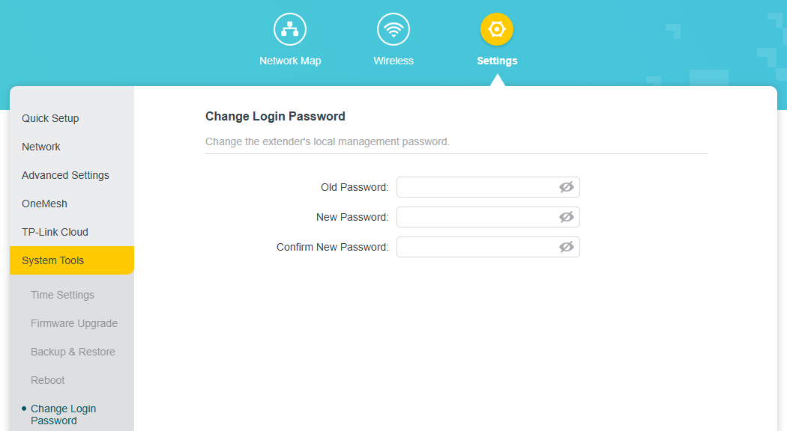
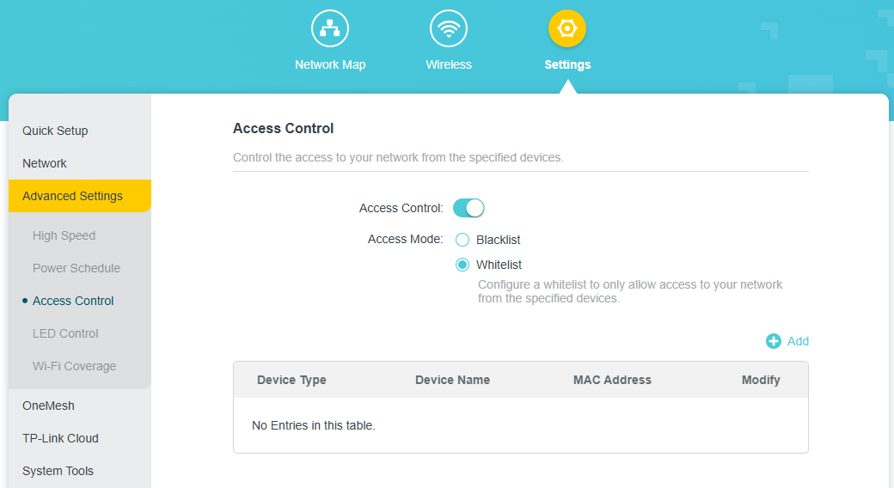
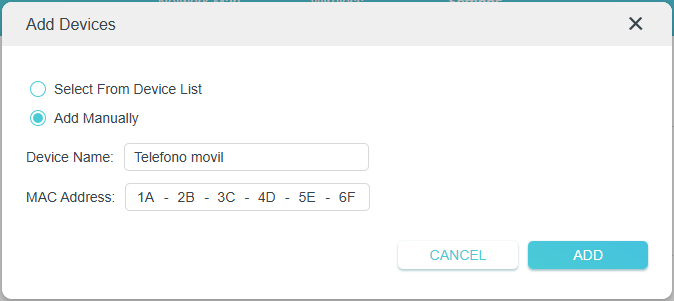
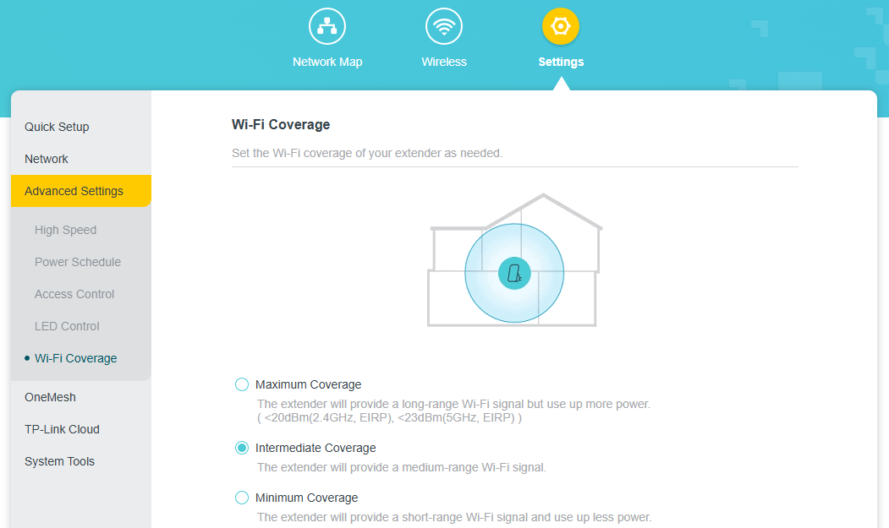

# Proyecto 8. Parte 1: Guía de Hardening

## Introducción

En esta parte del Proyecto 8 se elaborará una guía de hardening de un dispositivo de uno de los simuladores que se encuentran en [este enlace](https://routersecurity.org/resources.php). El modelo que he escogido es el extensor de red [RE190](https://emulator.tp-link.com/re190-eu-v5/index.html#firmwareCloud) del simulador de TpLink ya que es el tengo en casa.

## Procesos

### 1. Asegurar credenciales de acceso

El primer paso es cambiar la contraseña de acceso a la configuración por una que cumpla los requisitos de credenciales seguras:

- Mínimo 12 caracteres
- Incluir letras minúsculas y mayúsculas
- Incluir números
- Incluir caracteres especiales

### 2. Actualizar firmware

El segundo paso será actualizar el firmware a la ultima versión disponible ya que de esta forma podremos hacer uso de las ultimas funciones en materia de seguridad.

### 3. Habilitar whitelist

Para evitar que se conecten dispositivos no deseados, habilitaremos una whitelist a la que añadiremos los dispositivos que queremos que puedan conectarse.

Para ello damos un nombre al dispositivo y añadimos su dirección MAC.

### 4. Alcance de la red

Para evitar que se puede acceder a la red desde fuera del área deseada, ajustaremos el rango de la red para que se mantenga dentro de la zona desde donde queremos que sea accesible.

