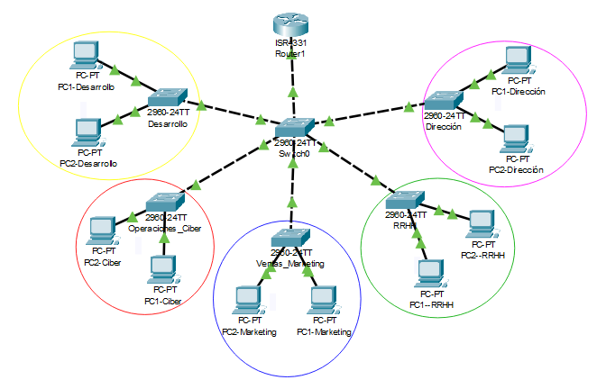

id: proyecto2_brs
title: Guía de Segmentación de Red
description: Guía de segmentación de red creando distintas VLANS con el método router-on-a-stick.
author: Israel Valderrama García, Alejandro Seoane, Víctor Jiménez.
summary: Codelab de guía de segmentación de red
categories: codelab, markdown
environments: Web
status: Published

# Proyecto2 - BRS


## **Introducción**

G3Ciber es una empresa especializada en brindar soluciones de ciberseguridad avanzadas y personalizadas para proteger la infraestructura digital de sus clientes. Con un enfoque en la protección de datos, la prevención de ataques cibernéticos y la seguridad de redes, G3Ciber se posiciona como un líder en el sector, ofreciendo servicios que aseguran un entorno digital confiable y resiliente.

En su infraestructura de red, G3Ciber utiliza un esquema de cinco VLANs (Redes de Área Local Virtual), lo cual permite una segmentación eficaz del tráfico y refuerza la seguridad interna. Cada VLAN tiene un propósito específico para optimizar la eficiencia y minimizar los riesgos asociados con posibles amenazas internas y externas. Este enfoque segmentado facilita el control y la protección de datos sensibles, la gestión de accesos y la capacidad de responder rápidamente ante incidentes de seguridad.

Con esta arquitectura robusta y bien segmentada, G3Ciber se dedica a ofrecer soluciones seguras, confiables y adaptadas a las necesidades actuales de seguridad informática.

## **Planificación y definición de VLANS**

## **Sentido de la segmentación**

La segmentación de la red se refiere a dividir una red en varias subredes lógicas, normalmente esto se hace en VLANs. Esto lo hacemos para organizar y optimizar el tráfico de una red, aumentar la seguridad, y reducir las colisiones y problemas que puedan surgir. 

Nuestra empresa de cibersguridad está compuesta por 5 departametos clave:
- Desarrollo
- Operaciones de ciberseguridad
- Marketing y ventas
- Recursos humanos (RRHH) 
- Dirección

Nosotros hemos realizado la siguiente segmentación de la red: 



En el podemos ver como hemos creado diferentes VLANs por cada departamento de nuestra empresa (desarrollo, oper_ciberseguridad, dirección, marketing, RRHH). Donde las tendremos numeradas por VLAN 10, 20, 30, 40, 50

#### **¿Por qué hemos segmentado la red?**

La hemos realizado la segmentación de red por los siguientes motivos:

- La organización lógica de la empresa, donde los departamentos estan dividido según su funcionalidad con lo que agrupamos los dispositivos lógicamente. 

- Facilidades a cambios, si hay que hacer un cambio dentro de la red de un departamento se puede resolver más fácilmente dentro de subredes.

- Control del tráfico, con lo que los datos solo se enviarán a los departamentos que sean necesarios, con lo que evitaremos que pase por todos los departamentos. 

- Mayor seguridad, debido a la segmentación podemos aplicar políticas de seguridad específicas (filtros, reglas de firewall o restricciones de acceso a VLANs)

### **Coherencia con funcionalidad y seguridad**
La segmentación que hemos mostrado es coherente tanto en  la funcionalidad como en la seguridad:
- Funcionalidad  
 Cada departamento tiene sus dispositivos conectados a un switch específico y dedicado, por lo que configurar VLANs específicas para cada área es más fácil de configurar.  
 Al estar todo conectado a un switch central es posible la gestión del tráfico interno entre las distintas VLANs. 

- Seguridad  
 Al segmentar la red aseguramos que los departamentos solo interactúen con otras. Por ejemplo creado ACLs (listas de control de acceso) para que un cierto departamento pueda acceder a ciertos sistemas que son críticos.  
 Mejora de la seguridad debido a que el firewall en vez de tener normas generales a cada VLAN se le aplicaría un firewall específico dependiendo de sus necesidades. 

## **Calcular el direccionamiento de las ip de cada VLANS**
Para realizar el cálculo del direccionamiento de las diferentes VLANs que hemos definido tendremos que saber cuantos equipos va a haber en cada VLAN. Tras hacer un invetigación hemos definido los siguientes dispositivos por cada VLAN:

- Dirección 15 equipos.
- RRHH 30 equipos.
- Operaciones de ciberseguridad 100 equipos.
- Marketing y ventas 50 equipos.
- Desarrollo 120 equipos.

Asignaremos las VLANs en función de la cantidad de equipos que necesitan. Empezaremos con la VLAN que necesita más direcciones y continuaremos en orden descendente.

#### **TABLA DE DIRECCIONAMIENTO**
---
| VLAN               | Dispositivos  | Red           | Máscara               | Primera IP    | Broadcast      |
|--------------------|---------------|---------------|-----------------------|---------------|----------------|
| Desarrollo         | 120           | 192.168.0.0   | 255.255.255.128 (/25) | 192.168.0.1   | 192.168.0.127  |
| Operaciones_Ciber  | 100           | 192.168.0.128 | 255.255.255.128 (/25) | 192.168.0.129 | 192.168.0.255  |
| Marketing          | 50            | 192.168.1.0   | 255.255.255.192 (/26) | 192.168.1.1   | 192.168.1.63   |
| RRHH               | 30            | 192.168.1.64  | 255.255.255.224 (/27) | 192.168.1.65  | 192.168.1.95   |
| Dirección          | 15            | 192.168.1.96  | 255.255.255.240 (/28) | 192.168.1.97  | 192.168.1.111  |

<<<<<<< Updated upstream
## **Configuración Packet Tracer**
### **Configuración de las VLANS en los switches**

=======
## Configuración Packet Tracer
### Configuración de las VLANS en los switches
#### Creación VLANs
>>>>>>> Stashed changes
Como tenemos las vlans 10 de Desarrollo,20 de Ciber, 30 de Marketing, 40 de RRHH, 50 de Dirección en los siguientes comandos de packet tracer deberiamos sustituir `{NUMERO_VLAN}`por el número en concreto de la vlan. Y para el nombre deberiamos hacer lo mismo donde pone `{NOMBRE_VLAN}`

```cisco
enable

configure terminal

vlan {NUMERO_VLAN}

name {NOMBRE_VLAN}

exit
```

**Ejemplo:**

```cisco
enable

configure terminal

vlan 10

name Desarrollo

exit
```

#### Asignación de puertos a las VLAN

En cada VLAN tendremos que asignarle a cada puerto que conecta con los PCs la VLAN a la que le pertenece. Pondremos utilizar la opción **range** porque los dos puertos que conectan a a los 2 ordenadores pertenecen a la misma VLAN. 


```cisco
enable

configure terminal

interface (range) fastEthernet{Nº INTERFAZ / (RANGO INTERFACES)}

swichport mode access

swichport access vlan {Nº VLAN}

exit
```
**Ejemplo:**

```cisco
enable

configure terminal

interface range fastEthernet 0/1-2

swichport mode access

swichport access vlan 10

exit
```

### Configuración de enlaces troncales

Para manejar el trafico de las VLANs entre todos los switch y routers de la red configuraremos las interfaces que conecten switch-switch o switch-router en modo **trunk**. 

```cisco
enable

configure terminal

interface fastEthernet{Nº INTERFAZ}

swichport mode trunk

exit
```

**Ejemplo:**
```cisco
enable

configure terminal

interface fastEthernet 0/1

swichport mode trunk

exit
```

### **Configuración de enrutamiento con router-on-a-stick**

Crearemos en el router subinterfaces de cada VLAN que tenemos definida.

```cisco
enable

configure terminal

interface GigabitEthernet 0/0/0.{Nº INTERFAZ}

encapsulation dot1Q {Nº VLAN}

ip address {PUERTA ENLACE} {MÁSCARA}

exit
```
**Ejemplo:**

```cisco
enable

configure terminal

interface GigabitEthernet 0/0/0.10

encapsulation dot1Q 10

ip address 192.168.0.1 255.255.255.128

exit
```

## **Validación y pruebas finales**

Poner los PCs en modo DHCP para que cojan las IPs de su VLAN correspondiene.

Comprobamos que hace ping de un equipo al otro de otro departamento.

**PC1-Ciber a PC2-RRHH:**


**PC2-Desarrollo a PC2-Dirección:**


**PC2-Marketing a PC1-Ciber:**

