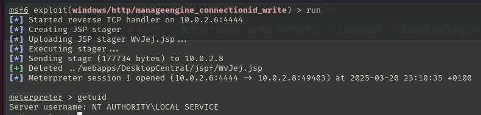
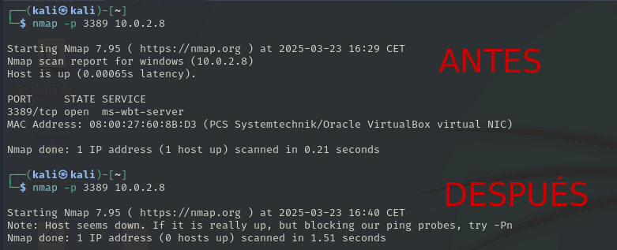

# Anexos - pentesting "La Descuidada S.A."

## Índice

- [Declaración de confidencialidad](#declaración-de-confidencialidad)
- [Descargo de responsabilidad](#descargo-de-responsabilidad)
- [Información de contacto](#información-de-contacto)
- [Metodología](#metodología)
  - [Reconocimiento](#1-reconocimiento)
  - [Análisis de vulnerabilidades](#2-análisis-de-vulnerabilidades)
  - [Explotación](#3-explotación)
  - [Escalada de privilegios](#4-escalada-de-privilegios)
  - [Post-explotación](#5-post-explotación)
  - [Documentación](#6-documentación)
- [Recopilación de información](#recopilación-de-información)
  - [Windows Server 2008](#windows-server-2008)
  - [Windows Server 2016](#windows-server-2016)

## Declaración de confidencialidad

El presente informe de pruebas de pentesting contiene información confidencial y
sensible relacionada con la seguridad de los dos sistemas evaluados. La divulgación,
distribución o reproducción de este documento sin la debida autorización está estrictamente
prohibida.

Toda la información contenida en este informe ha sido recopilada con fines
exclusivos de evaluación de seguridad y está destinada únicamente para el uso del cliente o
de las partes autorizadas expresamente. Cualquier uso indebido de la información
proporcionada podría comprometer la seguridad de los sistemas analizados y dar lugar a
consecuencias legales.

El cliente se compromete a proteger la confidencialidad de este informe y a restringir
su acceso solo a personal autorizado con el fin de mitigar riesgos de seguridad y fortalecer
la protección de la información evaluada.

## Descargo de responsabilidad

El presente informe ha sido elaborado con el propósito de identificar vulnerabilidades
y riesgos de seguridad en los sistemas evaluados. Las pruebas realizadas se llevaron a
cabo en un entorno controlado y siguiendo buenas prácticas de seguridad informática. Sin
embargo, no se garantiza la ausencia total de amenazas o vulnerabilidades no identificadas.

El equipo de pentesting y la entidad responsable de este informe no asumen
responsabilidad alguna por el uso indebido de la información contenida en el mismo ni por
daños derivados de la implementación o no implementación de las recomendaciones
sugeridas. Es responsabilidad del cliente evaluar y aplicar las medidas de mitigación
necesarias para mejorar la seguridad de su aplicación web.

Asimismo, este informe no debe considerarse una certificación de seguridad
absoluta, ya que las amenazas y vulnerabilidades pueden evolucionar con el tiempo. Se
recomienda realizar evaluaciones de seguridad periódicas para mantener la integridad y
protección de la aplicación

## Información de contacto

**Empresa auditada:** La Descuidada S.A.

**Equipo auditor:** Grupo 3, IES Rafael Alberti

**Correo de contacto:** <grupo3@g.educaand.es>

**Fecha de inicio:** 18/03/2025  

**Fecha de finalización:** 24/03/2025

## Metodología

Basada en estándares como OWASP, organizada en las siguientes fases:

### 1. Reconocimiento  

   Recopilación de información sobre los sistemas mediante escaneo de puertos, fingerprinting y servicios expuestos.

### 2. Análisis de vulnerabilidades  

   Identificación de vulnerabilidades conocidas utilizando herramientas automatizadas(como nessus y openvas)

### 3. Explotación

   Explotación de las vulnerabilidades para evaluar su impacto.

### 4. Escalada de privilegios  

   Verificación de posibles vectores para obtener mayores privilegios.

### 5. Post-explotación  

   Extracción de información y de persistencia.

### 6. Documentación

   Informe con todos los hallazgos, métodos utilizados y mitigación.

## Recopilación de información

### Windows Server 2008

- Hallazgo 1:

    [Reporte de Nessus de vulnerabilidades](reportes/windows2008/Windows_Host_mhhxps.pdf)

- Hallazgo 2:

    [Reporte de Nessus de vulnerabilidades .nessus](reportes/windows2008/Windows_Host_ru4af5.nessus)

- Hallazgo 3:

| Description of vulnerability| Permite ejecución remota de código en ManageEngine mediante HTTP malformado.|
|-----------------------------|-----------------------------------------------------------------------------|
| **CVE/CWE**                 | [CVE-2022-47966](https://nvd.nist.gov/vuln/detail/CVE-2022-47966) / [CWE-287](https://cwe.mitre.org/data/definitions/287.html) |
| **CVSS v3**                 | 9.8                                                                         |
| **Severity**                | Crítico                                                                     |
| **Impact**                  | Ejecución remota de código sin autenticación                                |
| **Affected systems**        | windows2008                                                                 |
| **Proof Of Concept (POC)**  |      |
| **Remediation**             | Actualizar a la última versión parcheada por ManageEngine                   |
| **Reference links**         | [Zoho Advisory](https://www.manageengine.com/security/advisory)             |

- Hallazgo 4:

| Description of vulnerability| Permite ejecución remota de código en ManageEngine mediante HTTP malformado.|
|-----------------------------|-----------------------------------------------------------------------------|
| **CVE/CWE**                 | [CVE-2011-0657](https://nvd.nist.gov/vuln/detail/CVE-2011-0657) / [CWE-119](https://cwe.mitre.org/data/definitions/119.html) |
| **CVSS v3**                 | 10.0                                                                         |
| **Severity**                | Crítico                                                                     |
| **Impact**                  | Ejecución remota de código con privilegios elevados                         |
| **Affected systems**        | windows2008                                                                 |
| **Proof Of Concept (POC)**  |                          |
| **Remediation**             | Aplicar parches de seguridad o actualizar a una versión segura              |
| **Reference links**         | [NVD CVE-2011-0657](https://nvd.nist.gov/vuln/detail/CVE-2011-0657)         |

- Hallazgo 5:

| Description of vulnerability | Vulnerabilidad en SMBv1 permite ejecución remota de código.                |
|-----------------------------|-----------------------------------------------------------------------------|
| **CVE/CWE**                 | [CVE-2017-0144](https://nvd.nist.gov/vuln/detail/CVE-2017-0144) / [CWE-20](https://cwe.mitre.org/data/definitions/20.html) |
| **CVSS v3**                 | 9.8                                                                        |
| **Severity**                | Crítico                                                                    |
| **Impact**                  | Ejecución remota de código y propagación de malware                        |
| **Affected systems**        | windows2008                                                                |
| **Proof Of Concept (POC)**  |                         |
| **Remediation**             | Aplicar parche MS17-010 o deshabilitar SMBv1                               |
| **Reference links**         | [Microsoft Advisory](https://msrc.microsoft.com/update-guide/vulnerability/CVE-2017-0144) |

- Hallazgo 6:

| Description of vulnerability | Vulnerabilidad en RDP permite ejecución remota sin autenticación.           |
|------------------------------|-----------------------------------------------------------------------------|
| **CVE/CWE**                  | [CVE-2019-0708](https://nvd.nist.gov/vuln/detail/CVE-2019-0708) / [CWE-787](https://cwe.mitre.org/data/definitions/787.html) |
| **CVSS v3**                  | 9.8 (Crítico)                                                               |
| **Severity**                 | Crítico                                                                     |
| **Impact**                   | Ejecución remota de código con privilegios elevados                         |
| **Affected systems**         | windows2008                                                                 |
| **Proof Of Concept (POC)**   |                                                                                    | 
| **Remediation**              | Aplicar parche de Microsoft o deshabilitar RDP si no es necesario           |
| **Reference links**          | [Microsoft Advisory](https://msrc.microsoft.com/update-guide/vulnerability/CVE-2019-0708) |

- Hallazgo 7:

| Description of vulnerability | Ejecución remota de código a través del protocolo de transporte de Elasticsearch |
|---------------------------------|-----------------------------------------------------------------------------------|
| **CVE/CWE**                     | [CVE-2015-5377](https://nvd.nist.gov/vuln/detail/CVE-2015-5377) / [CWE-94](https://cwe.mitre.org/data/definitions/94.html) |
| **CVSS v3**                     | 9.8 |
| **Severity**                   | Crítica |
| **Impact**                     | Permite a un atacante remoto ejecutar código arbitrario en el servidor afectado mediante el protocolo de transporte de Elasticsearch sin autenticación previa. |
| **Affected systems**          | Versiones de Elasticsearch anteriores a la 1.6.1. |
| **Proof Of Concept (POC)**    |   |
| **Remediation**                 | Actualizar Elasticsearch a la versión 1.6.1 o superior. Alternativamente, asegurar que solo aplicaciones de confianza tengan acceso al puerto del protocolo de transporte. |
| **Reference links**       | [Elasticsearch ESA-2015-06 - Tenable](https://www.tenable.com/plugins/nessus/119499), [Exploit-DB: ElasticSearch - Remote Code Execution](https://www.exploit-db.com/exploits/36337) |

- Hallazgo 8:

| Description of vulnerability | Vulnerabilidad que permite código remoto a través del RDP |
|------------------------------|----------------------------------------------------------------|
| **CVE/CWE**                  | [CVE-2012-0002](https://nvd.nist.gov/vuln/detail/CVE-2012-0002) / [CWE-94](https://cwe.mitre.org/data/definitions/94.html)|
| **CVSS v3**                  | 9.3 |
| **Severity**                 | Alta |
| **Impact**                   | Esta vulnerabilidad permite ejecutar codigo remoto y poder hacer un ataque de denegación al servicio RDP.|
| **Affected systems**         | Servicio RPD vulnerable en el puerto 3389 |
| **Proof Of Concept (POC)**   |      | 
| **Reference links**          | [MS12-020 - Exploit DB](https://www.exploit-db.com/exploits/18606) |

- Hallazgo 9:

| Description of vulnerability | Vulnerabilidad de Path Traversal en Oracle GlassFish Server |
|------------------------------|----------------------------------------------------------------|
| **CVE/CWE**                  | [CVE-2017-1000028](https://nvd.nist.gov/vuln/detail/CVE-2017-1000028) / [CWE-22](https://cwe.mitre.org/data/definitions/22.html) |
| **CVSS v3**                  | 7.5 |
| **Severity**                 | Alta |
| **Impact**                   | Permite a un atacante remoto acceder a archivos arbitrarios en el sistema a través de una petición HTTP especialmente diseñada. No requiere autenticación. |
| **Affected systems**         | Servidor con Oracle GlassFish accesible en el puerto 4848 |
| **Proof Of Concept (POC)**   | Acceso a la ruta `https://windows:4848/theme/META-INF%c0%af.../users` permite visualizar el contenido de carpetas como `vagrant`, `Documents`, `AppData`, etc. |
| **Remediation**              | Aplicar parches de seguridad proporcionados por Oracle. Restringir el acceso al puerto 4848 desde redes no autorizadas. Deshabilitar interfaces administrativas innecesarias. |
| **Reference links**          | [CVE-2017-1000028 - NVD](https://nvd.nist.gov/vuln/detail/CVE-2017-1000028), [EDB-39441 - Exploit DB](https://www.exploit-db.com/exploits/39441) |

### Windows Server 2016

- Hallazgo 1:

    [Reporte Nessus de vulnerabilidades](reportes/windows2016/windowsServer2016_3io7un.pdf)

- Hallazgo 2:

    [Reporte Nessus de vulnerabilidades .nessus](reportes/windows2016/Windows-2016_f7jvt9.nessus)

- Hallazgo 3:

| Description of vulnerability | Ejecución remota de código a través de SMBv1 (MS17-010 + PsExec) |
|------------------------------|------------------------------------------------------------------------|
| **CVE/CWE**                  | [CVE-2017-0144](https://nvd.nist.gov/vuln/detail/CVE-2017-0144) / [CWE-787](https://cwe.mitre.org/data/definitions/787.html) |
| **CVSS v3**                  | 8.8 |
| **Severity**                 | Crítica |
| **Impact**                   | Permite a un atacante remoto ejecutar código a través de SMBv1 y subir una carga útil con privilegios de sistema. Se requiere acceso al recurso compartido `ADMIN$`. |
| **Affected systems**         | windows2016 |
| **Proof Of Concept (POC)**   |    |
| **Remediation**              | Aplicar el parche MS17-010. Deshabilitar SMBv1 si no es necesario. Limitar el acceso a recursos compartidos. |
| **Reference links**          | [MS17-010 - Microsoft](https://learn.microsoft.com/en-us/security-updates/securitybulletins/2017/ms17-010), [OWASP A06 2021](https://owasp.org/Top10/A06_2021-Vulnerable_and_Outdated_Components/) |
