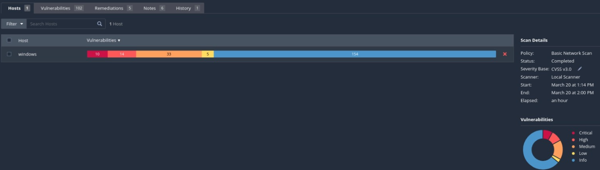
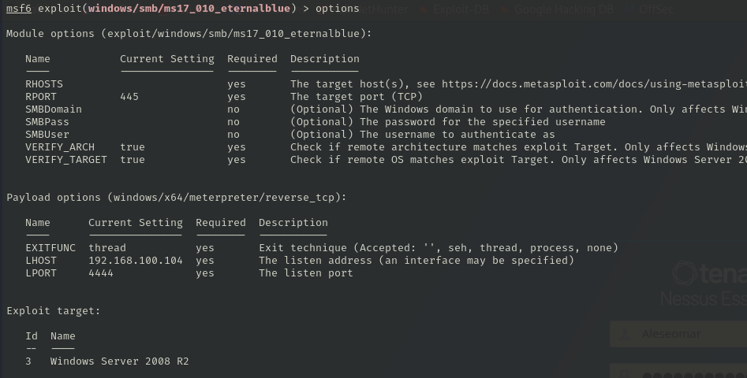
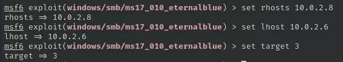
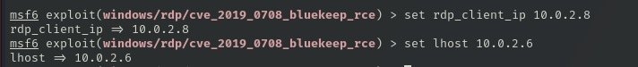
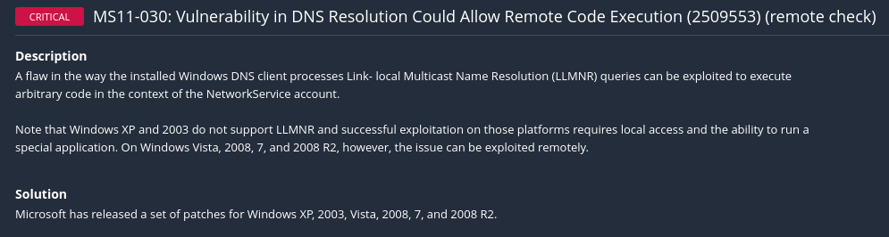
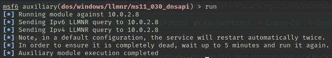
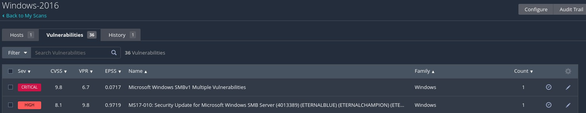
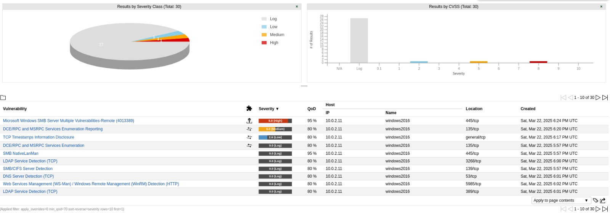

# Informe pentesting "La Descuidada S.A."

## Índice

1. [Resumen de la evaluación](#1-resumen-de-la-evaluación)
2. [Índices de gravedad de los hallazgos](#2-índices-de-gravedad-de-los-hallazgos)
3. [Factores de riesgo](#3-factores-de-riesgo)
4. [Alcance](#4-alcance)
5. [Resumen ejecutivo](#5-resumen-ejecutivo)  
   5.1. [Windows Server 2008](#51-windows-server-2008)  
   5.2. [Windows Server 2016](#52-windows-server-2016)
6. [Resumen e informe de vulnerabilidades](#6-resumen-e-informe-de-vulnerabilidades)  
   6.1. [Microsoft Windows Server 2008](#61-microsoft-windows-server-2008)  
   6.2. [Microsoft Windows Server 2016](#62-microsoft-windows-server-2016)
7. [Resultados técnicos del informe](#7-resultados-técnicos-del-informe)  
   7.1. [Windows Server 2008 - Resultados](#71-windows-server-2008---resultados)  
   7.2. [Windows Server 2016 - Resultados](#72-windows-server-2016---resultados)
8. [Anexos](#8-anexos)

## 1. Resumen de la evaluación

Se ha realizó un test de intrusión sobre dos servidores Windows denominados `windows` (Windows Server 2008) y `windows2016` (Windows Server 2016), para identificar vulnerabilidades y proporcionar mitigaciones. Se han obtenido resultados, incluyendo ejecución remota de comandos y obtención de credenciales.

## 2. Índices de gravedad de los hallazgos

Para valorar la severidad de las vulnerabilidades identificadas durante la evaluación se ha utilizado el sistema CVSS v3 (Common Vulnerability Scoring System), que clasifica los hallazgos en los siguientes niveles:

- **Crítica** (9.0 – 10.0)
- **Alta** (7.0 – 8.9)
- **Media** (4.0 – 6.9)
- **Baja** (0.1 – 3.9)

## 3. Factores de riesgo

- Uso de sistemas operativos obsoletos y sin soporte (Windows Server 2008)
- Exposición de servicios vulnerables a través de SMB, RDP y HTTP
- Configuraciones por defecto y credenciales débiles
- Servicios accesibles sin autenticación
- Ausencia de medidas de control de acceso y segmentación

## 4. Alcance

El alcance de la evaluación ha abarcado los sistemas definidos por "La Descuidada S.A.", los cuales fueron analizados técnica y prácticamente mediante herramientas de escaneo, explotación y post-explotación.

En todos los sistemas evaluados se logró acceder al mediante explotación de vulnerabilidades, obteniendo sesiones con distintos niveles de privilegios.

| Hostname    | Sistema operativo   | IP       |
| ----------- | ------------------- | -------- |
| windows     | Windows Server 2008 | 10.0.2.8 |
| windows2016 | Windows Server 2016 | 10.0.2.5 |

## 5. Resumen ejecutivo

### 5.1. Windows Server 2008

En el servidor Windows Server 2008, se descubrieron fallas de ejecución remota de código (RCE), algunas sin autenticación, que permiten tomar el control del sistema. EDestaca el uso del protocolo SMBv1, explotable mediante el conocido fallo EternalBlue (MS17-010), que permitió el acceso con privilegios de sistema. También se explotó una vulnerabilidad en el protocolo RDP conocida como BlueKeep, que posibilita ataques remotos sin credenciales. Además, se identificaron vulnerabilidades en aplicaciones como ManageEngine y Elasticsearch, que permiten la ejecución de código y comprometen seriamente la seguridad del entorno.

### 5.2. Windows Server 2016

En windows2016, se explotó con éxito la vulnerabilidad MS17-010 (EternalBlue), obteniendo acceso remoto con privilegios de sistema como administrador.

## 6. Resumen e informe de vulnerabilidades

### 6.1. Microsoft Windows Server 2008

Hemos realizado un análisis con Nessus para ver las vulnerabilidades que podia tener el equipo y una vez encontrada intentar la explotación de las esas vulnerabilidades. Del anterior escaneo nos ha encontrado 216 vulnerabilidades de las cuales 10 son criticas, 10 altas, 33 Medias, 5 bajas.

El reporte completo de Nessus se puede observar en l informe anexo en el primer hallazgo.

Todas las vulnerabilidades están recogidas en el informe anexo para más detalles y revisar todas consultar. Estas son las más importantes y ordenadas por peligrosidad :

| Description of vulnerability | Vulnerabilidad en SMBv1 permite ejecución remota de código.                                                                                                                                                                                                                                       |
| ---------------------------- | ------------------------------------------------------------------------------------------------------------------------------------------------------------------------------------------------------------------------------------------------------------------------------------------------- |
| **CVE/CWE**                  | [CVE-2017-0144](https://nvd.nist.gov/vuln/detail/CVE-2017-0144) / [CWE-20](https://cwe.mitre.org/data/definitions/20.html)                                                                                                                                                                        |
| **CVSS v3**                  | 9.8                                                                                                                                                                                                                                                                                               |
| **Severity**                 | Crítico                                                                                                                                                                                                                                                                                           |
| **Impact**                   | Ejecución remota de código y propagación de malware                                                                                                                                                                                                                                               |
| **Affected systems**         | windows2008                                                                                                                                                                                                                                                                                       |
| **Proof Of Concept (POC)**   |      |
| **Remediation**              | Aplicar parche MS17-010 o deshabilitar SMBv1                                                                                                                                                                                                                                                      |
| **Reference links**          | [Microsoft Advisory](https://msrc.microsoft.com/update-guide/vulnerability/CVE-2017-0144)                                                                                                                                                                                                         |

| Description of vulnerability | Vulnerabilidad en RDP permite ejecución remota sin autenticación.                                                                                                                                                                       |
| ---------------------------- | --------------------------------------------------------------------------------------------------------------------------------------------------------------------------------------------------------------------------------------- |
| **CVE/CWE**                  | [CVE-2019-0708](https://nvd.nist.gov/vuln/detail/CVE-2019-0708) / [CWE-787](https://cwe.mitre.org/data/definitions/787.html)                                                                                                            |
| **CVSS v3**                  | 9.8 (Crítico)                                                                                                                                                                                                                           |
| **Severity**                 | Crítico                                                                                                                                                                                                                                 |
| **Impact**                   | Ejecución remota de código con privilegios elevados                                                                                                                                                                                     |
| **Affected systems**         | windows2008                                                                                                                                                                                                                             |
| **Proof Of Concept (POC)**   |     |
| **Remediation**              | Aplicar parche de Microsoft o deshabilitar RDP si no es necesario                                                                                                                                                                       |
| **Reference links**          | [Microsoft Advisory](https://msrc.microsoft.com/update-guide/vulnerability/CVE-2019-0708)                                                                                                                                               |

| Description of vulnerability | Permite ejecución remota de código en ManageEngine mediante HTTP malformado.                                                                                                                                                                                                                   |
| ---------------------------- | ---------------------------------------------------------------------------------------------------------------------------------------------------------------------------------------------------------------------------------------------------------------------------------------------- |
| **CVE/CWE**                  | [CVE-2011-0657](https://nvd.nist.gov/vuln/detail/CVE-2011-0657) / [CWE-119](https://cwe.mitre.org/data/definitions/119.html)                                                                                                                                                                   |
| **CVSS v3**                  | 10.0                                                                                                                                                                                                                                                                                           |
| **Severity**                 | Crítico                                                                                                                                                                                                                                                                                        |
| **Impact**                   | Ejecución remota de código con privilegios elevados                                                                                                                                                                                                                                            |
| **Affected systems**         | windows2008                                                                                                                                                                                                                                                                                    |
| **Proof Of Concept (POC)**   |      |
| **Remediation**              | Aplicar parches de seguridad o actualizar a una versión segura                                                                                                                                                                                                                                 |
| **Reference links**          | [NVD CVE-2011-0657](https://nvd.nist.gov/vuln/detail/CVE-2011-0657)                                                                                                                                                                                                                            |

| Description of vulnerability | Ejecución remota de código a través del protocolo de transporte de Elasticsearch                                                                                                     |
| ---------------------------- | ------------------------------------------------------------------------------------------------------------------------------------------------------------------------------------ |
| **CVE/CWE**                  | [CVE-2015-5377](https://nvd.nist.gov/vuln/detail/CVE-2015-5377) / [CWE-94](https://cwe.mitre.org/data/definitions/94.html)                                                           |
| **CVSS v3**                  | 9.8                                                                                                                                                                                  |
| **Severity**                 | Crítica                                                                                                                                                                              |
| **Impact**                   | Permite a un atacante remoto ejecutar código arbitrario en el servidor afectado mediante el protocolo de transporte de Elasticsearch sin autenticación previa.                       |
| **Affected systems**         | Versiones de Elasticsearch anteriores a la 1.6.1.                                                                                                                                    |
| **Proof Of Concept (POC)**   |                                                                      |
| **Remediation**              | Actualizar Elasticsearch a la versión 1.6.1 o superior. Alternativamente, asegurar que solo aplicaciones de confianza tengan acceso al puerto del protocolo de transporte.           |
| **Reference links**          | [Elasticsearch ESA-2015-06 - Tenable](https://www.tenable.com/plugins/nessus/119499), [Exploit-DB: ElasticSearch - Remote Code Execution](https://www.exploit-db.com/exploits/36337) |

| Description of vulnerability | Vulnerabilidad de Path Traversal en Oracle GlassFish Server                                                                                                                                                                                                                       |
| ---------------------------- | --------------------------------------------------------------------------------------------------------------------------------------------------------------------------------------------------------------------------------------------------------------------------------- |
| **CVE/CWE**                  | [CVE-2017-1000028](https://nvd.nist.gov/vuln/detail/CVE-2017-1000028) / [CWE-22](https://cwe.mitre.org/data/definitions/22.html)                                                                                                                                                  |
| **CVSS v3**                  | 7.5                                                                                                                                                                                                                                                                               |
| **Severity**                 | Alta                                                                                                                                                                                                                                                                              |
| **Impact**                   | Permite a un atacante remoto acceder a archivos arbitrarios en el sistema a través de una petición HTTP especialmente diseñada. No requiere autenticación.                                                                                                                        |
| **Affected systems**         | Servidor con Oracle GlassFish accesible en el puerto 4848                                                                                                                                                                                                                         |
| **Proof Of Concept (POC)**   | Acceso a la ruta `https://windows:4848/theme/META-INF%c0%af.../users` permite visualizar el contenido de carpetas como `vagrant`, `Documents`, `AppData`, etc.  |
| **Remediation**              | Aplicar parches de seguridad proporcionados por Oracle. Restringir el acceso al puerto 4848 desde redes no autorizadas. Deshabilitar interfaces administrativas innecesarias.                                                                                                     |
| **Reference links**          | [CVE-2017-1000028 - NVD](https://nvd.nist.gov/vuln/detail/CVE-2017-1000028), [EDB-39441 - Exploit DB](https://www.exploit-db.com/exploits/39441)                                                                                                                                  |

### 6.2. Microsoft Windows Server 2016

Hemos realizado un análisis con nmap para saber que puertos tiene abierto y que servicios tiene abierto, después hemos realizado otro análisis con Nessus para ver que vulnerabilidades nos encontraba y depués hemos hecho otro con OpenVas para ver corroborar la información que nos había proporcionado Nessus.

| Description of vulnerability | Ejecución remota de código a través de SMBv1 (MS17-010 + PsExec)                                                                                                                                   |
| ---------------------------- | -------------------------------------------------------------------------------------------------------------------------------------------------------------------------------------------------- |
| **CVE/CWE**                  | [CVE-2017-0144](https://nvd.nist.gov/vuln/detail/CVE-2017-0144) / [CWE-787](https://cwe.mitre.org/data/definitions/787.html)                                                                       |
| **CVSS v3**                  | 8.8                                                                                                                                                                                                |
| **Severity**                 | Crítica                                                                                                                                                                                            |
| **Impact**                   | Permite a un atacante remoto ejecutar código a través de SMBv1 y subir una carga útil con privilegios de sistema. Se requiere acceso al recurso compartido `ADMIN$`.                               |
| **Affected systems**         | windows2016                                                                                                                                                                                        |
| **Proof Of Concept (POC)**   |                                                                            |
| **Remediation**              | Aplicar el parche MS17-010. Deshabilitar SMBv1 si no es necesario. Limitar el acceso a recursos compartidos.                                                                                       |
| **Reference links**          | [MS17-010 - Microsoft](https://learn.microsoft.com/en-us/security-updates/securitybulletins/2017/ms17-010), [OWASP A06 2021](https://owasp.org/Top10/A06_2021-Vulnerable_and_Outdated_Components/) |

## 7. Resultados técnicos del informe

### 7.1. Windows Server 2008 - Resultados

Se realizaron análisis con **Nessus**, **OpenVAS** y **Metasploit**, para escaneo de vulnerabilidades que puedan comprometer el sistema.

La vulnerabilidad **MS17-010 (EternalBlue)** fue explotada con éxito mediante `exploit/windows/smb/ms17_010_eternalblue`, obteniendo una sesión **meterpreter** con privilegios **NT AUTHORITY\SYSTEM**.

También se detectó **CVE-2019-0708 (BlueKeep)**, que permite ejecución remota sin autenticación, representando un riesgo aunque no fue explotada completamente.

El sistema corría una instancia vulnerable de **ManageEngine Desktop Central**, explotada con éxito para ejecutar código remotamente. Además, se aprovechó una vulnerabilidad en **Elasticsearch (ESA-2015-06)** para acceder al sistema desde un servicio mal configurado.

Por último, el servidor **Oracle GlassFish** presentaba una vulnerabilidad de **Path Traversal** queF permitió listar y acceder a archivos sensibles sin autenticación.

### 7.2. Windows Server 2016 - Resultados

Se ha utilizamos Nessus y OpenVAS para identificar vulnerabilidades en el sistema. Ambos coincidieron en la presencia de la vulnerabilidad MS17-010 (EternalBlue), la cual fue explotada con éxito usando el módulo exploit/windows/smb/ms17_010_psexec de Metasploit.

Se obtuvo una sesión Meterpreter con privilegios de NT AUTHORITY\SYSTEM, lo que permitió acceder al sistema. También se ejecutó un dumpeo de hashes de los usuarios, lo que dió la existencia de contraseñas débiles. Se ha obtenido que el nombre del pc es `DC-COMPANY`

## 8. Anexos

La declaración de confidencialidad, el descargo de responsabilidad y más anexos se
recogen en el siguiente documento:

[Anexos pentesting](AnexoPentesting.md)

