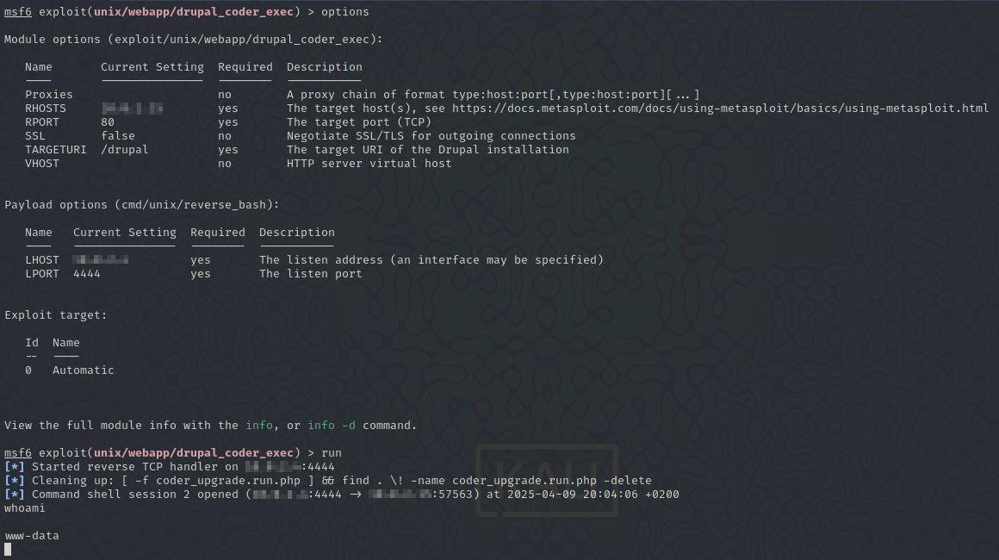

# Anexos - pentesting "Pata Palo Corp."

## Índice

- [Declaración de confidencialidad](#declaración-de-confidencialidad)
- [Descargo de responsabilidad](#descargo-de-responsabilidad)
- [Información de contacto](#información-de-contacto)
- [Metodología](#metodología)
  - [Reconocimiento](#1-reconocimiento)
  - [Análisis de vulnerabilidades](#2-análisis-de-vulnerabilidades)
  - [Explotación](#3-explotación)
  - [Escalada de privilegios](#4-escalada-de-privilegios)
  - [Post-explotación](#5-post-explotación)
  - [Documentación](#6-documentación)
- [Recopilación de información](#recopilación-de-información)
  - [MS3_Ubuntu](#ms3_ubuntu)
  - [Kioptix](#kioptix)
  - [W1r3s](#w1r3s)

## Declaración de confidencialidad

El presente informe de pruebas de pentesting contiene información confidencial y sensible relacionada con la seguridad de los dos sistemas evaluados. La divulgación, distribución o reproducción de este documento sin la debida autorización está estrictamente prohibida.

Toda la información contenida en este informe ha sido recopilada con fines exclusivos de evaluación de seguridad y está destinada únicamente para el uso del cliente o de las partes autorizadas expresamente. Cualquier uso indebido de la información proporcionada podría comprometer la seguridad de los sistemas analizados y dar lugar a consecuencias legales.

El cliente se compromete a proteger la confidencialidad de este informe y a restringir su acceso solo a personal autorizado con el fin de mitigar riesgos de seguridad y fortalecer la protección de la información evaluada.

## Descargo de responsabilidad

El presente informe ha sido elaborado con el propósito de identificar vulnerabilidades y riesgos de seguridad en los sistemas evaluados. Las pruebas realizadas se llevaron a cabo en un entorno controlado y siguiendo buenas prácticas de seguridad informática. Sin embargo, no se garantiza la ausencia total de amenazas o vulnerabilidades no identificadas.

El equipo de pentesting y la entidad responsable de este informe no asumen responsabilidad alguna por el uso indebido de la información contenida en el mismo ni por daños derivados de la implementación o no implementación de las recomendaciones sugeridas. Es responsabilidad del cliente evaluar y aplicar las medidas de mitigación necesarias para mejorar la seguridad de su aplicación web.

Asimismo, este informe no debe considerarse una certificación de seguridad absoluta, ya que las amenazas y vulnerabilidades pueden evolucionar con el tiempo. Se recomienda realizar evaluaciones de seguridad periódicas para mantener la integridad y protección de la aplicación.

## Información de contacto

**Empresa auditada:** Pata de Palo Corp.

**Equipo auditor:** Grupo 3, IES Rafael Alberti

**Correo de contacto:** <grupo3@g.educaand.es>

**Fecha de inicio:** 25/03/2025

**Fecha de finalización:** 13/04/2025

## Metodología

Basada en estándares como OWASP, organizada en las siguientes fases:

### 1. Reconocimiento

Recopilación de información sobre los sistemas mediante escaneo de puertos, fingerprinting y servicios expuestos.

### 2. Análisis de vulnerabilidades

Identificación de vulnerabilidades conocidas utilizando herramientas automatizadas(como nessus)

### 3. Explotación

Explotación de las vulnerabilidades para evaluar su impacto.

### 4. Escalada de privilegios

Verificación de posibles vectores para obtener mayores privilegios.

### 5. Post-explotación

Extracción de información y de persistencia.

### 6. Documentación

Informe con todos los hallazgos, métodos utilizados y mitigación.

## Recopilación de información

### MS3_UBUNTU

- Hallazgo 1:

  [Reporte de Nessus de vulnerabilidades](./investigaciones/MS3_Ubuntu/ms3_ubuntu_pg4nxa.pdf)

- Hallazgo 2:

  [Reporte de Nessus de vulnerabilidades .nessus](./investigaciones/MS3_Ubuntu/ms3_ubuntu_s9n7be.nessus)

- Hallazgo 3:

| **Description of vulnerability** | Drupal Coder Module Deserialization RCE                                                |
| -------------------------------- | -------------------------------------------------------------------------------------- |
| **CVE/CWE**                      | CVE-2014-3704 / CWE-502                                                                |
| **CVSS v3**                      | 10.0                                                                                   |
| **Severity**                     | Crítica                                                                                |
| **Impact**                       | Ejecutar comandos arbitrarios en el servidor, comprometiendo completamente el sistema. |
| **Affected systems**             | Ubuntu 14.04.6 LTS                                                                     |
| **Proof Of Concept (POC)**       |                |
| **Remediation**                  | Actualizar Drupal a una versión segura; eliminar módulos vulnerables                   |
| **Reference links**              | <https://www.drupal.org/SA-CORE-2014-005>                                              |

- Hallazgo 4:

| **Description of vulnerability** | ProFTPD mod_copy Information Disclosure                                                                                          |
| -------------------------------- | -------------------------------------------------------------------------------------------------------------------------------- |
| **CVE/CWE**                      | CVE-2015-3306 / CWE-306                                                                                                          |
| **CVSS v3**                      | 9.8                                                                                                                              |
| **Severity**                     | Crítica                                                                                                                          |
| **Impact**                       | Permite ejecutar comandos para copiar y pegar en el servidor FTP (SITE CPFR y SITE CPTO) sin la necesidad de estar autenticados. |
| **Affected systems**             | Ubuntu 14.04.6 LTS                                                                                                               |
| **Proof Of Concept (POC)**       |              |
| **Remediation**                  | Deshabilitar mod_copy; actualizar ProFTPD a una versión parchada                                                                 |
| **Reference links**              | <https://cve.mitre.org/cgi-bin/cvename.cgi?name=CVE-2015-3306>                                                                   |

- Hallazgo 5:

| **Description of vulnerability** | SSL Medium Strength Cipher Suites Supported (SWEET32)                      |
| -------------------------------- | -------------------------------------------------------------------------- |
| **CVE/CWE**                      | CVE-2016-2183 /                                                            |
| **CVSS v3**                      | 7.5                                                                        |
| **Severity**                     | High                                                                       |
| **Impact**                       | Te dice la encriptación del host (entre 64 y 112 bits o encriptación 3DES) |
| **Affected systems**             | Ubuntu 14.04.6 LTS                                                         |
| **Proof Of Concept (POC)**       |              |
| **Remediation**                  | Deshabilitar cifrados débiles como 3DES y usar TLS modernos (TLS 1.2+)     |
| **Reference links**              | <https://sweet32.info/>, <https://nvd.nist.gov/vuln/detail/CVE-2016-2183>  |

- Hallazgo 6:

| **Description of vulnerability** | Apache Multiviews Arbitrary Directory Listing                                                                                             |
| -------------------------------- | ----------------------------------------------------------------------------------------------------------------------------------------- |
| **CVE/CWE**                      | CVE-2001-0731 /                                                                                                                           |
| **CVSS v3**                      | 5.3                                                                                                                                       |
| **Severity**                     | Media                                                                                                                                     |
| **Impact**                       | Multiview es un módulo de apache que muestra archivos basandose en coincidencias                                                          |
| **Affected systems**             | Ubuntu 14.04.6 LTS                                                                                                                        |
| **Proof Of Concept (POC)**       |   |
| **Remediation**                  | Desactivar mod_negotiation o configurar correctamente .htaccess                                                                           |
| **Reference links**              | <https://cve.mitre.org/cgi-bin/cvename.cgi?name=CVE-2001-0731>                                                                            |

### KIOPTIX

- Hallazgo 1:

  [Reporte de Nessus de vulnerabilidades](./investigaciones/Kioptix/Kioptix_cwh2lb.pdf)

- Hallazgo 2:

  [Reporte de Nessus de vulnerabilidades .nessus](./investigaciones/Kioptix/Kioptix_v4akmw.nessus)

- Hallazgo 3:

| Description of vulnerability |     |
| ---------------------------- | --- |
| **CVE/CWE**                  | /   |
| **CVSS v3**                  |     |
| **Severity**                 |     |
| **Impact**                   |     |
| **Affected systems**         |     |
| **Proof Of Concept (POC)**   |     |
| **Remediation**              |     |
| **Reference links**          |     |

### W1R3S

- Hallazgo 1:

  [Reporte de Nessus de vulnerabilidades](./investigaciones/W1r3s/w1r3s_beaacd.pdf)

- Hallazgo 2:

  [Reporte de Nessus de vulnerabilidades .nessus](./investigaciones/W1r3s/w1r3s_xep59d.nessus)

- Hallazgo 3:

| **Description of vulnerability** | Contraseña débil (fuerza bruta) y acceso SSH sin medidas de protección.                            |
| -------------------------------- | -------------------------------------------------------------------------------------------------- |
| **CVE/CWE**                      | CVE-2016-6210 / CWE-521: Weak Password Requirements                                                |
| **CVSS v3**                      | 8.8                                                                                                |
| **Severity**                     | Alta                                                                                               |
| **Impact**                       | Acceso remoto no autorizado, escalada a root, posible compromiso total                             |
| **Affected systems**             | Sistema Linux (Ubuntu 16.04.3 LTS), servicio SSH                                                   |
| **Proof Of Concept (POC)**       | Hydra → acceso con `computer`; `ssh` → acceso exitoso a w1r3s                                      |
| **Remediation**                  | Usar contraseñas fuertes, limitar intentos SSH, usar autenticación con clave pública               |
| **Reference links**              | <https://cwe.mitre.org/data/definitions/521.html> <https://nvd.nist.gov/vuln/detail/CVE-2016-6210> |

- Hallazgo 4:

| **Description of vulnerability** | Acceso no autenticado a un panel de instalación                                                |
| -------------------------------- | ---------------------------------------------------------------------------------------------- |
| **CVE/CWE**                      | NA / CWE-306: Missing Authentic for Critical Function                                          |
| **CVSS v3**                      | 8.8                                                                                            |
| **Severity**                     | Alta                                                                                           |
| **Impact**                       | Permite la configuración maliciosa del sistema por parte de un atacante                        |
| **Affected systems**             | Sistema Linux (Ubuntu 16.04.3 LTS)                                                             |
| **Proof Of Concept (POC)**       |   |
| **Remediation**                  | Eliminar o restringir el acceso al instalador tras la instalación                              |
| **Reference links**              | <https://owasp.org/Top10/A01_2021-Broken_Access_Control/>                                      |

- Hallazgo 5:

| **Description of vulnerability** | Acceso anónimo a servidor FTP y exposición de credenciales en texto plano                           |
| -------------------------------- | --------------------------------------------------------------------------------------------------- |
| **CVE/CWE**                      | NA / CWE-200 y CWE-319                                                                              |
| **CVSS v3**                      | 7.5                                                                                                 |
| **Severity**                     | Alta                                                                                                |
| **Impact**                       | Filtración de información interna y credenciales mediante sniffing                                  |
| **Affected systems**             | Sistema Linux (Ubuntu 16.04.3 LTS)                                                                  |
| **Proof Of Concept (POC)**       |       |
| **Remediation**                  | Deshabilitar acceso anónimo, usar FTPS o SFTP, aplicar controles de acceso                          |
| **Reference links**              | <https://cwe.mitre.org/data/definitions/200.html> <https://cwe.mitre.org/data/definitions/319.html> |
