# Investigación Kioptix

**Pentesters**: Alejandro Seoane Martínez

## Índice

1. [Detección de vulnerabilidades](#1-detección-de-vulnerabilidades)
2. [Desarrollo de vulnerabilidades](#2-desarrollo-de-vulnerabilidades)

## Detección de vulnerabilidades

Para detectar las vulnerabilidades hemos hecho uso de dos herramientas:

### Nessus

Hemos hecho un escanero de vulnerabilidades con Nessus a ver que tipos de vulnerabilidades encuntra en los servicios de la máquina.

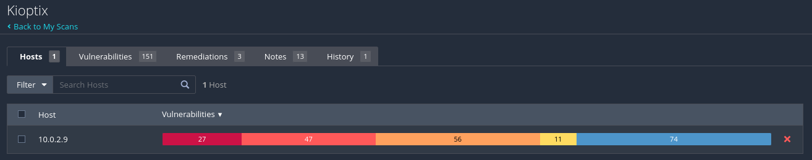

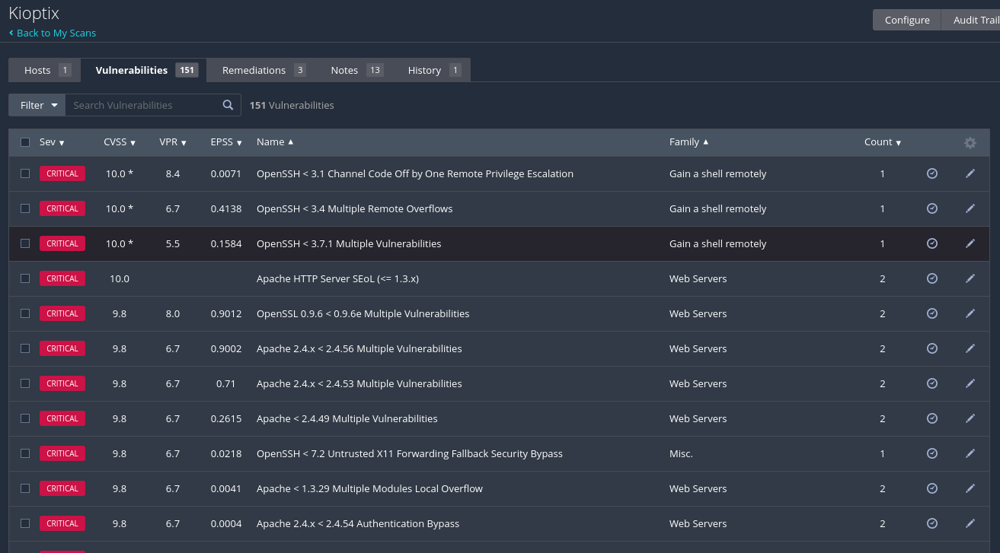

### Nmap

Nmap nos permite ejecutar un script de detección de vulnerabilidades. El resultado que nos ha dado se puede ver en [Escaneo Nmap](img/nmap-vulnerabilidad.md)

## Desarrollo de vulnerabilidades

Veremos los servicios que tienen abierto y buscaremos vulnerabilidades en ellos:

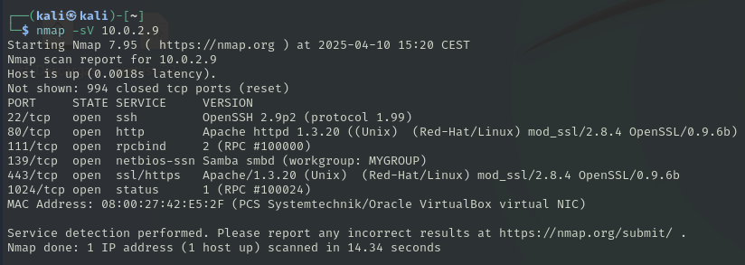

### Apache 1.3.x < 2.0.48 mod_userdir - Remote Users Disclosure

Esta vulnerabilidad revela usuarios del sistema mediante solicitudes a directorios personales.

Podemos usar metaexploit `auxiliary/scanner/http/apache_userdir_enum` explotar esta vulnerabilidad.

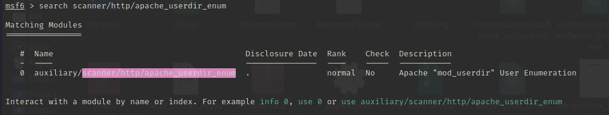

Configuraremos el exploit.

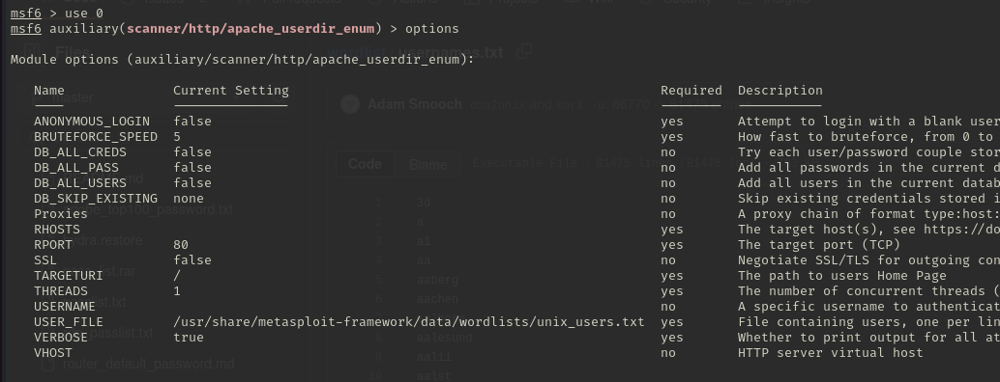

Y lo ejecutamos.

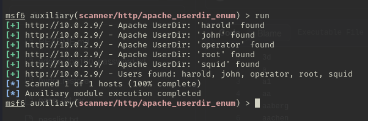

Podemos ver como nos ha listado los directorios de los usuarios que ha podido encontrar.

### Samba 2.2.x - Remote Buffer Overflow

Sabemos que la máquina vulnerable en el puerto 139 tiene el servicio de Samba. Para poder buscar algun exploit con el que vulnerar el servicio tendremos que determinar la versión de Samba.

Para esto usaremos el módulo auxiliary/scanner/smb/smb_version:

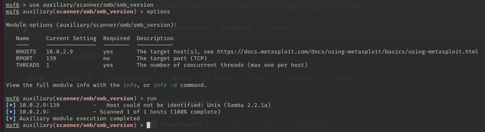

Ya sabemos que es la versión 2.2.1 de Samba.
Buscando en metaexploit no nos aparece ninguna vulnerabilidad de Samba en esa versión por lo que buscamos en Google.

Vemos que nos aparece la primera vulnerabilidad que si la buscamos en metaexploit nos aparece:

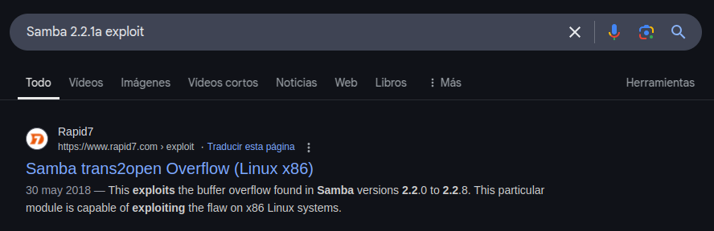

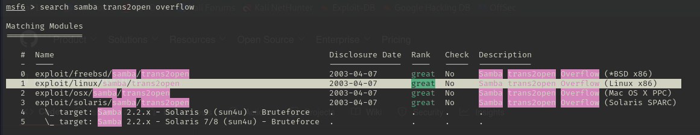

Le configuraremos el rhost, el lhost y el payload para que sea una shell reverse.

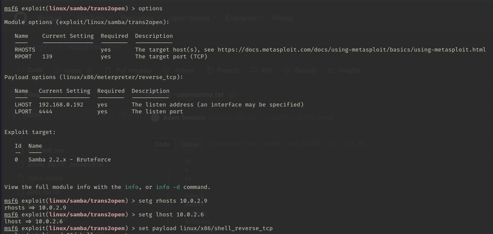

Una vez configurado ejecutamos el exploit, hace varios intentos hasta que parece que nos da acceso al sistema. Miramos y vemos que nos ha creado una shell reverse como root por lo que tenemos permisos de administración.

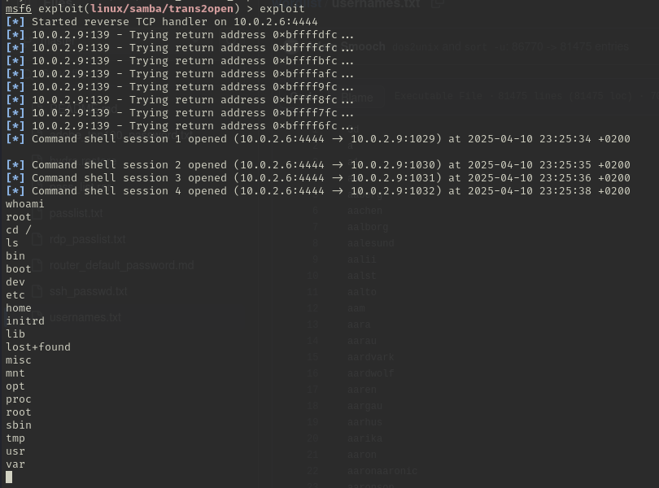

### Muestra de información a través de Samba

Con el comando enum3linux podemos listar información a traves del servicio de Samba. Esto es una vulnerabilidad debido a que hay información que no tendrían porque saber los atacantes.

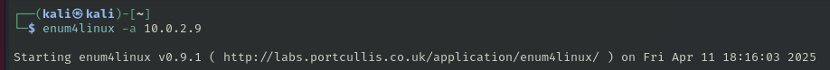

Podemos ver información general de la máquina como usuarios:

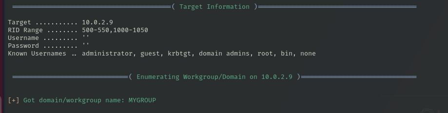

Listar las carpetas que estan compartidas:

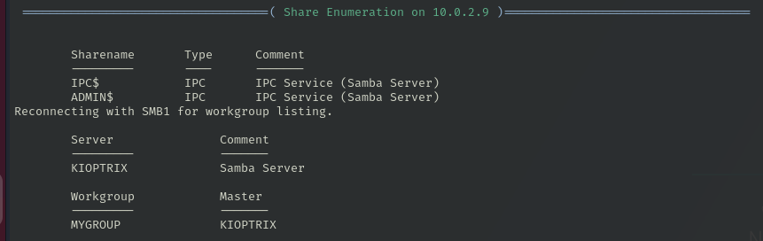

Información sobre las políticas de contraseñas:

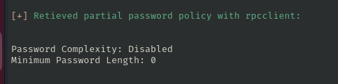

