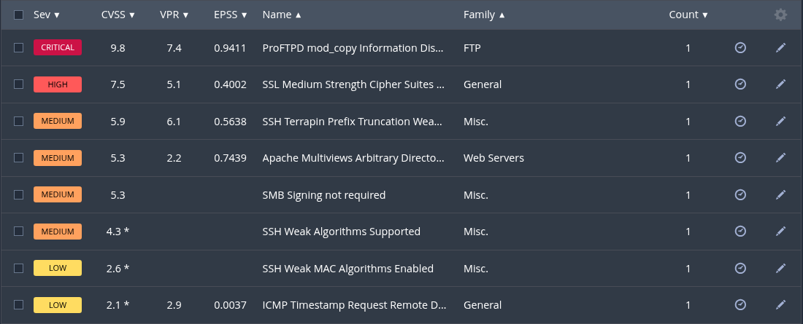
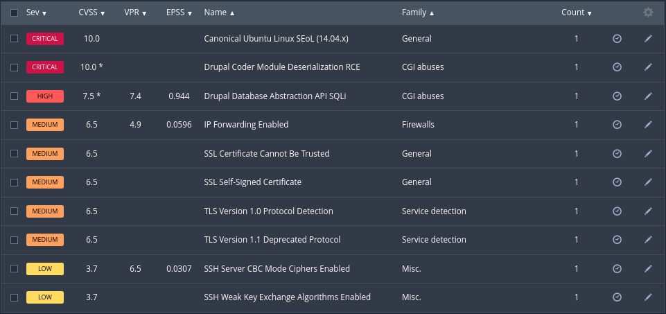

# Investigación MS3_Ubuntu

**Pentesters**: Nicolás Ruiz Ruiz y Victor Jimenez Corada

## Índice

1. [Detección de vulnerabilidades](#1-detección-de-vulnerabilidades)
2. [Desarrollo de vulnerabilidades](#2-desarrollo-de-vulnerabilidades)

## 1. Detección de vulnerabilidades

Para la detección de vulnerabilidades hemos usado Nessus para escanear la maquina, realizando dos escaneos para asegurarnos de encontrar todas las vulnerabilidades posibles. Los resultados han sido los siguientes:

- Reporte 1, realizado por Nicolás Ruiz:

  - [Base de datos](./metasploit_jmvm55.nessus)
  - [Documento PDF](./metasploit_j2oghf.pdf)

- Reporte 2, realizado por Víctor Jiménez:

  - [Archivo Nessus](./ms3_ubuntu_s9n7be.nessus)
  - [Reporte PDF](./ms3_ubuntu_pg4nxa.pdf)

## 2. Desarrollo de vulnerabilidades

La investigación y comprobación de vulnerabilidades detectadas la hemos dividido de la siguiente forma:

- Grupo 1, Nicolas Ruiz

- Grupo 2, Víctor Jiménez

### Explotación de vulnerabilidades

#### Críticas

- Canonical Ubuntu Linux SEoL (14.04.x)
- Drupal Coder Module Deserialization RCE
- ProFTPD mod_copy Information Disclosure

#### Altas

- Drupal Database Abstraction API SQLi
- SSL Medium Strength Cipher Suites Supported (SWEET32)

#### Medias

- IP Forwarding Enabled
- SSL Certificate Cannot Be Trusted
- SSL Self-Signed Certificate
- TLS Version 1.0 Protocol Detection
- TLS Version 1.1 Deprecated Protocol
- SSH Terrapin Prefix Truncation Weakness (CVE-2023-48795)
- Apache Multiviews Arbitrary Directory Listing
- SMB Signing not required
- SSH Weak Algorithms Supported

#### Bajas

- SSH Server CBC Mode Ciphers Enabled
- SSH Weak Key Exchange Algorithms Enabled
- SSH Weak MAC Algorithms Enabled
- ICMP Timestamp Request Remote Date Disclosure

---

Hecho por Nicolas Ruiz y Víctor Jiménez
