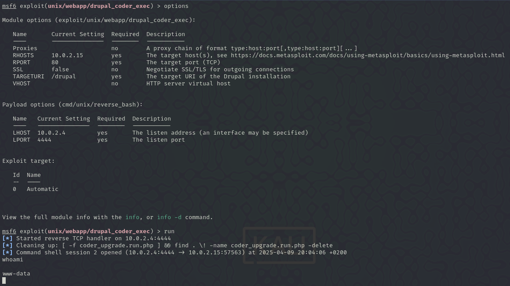
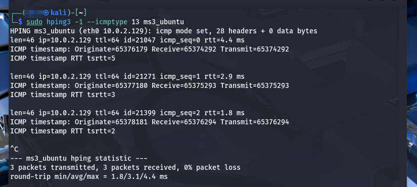

# Investigación MS3-ub1404

**Pentesters**: Nicolás Ruiz Ruiz y Victor Jimenez Corada

## Índice

1. [Detección de vulnerabilidades](#1-detección-de-vulnerabilidades)
2. [Desarrollo de vulnerabilidades](#2-desarrollo-de-vulnerabilidades)

## 1. Detección de vulnerabilidades

Este documento presenta un análisis de las vulnerabilidades detectadas en un escaneo realizado con Nessus sobre la maquina **_MS3-ub1404_**. Para cada vulnerabilidad se evalúa su explotabilidad y, en caso aplicable, hemos intentado explotarlas utilizando Metasploit.

Para asegurarnos de encontrar todas las vulnerabilidades posibles hemos realizado dos escaneos, los resultados han sido los siguientes:

- Reporte 1, realizado por Nicolás Ruiz:

  - [Base de datos](./metasploit_jmvm55.nessus)
  - [Documento PDF](./metasploit_j2oghf.pdf)

- Reporte 2, realizado por Víctor Jiménez:

  - [Archivo Nessus](./ms3_ubuntu_s9n7be.nessus)
  - [Reporte PDF](./ms3_ubuntu_pg4nxa.pdf)

## 2. Desarrollo de vulnerabilidades

La investigación y comprobación de vulnerabilidades detectadas la hemos dividido en dos grupos:

- Grupo 1, Nicolas Ruiz:

- Grupo 2, Víctor Jiménez:

### Explotación de vulnerabilidades

#### Críticas

- Canonical Ubuntu Linux SEoL (14.04.x)

  | Campo       | Valor                                                                                                                                                                                                                                                       |
  | ----------- | ----------------------------------------------------------------------------------------------------------------------------------------------------------------------------------------------------------------------------------------------------------- |
  | Explotable  | No                                                                                                                                                                                                                                                          |
  | Descripción | Al tratarse de sistema operativo fuera de soporte no puede explotarse directamente, pero sí conlleva un alto riesgo ya que convierte al sistema en un blanco fácil para ataques que exploten vulnerabilidades conocidas al no recibir parches de seguridad. |
  | CVE         | N/A                                                                                                                                                                                                                                                         |

- Drupal Coder Module Deserialization RCE

  | Campo       | Valor                                                                                                                                                                                     |
  | ----------- | ----------------------------------------------------------------------------------------------------------------------------------------------------------------------------------------- |
  | Explotable  | Si                                                                                                                                                                                        |
  | Descripción | El módulo "Coder" de Drupal es vulnerable a una deserialización insegura que permite a un atacante ejecutar comandos arbitrarios en el servidor, comprometiendo completamente el sistema. |
  | Explotación | Módulo `exploit/unix/webapp/drupal_coder_exec`                                                                                                                                            |
  | CVE         | CVE-2014-3704                                                                                                                                                                             |

  

- ProFTPD mod_copy Information Disclosure

| Campo      | Valor     |
| ---------- | --------- |
| Severity   | Critical  |
| ID         | 84215     |
| Version    | 1.11      |
| Type       | remote    |
| Family     | FTP       |
| CVSS score | 9.8       |
| CVE        | 2015-3306 |

Esta vulnerabilidad permite a los atacantes usar el módulo **mod_copy** quee permite ejecutar comandos para copiar y pegar en el servidor FTP (**SITE CPFR** y **SITE CPTO**) sin la necesidad de estar autenticados:

#### Altas

- Drupal Database Abstraction API SQLi

  | Campo       | Valor                                                                                                                                                                                                                                           |
  | ----------- | ----------------------------------------------------------------------------------------------------------------------------------------------------------------------------------------------------------------------------------------------- |
  | Explotable  | Si                                                                                                                                                                                                                                              |
  | Descripción | Drupal es vulnerable a una inyección SQL en su API de abstracción de base de datos. Esto permite a un atacante remoto ejecutar comandos arbitrarios mediante SQLi, lo cual puede llevar a la ejecución de código y compromiso total del sistema |
  | Explotación | Módulo `exploit/unix/webapp/drupal_coder_exec`                                                                                                                                                                                                  |
  | CVE         | CVE-2014-3704                                                                                                                                                                                                                                   |

  

- SSL Medium Strength Cipher Suites Supported (SWEET32)

| Campo      | Valor     |
| ---------- | --------- |
| Severity   | High      |
| ID         | 42873     |
| Version    | 1.22      |
| Type       | remote    |
| Family     | General   |
| CVSS score | 7.5       |
| CVE        | 2016-2183 |

La vulnerabilidad indica que el host usa encriptación media (entre 64 y 112 bits o encriptación 3DES).

#### Medias

- IP Forwarding Enabled

  | Campo       | Valor                                                                                                                                                                                                   |
  | ----------- | ------------------------------------------------------------------------------------------------------------------------------------------------------------------------------------------------------- |
  | Explotable  | No                                                                                                                                                                                                      |
  | Descripción | La redirección IP está habilitada, lo que puede permitir que la máquina actúe como router. Esto puede aprovecharse para realizar ataques _Man-In-The-Middle_ o para redirigir tráfico sin autorización. |
  | CVE         | CVE-1999-0511                                                                                                                                                                                           |

- SSL Certificate Cannot Be Trusted

  | Campo       | Valor                                                                                                                                                                                                                   |
  | ----------- | ----------------------------------------------------------------------------------------------------------------------------------------------------------------------------------------------------------------------- |
  | Explotable  | No                                                                                                                                                                                                                      |
  | Descripción | El certificado SSL del servidor no está firmado por una entidad fiable. Esto puede hacer que las conexiones sean susceptibles a ataques de tipo _Man-In-The-Middle_ al no poder verificar la autenticidad del servidor. |
  | CVE         | N/A                                                                                                                                                                                                                     |

- SSL Self-Signed Certificate

  | Campo       | Valor                                                                                                                                                   |
  | ----------- | ------------------------------------------------------------------------------------------------------------------------------------------------------- |
  | Explotable  | No                                                                                                                                                      |
  | Descripción | El servidor utiliza un certificado SSL autofirmado. Esto genera advertencias de seguridad en los navegadores y puede facilitar ataques de suplantación. |
  | CVE         | N/A                                                                                                                                                     |

- TLS Version 1.0 Protocol Detection

  | Campo       | Valor                                                                                                                                                  |
  | ----------- | ------------------------------------------------------------------------------------------------------------------------------------------------------ |
  | Explotable  | No                                                                                                                                                     |
  | Descripción | El servidor permite conexiones utilizando TLS 1.0, un protocolo criptográfico obsoleto y vulnerable a múltiples ataques conocidos como BEAST y POODLE. |
  | CVE         | CVE-2013-0169                                                                                                                                          |

- TLS Version 1.1 Deprecated Protocol

  | Campo       | Valor                                                                                                                                                                      |
  | ----------- | -------------------------------------------------------------------------------------------------------------------------------------------------------------------------- |
  | Explotable  | No                                                                                                                                                                         |
  | Descripción | Al igual que TLS 1.0, TLS 1.1 también está obsoleto y no se considera seguro. Aunque no es vulnerable a los mismos ataques que su versión anterior, no se aconseja su uso. |
  | CVE         | CVE-2013-0169                                                                                                                                                              |

- SSH Terrapin Prefix Truncation Weakness (CVE-2023-48795)

| Campo      | Valor      |
| ---------- | ---------- |
| Severity   | Medium     |
| ID         | 187315     |
| Version    | 1.4        |
| Type       | remote     |
| Family     | Misc.      |
| CVSS score | 5.9        |
| CVE        | 2023-48795 |

La entrada indica que el servidor es vulnerable a Man-in-the-Middle para manipular los paquetes iniciales de la negociación, sin que el cliente ni el servidor lo noten.

- Apache Multiviews Arbitrary Directory Listing

| Campo      | Valor      |
| ---------- | ---------- |
| Severity   | Medium     |
| ID         | 10704      |
| Version    | 1.38       |
| Type       | remote     |
| Family     | Web Server |
| CVSS score | 5.3        |
| CVE        | 2001-0731  |

**Multiviews** es un módulo de apache que intenta mostrar archivos basandose en coincidencias. Por ejemplo /index. -> /index.html

Esto indica que el servicio es vulnerable y podríamos hacer un dirbuster para listar todo el contenido de este:

- SMB Signing not required

| Campo      | Valor  |
| ---------- | ------ |
| Severity   | Medium |
| ID         | 57608  |
| Version    | 1.20   |
| Type       | remote |
| Family     | Misc.  |
| CVSS score | 5.3    |
| CVE        | N/A    |

Esta vulnerabilidad indica que el servidor SMB no exige el uso de firmas digitales en las comunicaciones. Esto permite que un atacante no autenticado intercepte y manipule el tráfico entre clientes y el servidor, facilitando ataques de tipo MitM.

- SSH Weak Algorithms Supported

| Campo      | Valor    |
| ---------- | -------- |
| Severity   | Medium   |
| ID         | 90317    |
| Version    | Rev. 1.3 |
| Type       | remote   |
| Family     | Misc.    |
| CVSS score | 4.3      |
| CVE        | N/A      |

Indica que el servidor SSH está configurado para utilizar algoritmos de cifrado débiles, específicamente el cifrado de flujo Arcfour.

#### Bajas

- SSH Server CBC Mode Ciphers Enabled

  | Campo       | Valor                                                                                                                                                                                |
  | ----------- | ------------------------------------------------------------------------------------------------------------------------------------------------------------------------------------ |
  | Explotable  | No                                                                                                                                                                                   |
  | Descripción | El servidor SSH permite el uso de cifrados CBC, los cuales son susceptibles a ataques de descifrado. Aunque la explotación directa es poco usual, es una mala práctica de seguridad. |
  | CVE         | CVE-2008-5161                                                                                                                                                                        |

- SSH Weak Key Exchange Algorithms Enabled

  | Campo       | Valor                                                                                                                                                                                    |
  | ----------- | ---------------------------------------------------------------------------------------------------------------------------------------------------------------------------------------- |
  | Explotable  | No                                                                                                                                                                                       |
  | Descripción | Algoritmos débiles de intercambio de claves pueden ser utilizados en conexiones SSH. Esto reduce la seguridad del canal cifrado y podría facilitar ataques de rompimiento criptográfico. |
  | CVE         | N/A                                                                                                                                                                                      |

- SSH Weak MAC Algorithms Enabled

| Campo      | Valor    |
| ---------- | -------- |
| Severity   | Low      |
| ID         | 71049    |
| Version    | Rev. 1.4 |
| Type       | remote   |
| Family     | Misc.    |
| CVSS score | 2.6      |
| CVE        | N/A      |

​La vulnerabilidad indica que el servidor SSH está configurado para permitir algoritmos débiles, específicamente MD5 y algoritmos de 96 bits.

- ICMP Timestamp Request Remote Date Disclosure

| Campo      | Valor     |
| ---------- | --------- |
| Severity   | Low       |
| ID         | 10114     |
| Version    | 1.56      |
| Type       | remote    |
| Family     | General   |
| CVSS score | 2.9       |
| CVE        | 1999-0524 |

Esta vulnerabilidad indica que el host responde a solicitudes ICMP de marca de tiempo, permitiendo a los atacantes conocer la hora local del sistema.

---

Hecho por Nicolas Ruiz y Víctor Jiménez
