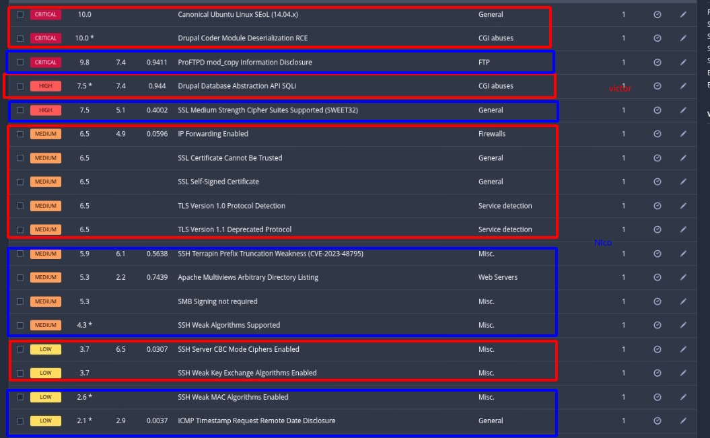

# Investigación MS3_Ubuntu

_Realizada por:_ **Nicolás Ruiz Ruiz** y **Victor Jimenez Cordero**

Hicimos el reporte con nessus y nos dió las siguientes vulnerabilidades:

- [**Base de datos**](./metasploit_jmvm55.nessus)
- [**Documento PDF**](./metasploit_j2oghf.pdf)

La investigación y comprobación de vulnerabilidades detectadas la hemos dividido de la siguiente forma:

**Victor** -> **Rojo**
**Nicolas** -> **Azul**