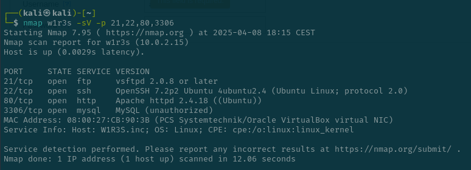
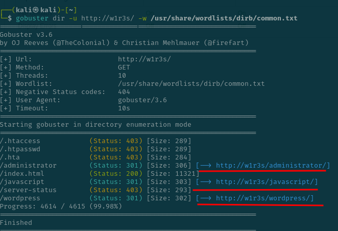
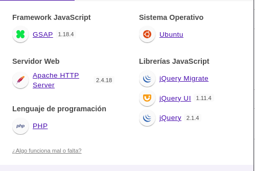
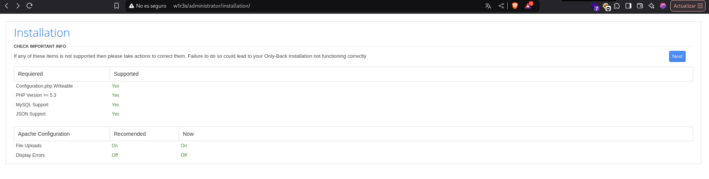
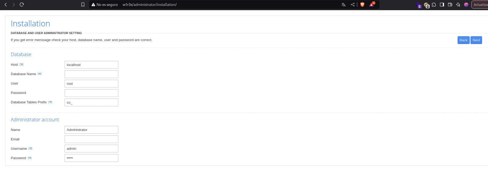
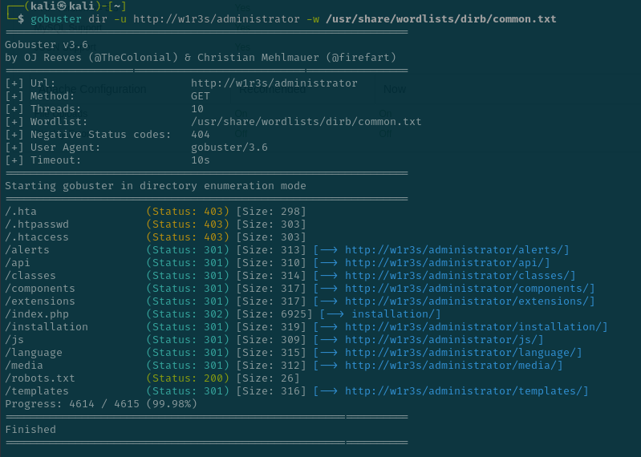
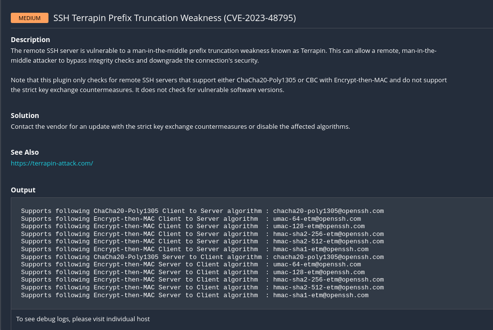
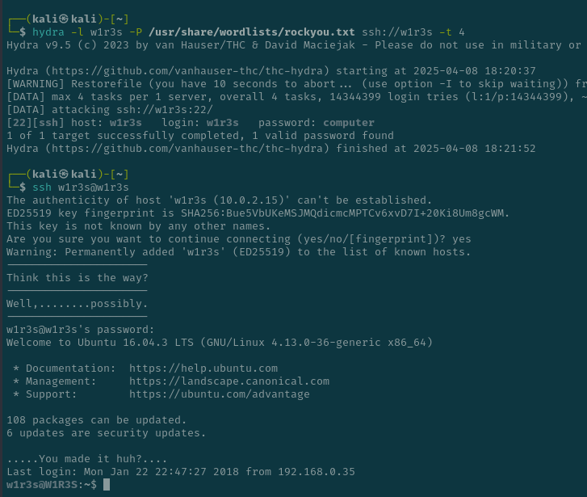
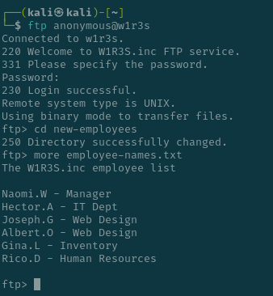
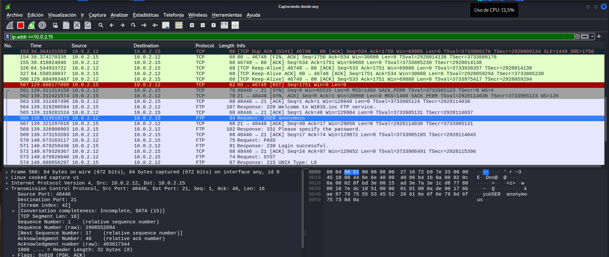

# Write ups máquina w1r3s

Tenemos 4 servicios, un ftp , ssh, un servidor http y una base de datos mysql

## Servidor http 

Escaneamos directorios del puerto 80 que es un servidor web

## `/administrator`

Esta es una vulnerbailidad de acceso no autenticado a un panel de instalación
## `Servidor openssh`

Vulnerabilidad de nessus

Vulnerabilidad propia

Por fuerza bruta se ha sacado que su contraseña es `computer` bastante insegura y me conecto por ssh

Usando el comando sudo su , me ha dado un error y se ha puesto con permisos de administrador root

Vulnerabilidad en el sistema ssh:

## `Servicio FTP`

Se puede acceder de forma anónima a el servidor ftp y se puede ver un listado de los trabajdores de la empresa, la vulnerabilidad es la siguiente

Credenciales en texto plano al acceder a los paquetes del wireshark (solo funciona una vez que te has logeado en ftp)

## Vulnerabilidades

- Acceso no autenticado a un panel de instalación
- posible ataque de man in the middle con CVE-2023-48795
- Contraseña débil de el usuario w1r3s en ssh : computer
- Comando para elevar privielgios - sudo su
- Acceder a ftp de forma anónima
- Ver credenciales de ftp en plano en wireshark
