# Proyecto 7: Attacking Enterprise Networks - Anexo

## Índice

1. [Declaración de confidencialidad](#1-declaración-de-confidencialidad)
2. [Descargo de responsabilidad](#2-descargo-de-responsabilidad)
3. [Información de contacto](#3-información-de-contacto)
4. [Metodología](#4-metodología)  
   4.1. [Reconocimiento](#41-reconocimiento)  
   4.2. [Análisis de vulnerabilidades](#42-análisis-de-vulnerabilidades)  
   4.3. [Explotación](#43-explotación)  
   4.4. [Escalada de privilegio](#44-escalada-de-privilegios)  
   4.5. [Post-explotación](#45-post-explotación)  
   4.6. [Documentación](#46-documentación)
5. [Figuras](#5-figuras)  
   5.1. [PC1-Sin nombre](#51-pc1---sin-nombre)  
   5.2. [PC2-Symfonos](#52-pc2---symfonos)  
   5.3. [PC3-Duriam](#53-pc3---duriam)  
   5.4. [PC4-Solstice](#54-pc4---solstice)  
   5.5. [PC5-Corrosion](#55-pc5---corrosion)

## 1. Declaración de confidencialidad

El presente informe de pruebas de pentesting contiene información confidencial y sensible relacionada con la seguridad de los sistemas y la red de la empresa. La divulgación, distribución o reproducción de este documento sin la debida autorización está estrictamente prohibida.

Toda la información contenida en este informe ha sido recopilada con fines exclusivos de evaluación de seguridad y está destinada únicamente para el uso del cliente o de las partes autorizadas expresamente. Cualquier uso indebido de la información proporcionada podría comprometer la seguridad de los sistemas analizados y dar lugar a consecuencias legales.

El cliente se compromete a proteger la confidencialidad de este informe y a restringir su acceso solo a personal autorizado con el fin de mitigar riesgos de seguridad y fortalecer la protección de la información evaluada.

## 2. Descargo de responsabilidad

El presente informe ha sido elaborado con el propósito de identificar vulnerabilidades y riesgos de seguridad en los sistemas evaluados. Las pruebas realizadas se llevaron a cabo en un entorno controlado y siguiendo buenas prácticas de seguridad informática. Sin embargo, no se garantiza la ausencia total de amenazas o vulnerabilidades no identificadas.

El equipo de pentesting y la entidad responsable de este informe no asumen responsabilidad alguna por el uso indebido de la información contenida en el mismo ni por daños derivados de la implementación o no implementación de las recomendaciones sugeridas. Es responsabilidad del cliente evaluar y aplicar las medidas de mitigación necesarias para mejorar la seguridad de su aplicación web.

Asimismo, este informe no debe considerarse una certificación de seguridad absoluta, ya que las amenazas y vulnerabilidades pueden evolucionar con el tiempo. Se recomienda realizar evaluaciones de seguridad periódicas para mantener la integridad y protección de la aplicación.

## 3. Información de contacto

**Empresa auditada:** Pata de Palo Corp.

**Equipo auditor:** Grupo 3, IES Rafael Alberti

**Correo de contacto:** <grupo3@g.educaand.es>

**Fecha de inicio:** 22/04/2025

**Fecha de finalización:** 5/05/2025

## 4. Metodología

Basada en estándares como OWASP, organizada en las siguientes fases:

### 4.1. Reconocimiento

Recopilación de información sobre los sistemas mediante escaneo de puertos, fingerprinting y servicios expuestos.

### 4.2. Análisis de vulnerabilidades

Identificación de vulnerabilidades conocidas utilizando herramientas automatizadas.

### 4.3. Explotación

Explotación de las vulnerabilidades para evaluar acceder al sistema.

### 4.4. Escalada de privilegios

Verificación de posibles vectores para obtener mayores privilegios.

### 4.5. Post-explotación

Extracción de información, persistencia y pivoting.

### 4.6. Documentación

Informe con todos los Figuras, métodos utilizados y mitigación.

## 5. Figuras

En esta sección se agrupan las figuras y vulnerabilidades encontradas en los sistemas planteados. Además, se añade un apartado de como conseguimos persistencia en la máquina y otro de como pivotar en la red para vulnerar los siguientes sistemas.

### 5.1. PC1 - Sin nombre

#### Escaneo PC1

- Figura 1: puertos abiertos de PC1

- Figura 2: escaneo de vulnerabilidades

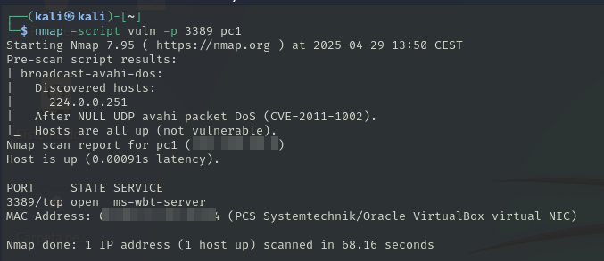

#### Vulnerabilidades PC1

- Figura 3: exploit usado

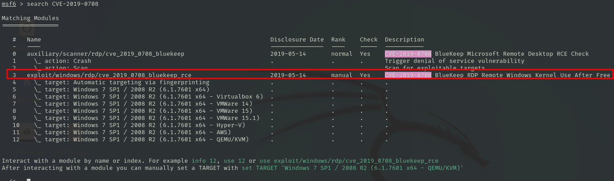

- Figura 4: inicio en el sistema

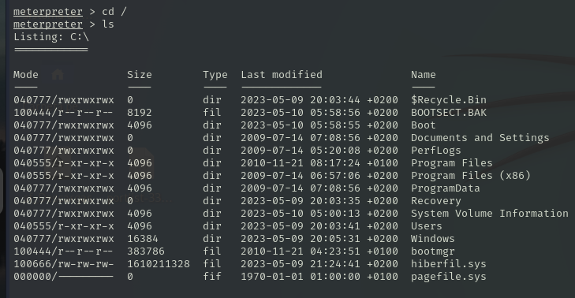

#### Persistencia PC1

- Figura 5: creación del payload

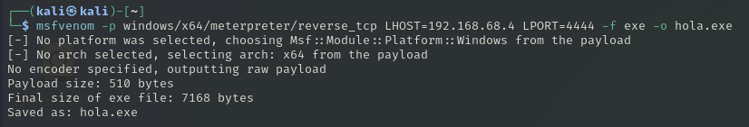

- Figura 6: exploit usado

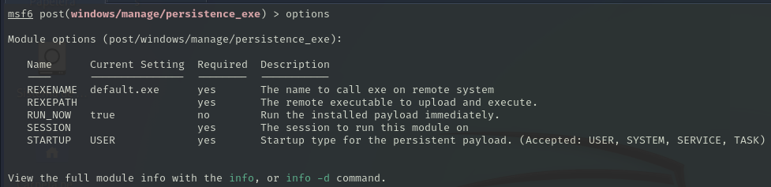

- Figura 7: Comprobación del payload

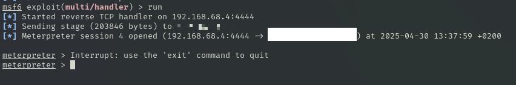

### 5.2. PC2 - Symfonos

#### Pivoting PC2

- Figura 8: exploit usado para añadir las redes de PC1

#### Escaneo PC2

- Figura 9: escaneo de puertos abiertos

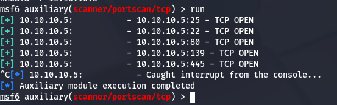

#### Vulnerabilidades PC2

- Figuras 10, 11 y 12: archivos encontrados en el SMB

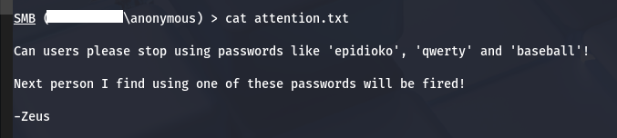

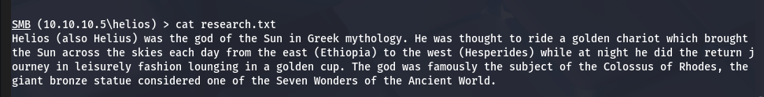

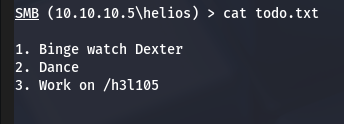

- Figura 13: wordpress instalado en la máquina

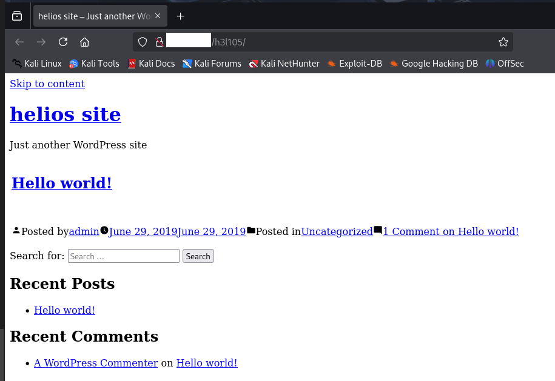

- Figura 14: plugin encontrado en carpeta _uploads_

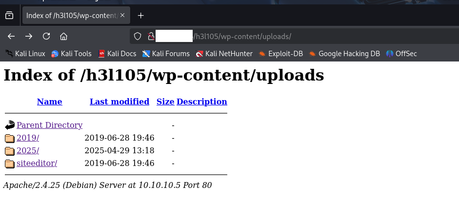

- Figura 15: exploit que permite ver archivos del sistema

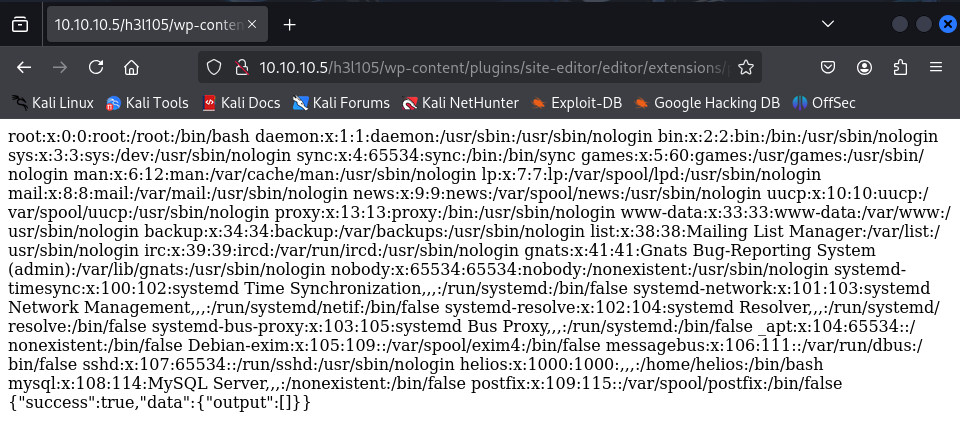

- Figura 16: correo inyectado con php

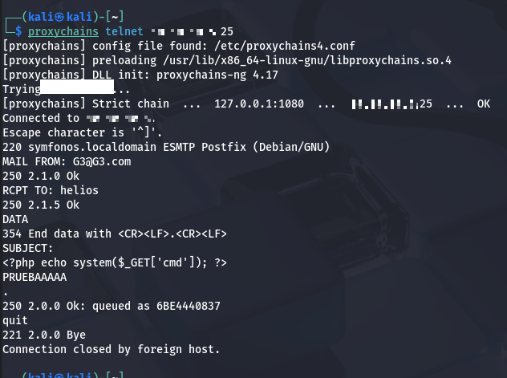

- Figuras 17 y 18: inicio en el sistema

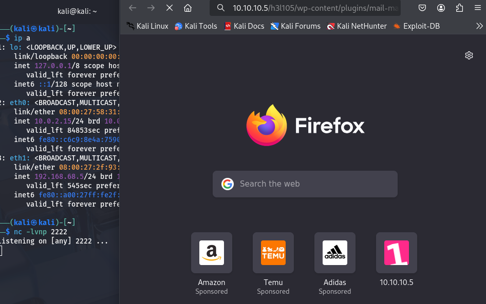

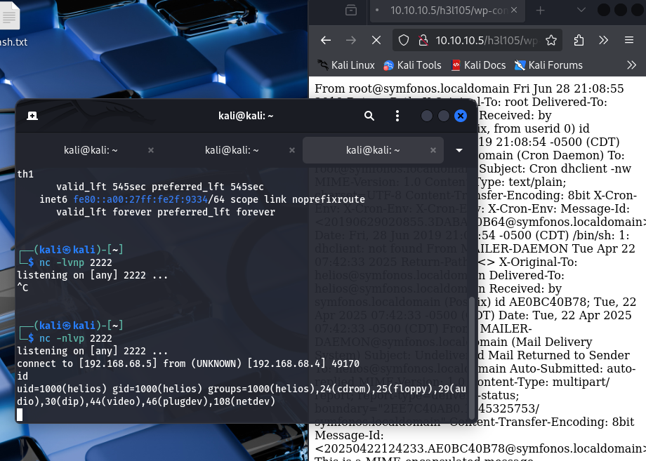

- Figura 19, 20 y 21: escalada de privilegios

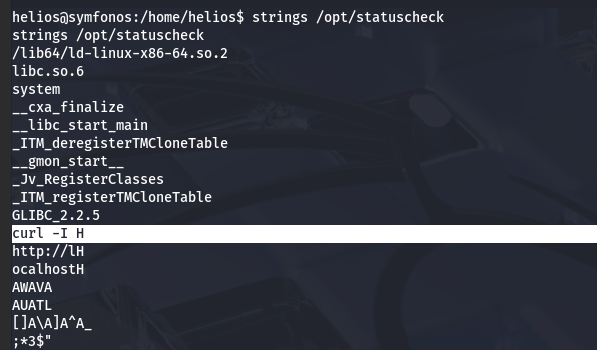

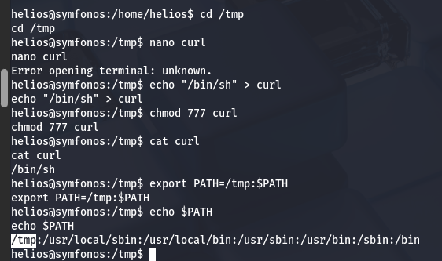

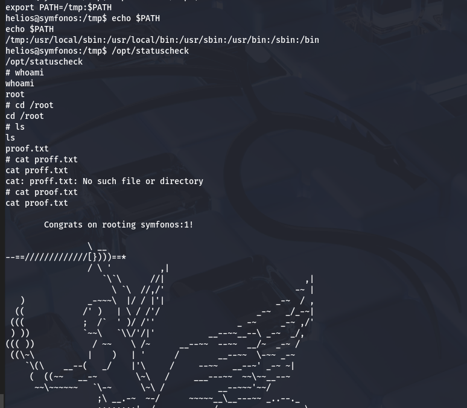

#### Persistencia PC2

- Figura 22: crear persistencia copiando clave RSA de la máquina atacante

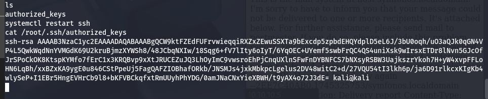

- Figura 23: comprobación

### 5.3. PC3 - Duriam

#### Pivoting PC3

- Figura 24, 25 y 26: Uso de chisel para crear un tunel desde la máquina atacante hasta Symfonos

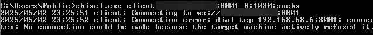

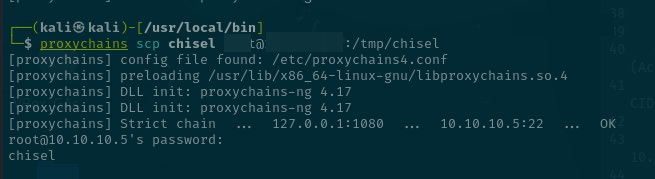

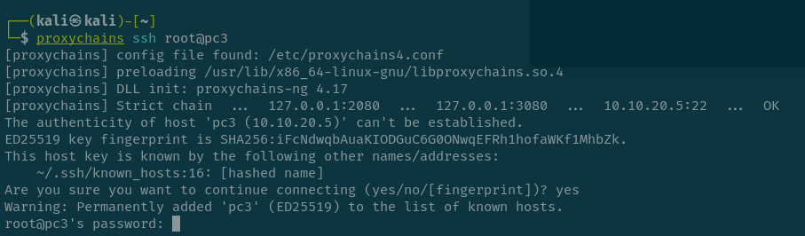

#### Escaneo PC3

- Figura 27: escaneo de puertos de PC3

- Figura 28: fuzzeo de directorios

#### Vulnerabilidades PC3

Vamos a envenenar los logs de apache , con un user agent que sea un script de php , para poder meter comandos de terminal

- Figura 29:

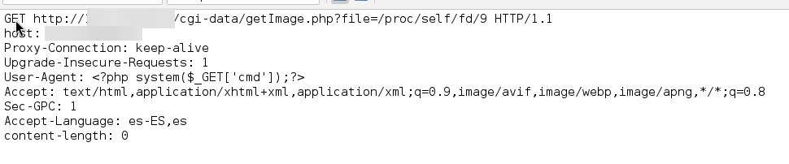

Escribimos esto en la url en el navegador

- Figura 30:

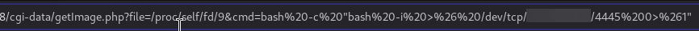

Abrimos el puerto 4445 y revisamos que se haya hecho la reverse shell

- Figura 31:

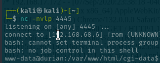

#### Persistencia PC3

Hacemos una backdoor que nos permita acceder a ssh mediante un certificado, creamos uno en nuestra máquina kali.

- Figura 32:

Ahora probamos a conectarnos y vemos que funciona perfectamente

- Figura 33:

### 5.4. PC4 - Solstice

#### Pivoting PC4

- Figura 34:

#### Escaneo PC4

#### Vulnerabilidades PC4

#### Persistencia PC4

### 5.5. PC5 - Corrosion

#### Pivoting PC5

#### Escaneo PC5

#### Vulnerabilidades PC5

#### Persistencia PC5

## 6. Hallazgos

- Hallazgo 3:

| **Description of vulnerability** | Vulnerabilidad de inclusión local de archivos (LFI) que permite ejecutar código arbitrario mediante envenenamiento de logs de Apache. |
| -------------------------------- | ------------------------------------------------------------------------------------------------------------------------------------- |
| **CVE/CWE**                      | CWE-98 (Improper Control of Filename for Include/Require in PHP Program)                                                              |
| **CVSS v3**                      | 7.8                                                                                                                                     |
| **Severity**                     | Alta                                                                                                                                    |
| **Impact**                       | Ejecución remota de comandos, obtención de acceso shell, posibilidad de escalada de privilegios a root.                                |
| **Affected systems**             | Servidor Linux con Apache y PHP vulnerable al LFI (afecta a sistemas sin validación de entradas en scripts PHP).                       |
| **Proof Of Concept (POC)**       |                                                                                            |
| **Remediation**                  | Validar y sanitizar todas las entradas de usuario; deshabilitar funciones peligrosas en PHP (`allow_url_include`, `include`, `require`); aplicar configuración segura de Apache. |
| **Reference links**              | <https://owasp.org/www-community/attacks/Local_File_Inclusion>                                                                           |
