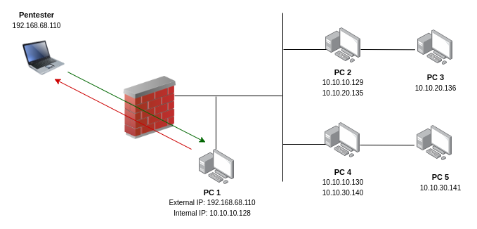
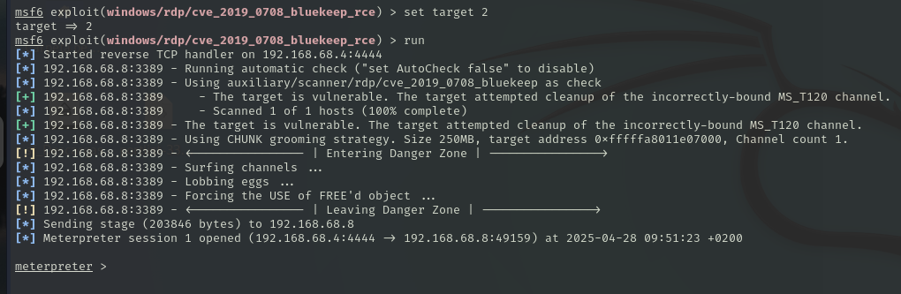
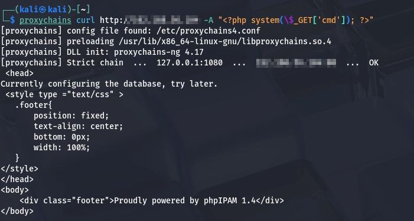

# Proyecto 7: Attacking Enterprise Networks - Informe de Auditoría

**Código**: P7

**Nombre**: Attacking Enterprise Networks

**Equipo de pentesting**: Grupo 3

**Fecha**: 24/04/2025

## Índice

1. [Resumen de la evaluación](#1-resumen-de-la-evaluación)
2. [Glosario de términos](#2-glosario-de-términos)
3. [Introducción](#3-introducción)  
   3.1. [Máquinas a auditar](#31-máquinas-a-auditar)  
   3.2. [Alcance](#32-alcance)
4. [Análisis](#4-análisis)  
   4.1. [Herramientas](#41-herramientas)
5. [Procesos](#5-procesos)  
   5.1. [PC1](#51-pc1)  
   5.2. [PC2 - symfonos1](#52-pc2---symfonos1)  
   5.3. [PC3 - Durian](#53-pc3---durian)  
   5.4. [PC4 - solstice](#54-pc4---solstice)  
   5.5. [PC5 - Corrosion](#55-pc5---corrosion)
6. [Trayectoria del ataque](#6-trayectoria-del-ataque)
7. [Índices de gravedad de los hallazgos](#7-índices-de-gravedad-de-los-hallazgos)
8. [Recomendaciones generales](#8-recomendaciones-generales)
9. [Resultados técnicos del informe](#9-resultados-técnicos-del-informe)
10. [Anexos](#10-anexos)

## 1. Resumen ejecutivo

{RESUMEN EJECUTIVO}

## 2. Glosario de términos

- **Pivoting:** Técnica que permite moverse lateralmente por una red desde una máquina comprometida.

- **Enumeración:** Recolección activa de información sobre servicios, usuarios y recursos de un sistema.

- **Escaneo de vulnerabilidades:** Detección automática de debilidades en sistemas o aplicaciones.

- **Reverse Shell:** Conexión desde un sistema comprometido hacia el atacante para obtener control remoto.

- **Proxychains:** Herramienta que permite redirigir conexiones a través de proxies.

- **Metasploit Framework:** Entorno de explotación para el desarrollo y ejecución de exploits y payloads.

- **Payload:** Código malicioso que se ejecuta tras explotar una vulnerabilidad.

- **Nmap:** Herramienta de escaneo de red y detección de servicios.

- **RDP (Remote Desktop Protocol):** Protocolo de acceso remoto a escritorios de Windows.

- **LFI (Local File Inclusion):** Vulnerabilidad que permite incluir archivos locales en una aplicación web.

- **CVE (Common Vulnerabilities and Exposures):** Identificador único para vulnerabilidades de seguridad públicas.

- **CWE (Common Weakness Enumeration):** Clasificación de tipos de fallos de seguridad en software.

- **Chisel:** Herramienta para crear túneles TCP sobre HTTP.

- **Netcat:** Herramienta de red para lectura y escritura de conexiones TCP/UDP.

- **John the Ripper:** Herramienta de craqueo de contraseñas.

- **Samba:** Protocolo de compartición de archivos e impresoras en redes Windows y Linux.

- **Proxy SOCKS:** Servidor proxy que reenvía tráfico a través de un túnel cifrado.

- **User-Agent:** Cabecera HTTP que identifica el cliente que realiza una petición.

- **Allow_url_include:** Directiva de PHP que permite incluir archivos remotos en scripts, desaconsejada por seguridad.

## 3. Introducción

### 3.1. Máquinas a auditar

El esquema y los datos de las maquinas a auditar son los siguientes:

| Nombre          | Sistema operativo      | Auditor           |
| --------------- | ---------------------- | ----------------- |
| PC1             | Windows 7 (64-bit)     | Alejandro Seoane  |
| PC2 - symfonos1 | Debian (64-bit)        | Nicolas Ruiz      |
| PC3 - Durian    | Debian (64-bit)        | Alejandro Díaz    |
| PC4 - solstice  | Debian (64-bit)        | Israel Valderrama |
| PC5 - Corrosion | Ubuntu (64-bit)        | Víctor Jiménez    |

### 3.2. Alcance

Las pruebas se han realizado en los siguientes dominios y rangos de red:

- "External" facing target host: 192.168.68.166
- Rango de red interno: 10.10.10.0/24
- Rango de red interno: 10.10.20.0/24
- Rango de red interno: 10.10.30.0/24

Se han utilizado técnicas como la enumeración y el escaneo de vulnerabilidades evitando provocar interrupciones del servicio.

## 4. Análisis

### 4.1. Herramientas

Las herramientas utilizadas han sido las siguientes:

- Nmap 7.95
- Metasploit 6.4.45-dev
- Proxychain 4.17
- msfvenom 1.4.4
- Chisel 1.10.1

## 5. Procesos

### 5.1. PC1

Primero haremos un escaneo de la red para localizar la IP y los puertos que tiene abierto la máquina que queremos vulnerar. Una vez localizado empezaremos la búsquedas de posibles explotaciones a través del puerto rdp.
Con el módulo de `winodws/rdp/cve_2019_0708_bluekeep_rce` para conseguir una shell con privilegios de administrador.

Una vez teniendo acceso con permisos de administrador hemos conseguido crear persistencdia para poder acceder cada vez que el usuario inicie sesión nos conectará al sistema con un payload que hemos creado. Hemos usado los módulos `windows/manage/persistence_exe`y `multi/handler`.

A parte hemos podido vulnerar alguna contraseña de los usuarios del sistema utilizando John the Ripper.

### 5.2. PC2 - symfonos1

{PROCESOS DE LA MAQUINA 2}

### 5.3. PC3 - Durian

{PROCESOS DE LA MAQUINA 3}

### 5.4. PC4 - solstice

Una vez visto que tenemos una subred en el sistema que hemos vulnerado (PC1) lo que hacemos es escanear la nueva red para ver que puertos tiene abierto, y para ello usamos el siguiente modulo de metasploit `auxiliary/scanner/portscan/tcp` y configuramos los parámetros, como se puede ver en la _Figura 35_ y _Figura 36_ del Anexo.

Hemos visto que tiene varias ip asociadas a esa red:

- 10.10.10.4 -> 22, 21, 25, 80, 139, 445, 2121, 3128, 8593.
- 10.10.10.5 -> 135, 139, 445, 3389, (Esta es la ip del windows).  
- 10.10.10.2 -> 135, 445, 2179, 3306, 5040, 7070, 8733,9102, 9180.
- 10.10.10.1 -> 53

Una vez que sabemos que la ip correcta es la 10.10.10.4 lo que hacemos es crear un proxy con el siguiente modulo de metasploit `server/socks_proxy` lo configuramos como se ve en la _Figura 37_ del Anexo y lo ejecutamos.

Después lo que deberemos hacer es un nmap con proxychains para ver cuales son los servicios que están ejecutándose en cada puerto como se puede ver en la _Figura 38_ del Anexo.

Como hay un servicio que no sabemos cual es, entonces para saber que servicio es hemos probado hacer curl por si tiene una página y es un servicio http. Una vez realizado el curl al puerto `8593` nos ha devuelto una página y vemos que tiene dos enlaces uno que sería a `/index.php` y otro que tiene `/index.php?book=list`.

Una vez visto esto podemos probar si tiene una vulnerabilidad de LFI para ver si nos muestra algo del sistema y hemos probado para ver si nos muestra el contenido del `/etc/passwd`y para ello lo hemos probado como se puede ver en la _Figura 39_  del Anexo.

Ahora hemos metido un payload malicioso de php en el user agent para poder vulnerar la maquina y explotarla como se ve en la _Figura 40_ y _Figura 41_ del Anexo.

Hemos puesto en escucha el puerto al que nos queremos conectar con el siguiente comando: `nc -nlvp 4444` y en otra terminal hemos puesto lo que se ven en las _Figuras 44_ del Anexo.

Una vez estando dentro hemos puesto un netcat en el puerto 1234 con el siguiente comando `nc -nlvp 1234` y en la terminal que nos hemos conseguido entramos en el directorio `/var/tmp/sv` y creamos un archivo que se llama shell.php y le hemos puesto el contenido de una reverse shell de php que hay en internet y hemos puesto en la terminal el siguiente comando `curl 127.0.0.1:57/shell.php` y ya con esto hemos mejorado la shell como se puede ver en la _Figura 45_, _Figura 46_ y _Figura 47_ del Anexo.

Entramos en /root/.ssh/ y creamos un archivo que se llama authorized_keys y pegamos el contenido de la clave pública de ssh que hemos generado. Reiniciamos el servicio de ssh.

En otra terminal intentamos entrar por ssh con el siguiente comando `ssh -i .ssh/id_rsa root@ip` como se ve en la _Figura 49_ del Anexo.

Otra de las vulnerabilidades que hemos encontrado es que el servicio del Samba es vulnerable y hemos probado el módulo de `scanner/smb/smb_login` y hemos puesto en la configuración los parámetros de USER_FILE y PASs_FILE le hemos pasados dos diccionarios y lo hemos ejecutado y nos ha creado varias sesiones como se puede ver en la _Figura 42_, _Figura 43_ y _Figura 44_ del Anexo.

### 5.5. PC5 - Corrosion

{PROCESOS DE LA MAQUINA 5}

## 6. Trayectoria del ataque

Durante la auditoría se llevó a cabo un reconocimiento inicial de la red local 192.168.68.0/24, identificando un servidor (PC1) vulnerable. Tras comprometer esta máquina, se detectó su pertenencia a una red adicional (10.10.10.0/24), lo que permitió expandir el alcance del análisis. A través de técnicas de pivoting desde PC1, se logró acceder a las máquinas PC2 y PC4, las cuales también presentaban vulnerabilidades explotables. Desde estas, se identificaron nuevas redes internas (10.10.20.0/24 y 10.10.30.0/24), que fueron igualmente mapeadas y analizadas. Finalmente, mediante técnicas de _pivoting_ desde PC2 y PC4, se comprometieron las máquinas PC3 y PC5. Este proceso evidenció una segmentación deficiente de la red interna y una falta de controles adecuados para aislar los distintos segmentos, facilitando el movimiento lateral entre máquinas comprometidas.

## 7. Índices de gravedad de los hallazgos

- **Crítica** (9.0 – 10.0)
- **Alta** (7.0 – 8.9)
- **Media** (4.0 – 6.9)
- **Baja** (0.1 – 3.9)

### PC1

- Hallazgo 1:

| **Description of vulnerability** | Fallo crítico en el protocolo RDP de Microsoft que permite ejecución remota de código sin autenticación                                                |
| -------------------------------- | -------------------------------------------------------------------------------------- |
| **CVE/CWE**                      | CVE-2014-3704 / CWE-502                                                                |
| **CVSS v3**                      | 9.8                                                                                    |
| **Severity**                     | Crítica                                                                                |
| **Impact**                       | Ejecución remota de código, toma de control total del sistema y propagación de malware. |
| **Affected systems**             | Windows 7, Windows Server 2008, Windows Server 2008 R2                                                                    |
| **Proof Of Concept (POC)**       |              |
| **Remediation**                  | Aplicar parches de Microsoft (KB4499164, KB4499175); deshabilitar RDP si no es esencial                  |
| **Reference links**              | https://cve.mitre.org/cgi-bin/cvename.cgi?name=CVE-2019-0708                                           |

### PC2

- Hallazgo X:

| **Description of vulnerability** ||
| -------------------------------- | -------------------------------------------------------------------------------------- |
| **CVE/CWE**                      |         |
| **CVSS v3**                      |         |
| **Severity**                     |         |
| **Impact**                       |         |
| **Affected systems**             |         |
| **Proof Of Concept (POC)**       |         |
| **Remediation**                  |         |
| **Reference links**              |         |

### PC3

- Hallazgo 3:

| **Description of vulnerability** | Vulnerabilidad de inclusión local de archivos (LFI) que permite ejecutar código arbitrario mediante envenenamiento de logs de Apache. |
| -------------------------------- | ------------------------------------------------------------------------------------------------------------------------------------- |
| **CVE/CWE**                      | CWE-98 (Improper Control of Filename for Include/Require in PHP Program)                                                              |
| **CVSS v3**                      | 7.8                                                                                                                                     |
| **Severity**                     | Alta                                                                                                                                    |
| **Impact**                       | Ejecución remota de comandos, obtención de acceso shell, posibilidad de escalada de privilegios a root.                                |
| **Affected systems**             | Servidor Linux con Apache y PHP vulnerable al LFI (afecta a sistemas sin validación de entradas en scripts PHP).                       |
| **Proof Of Concept (POC)**       |                                                                                            |
| **Remediation**                  | Validar y sanitizar todas las entradas de usuario; deshabilitar funciones peligrosas en PHP (`allow_url_include`, `include`, `require`); aplicar configuración segura de Apache. |
| **Reference links**              | https://owasp.org/www-community/attacks/Local_File_Inclusion                                                                           |

### PC4

- Hallazgo 4:

| **Description of vulnerability** | Local File Inclusion (LFI) que permite leer archivos locales y ejecutar código PHP malicioso inyectado vía User-Agent.                  |
| -------------------------------- | --------------------------------------------------------------------------------------------------------------------------------------- |
| **CVE/CWE**                      | CWE-98: Improper Control of Filename for Include yCWE-20: Improper Input Validation                                                     |
| **CVSS v3**                      | 7.8 (High)                                                                                                                              |
| **Severity**                     | High                                                                                                                                    |
| **Impact**                       | Lectura de archivos sensibles, ejecución remota de código, obtención de shell.                                                          |
| **Affected systems**             | Sistema web en 10.10.10.4 (servicio en puerto 8593).                                                                                    |
| **Proof Of Concept (POC)**       |                                                                                                 |
| **Remediation**                  | Validar y sanear correctamente las entradas de usuario en parámetros GET. Deshabilitar `allow_url_include` y `allow_url_fopen` en PHP.  |
| **Reference links**              | [OWASP LFI](https://owasp.org/www-community/attacks/Local_File_Inclusion), [CWE-98](https://cwe.mitre.org/data/definitions/98.html)     |

### PC5

- Hallazgo X:

| **Description of vulnerability** ||
| -------------------------------- | -------------------------------------------------------------------------------------- |
| **CVE/CWE**                      |         |
| **CVSS v3**                      |         |
| **Severity**                     |         |
| **Impact**                       |         |
| **Affected systems**             |         |
| **Proof Of Concept (POC)**       |         |
| **Remediation**                  |         |
| **Reference links**              |         |

## 8. Recomendaciones generales

Para mitigar los riesgos lo que deberíamos hacer es actualizar las versiones que contengan vulnerabilidades.

## 9. Resultados técnicos del informe

{CONCLUSIÓN DE LOS RESULTADOS DEL INFORME}

## 10. Anexos

Las figuras y hallazgos relacionados con el análisis, se encuentran recogidos en el siguiente anexo:

[Anexo auditoría](./AnexoAuditoria.md)

---

Documento redactado por **_Grupo 3_**.

Fdo:

