# Writeup del PC1

## Acceso al sistema

Lo primero que haremos será comprobar que nuestra kali esta en la misma red que el PC1.

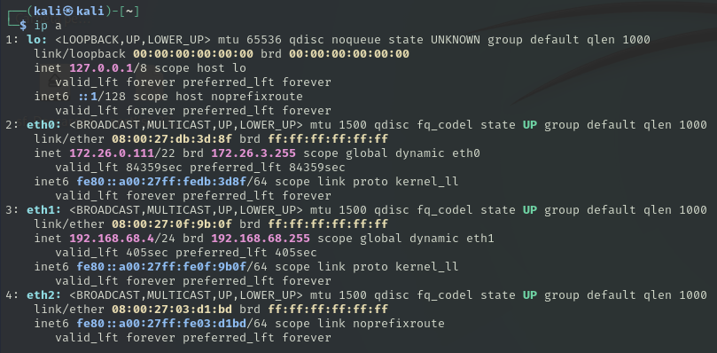

Hemos realizado un escaneo de la red 192.168.68.0/24. Le hemos asignado a la ip del PC1 un nombre de host para no revelar la IP.
En el escaneo podemos ver como tiene abierto el puero 3389 (RDP de Windows). Más abajo también nos ha encontrado datos como el nombre del ordenador en el que pone Win 7 con lo que confirmamos que es un Windows 7.

Vamos a realizar un escaneo de vulnerabilidades al puerto del PC1 a ver si podemos encontrar alguna. No nos ha encontrado nada por lo que vamos a buscar por internet.

Buscaremos alguna vulnerabilidad conocida de RDP para Windows 7.

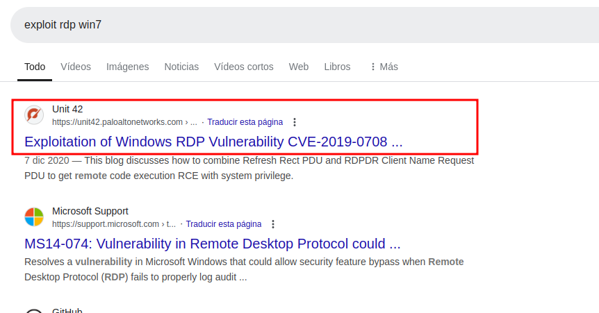

Y encontramos una vulnerabilidad llamada BlueKeep

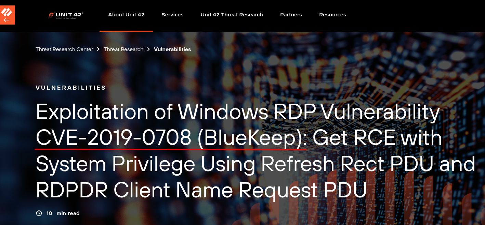

Buscaremos la vulnerabilidad en metaexploit y la seleccionaremos.

Estas son las opciones que podemos configurar en el exploit.

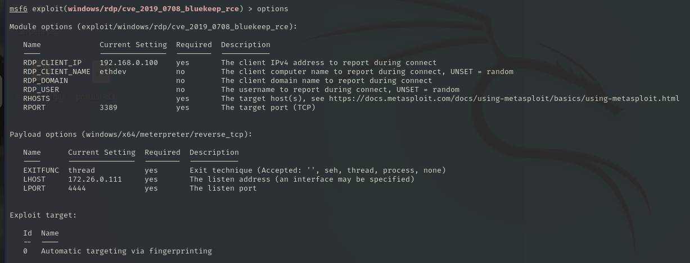

Configuraremos las opciones necesarias para que funcione correctamente el exploit.

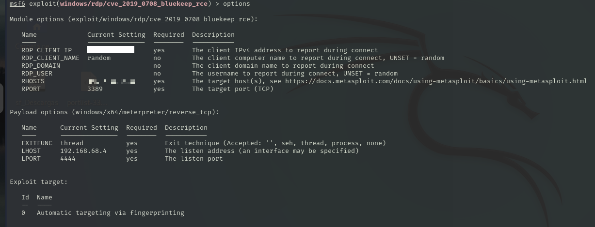

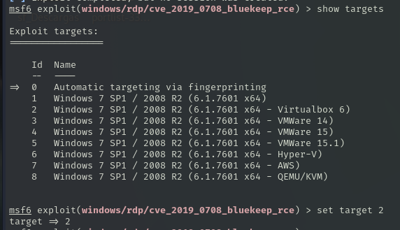

Una vez configurado el exploit lo ejecutaremos. Podemos ver como nos ha creado una shell reverse en el PC1 a través del exploit.

Vemos como somos usuarios del sistema autorizados por lo que tenemos permisos de administrador.

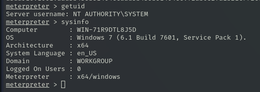

También podemos navegar por los diferentes directorios del sistema.

## Pivoting

Vamos a utilizar un modulo de metaexploit para identificar si podemos encontrar otras redes que haya en el sistema.

Primero confirmamos que tenemos guardada la sesión de meterpreter del PC1.

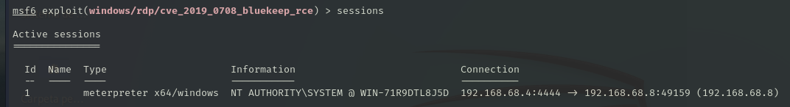

El módulo autoruote nos permitira averiguar si hay otras redes. Miramos las opciones del módulo y solo tendremos que agregar la sesión que tenemos activa.

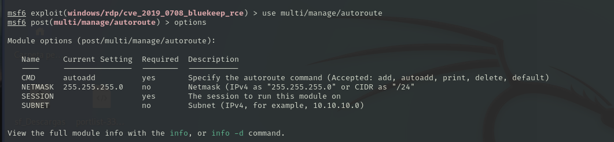

Elegimos la sesión y ejecutamos el módulo. Vemos que nos ha encontrado 2 redes.

Para verlo mejor podemos utilizar el comando `route` y nos aparecen la red 192.168.68.0/24 que es la que conocemos y también nos aparece otra la cuál es la 10.10.10.0/24 por lo cuál podemos seguir investigando esta red a ver si podemos seguir vulnerando máquinas.

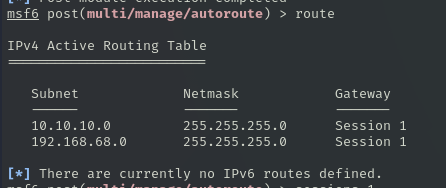

## Robo de credenciales

Como tenemos acceso a través de meterpreter podemos probar a robar las credenciales de algún usuario del sistema. Esto lo haremos con el comando `hashdump`.

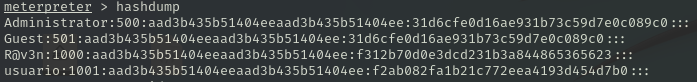

Copiamos la linea que nos sale de los usuarios del sistema 1000 (R@v3n) y 1001 (usuario). 

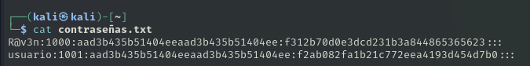

Con la herramienta JohnRipper podemos hacerle fuerza bruta a ver si podemos conseguir alguna contraseña.
Vemos que nos ha encontrado que la contraseña de usuario es usuario.

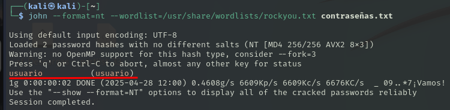

Vamos a hacer una prueba desde el sistema comprometido y efectivamente nos podemos loguear con usuario y acceder al sistema.

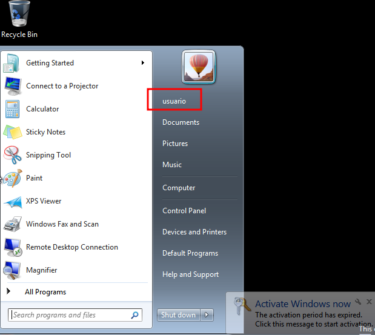

## Puerta trasera

Una vez hemos vulnerado la máquina crearemos una puerta trasera para poder acceder a ella. Para poder crear esto usaremos un payload que se active cuando un usuario inicie sesión.

Lo primero que tendremos que hacer es crear el payload de meterpreter, para esto utilizaremos `msvenom`.

Le pondremos la ruta del payload, nuestra IP, el puerto por el que vamos a escuchar y el tipo de archivo que vamos a generar junto a su nombre.

Ahora usaremos este módulo de metaexploit que nos permite generar persistencia con el payload que hemos creado.

Configuramos el módulo eligiendo las opciones que necesitemos para que funcione.

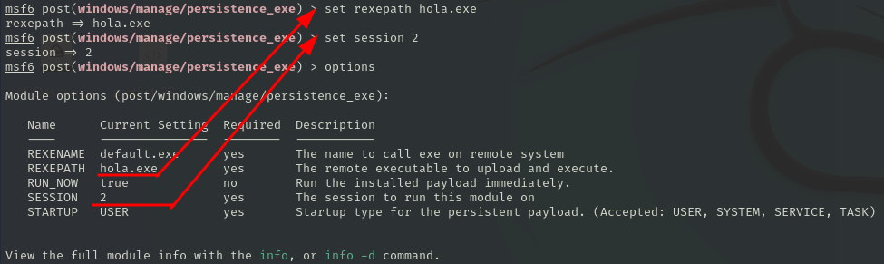

Y lo ejecutaremos. Vemos que el módulo se ha completado y nos ha generado la persistencia.
Podemos ver como ha cogido nuestro payload y lo ha metido en C:\Users\usuario\AppData\Local\Temp.

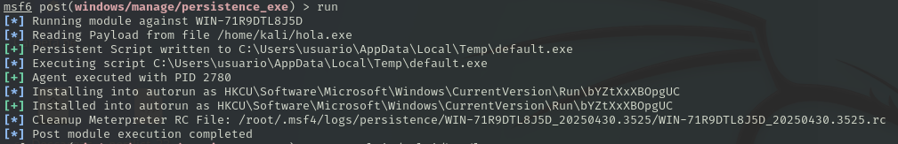

Una vez hemos generado la persistencia vamos a probar que funcione correctamente. Para elo utilizaremos el modulo de handler para ponernos en escucha hasta que el payload se ejecute.

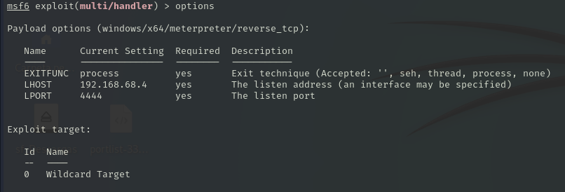

Lo ejecutamos y nos ponemos en escucha.

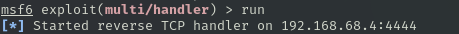

Haremos la prueba de que el usuario inicia sesión.

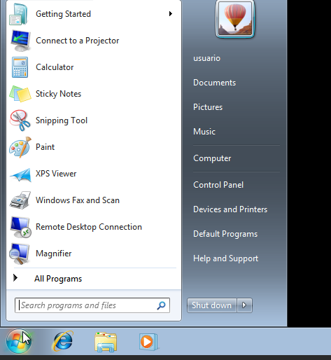

Una vez el usuario inicie sesión nos conectará con una consola de meterpreter al sistema.

Aquí podemos ver que tendríamos permisos del usuario que se ha logueado.

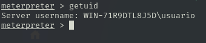