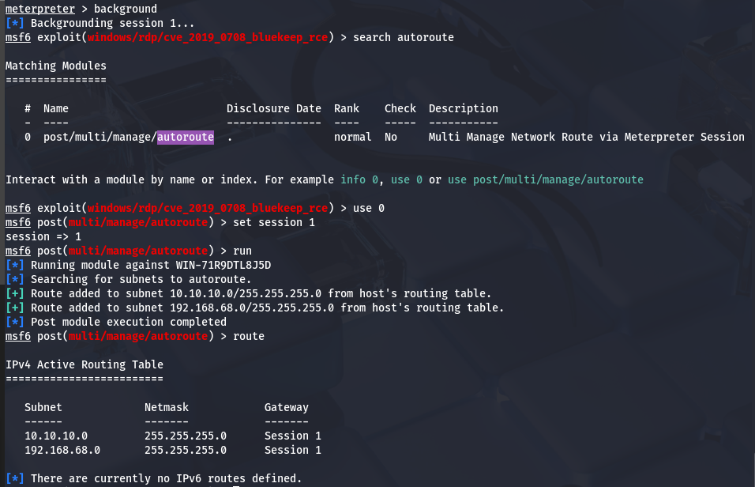
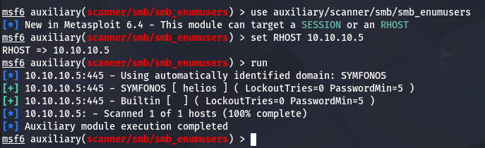
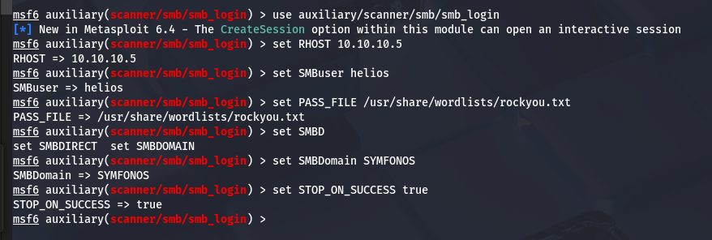
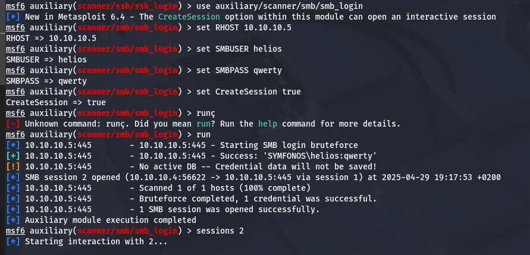
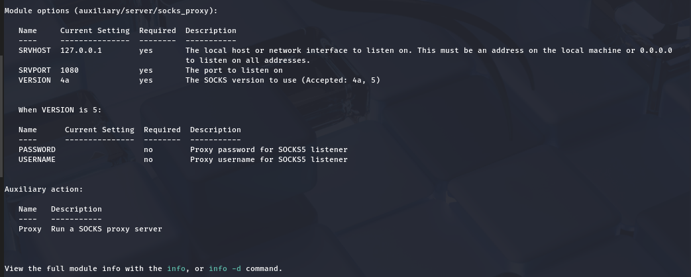
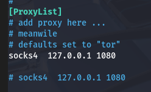
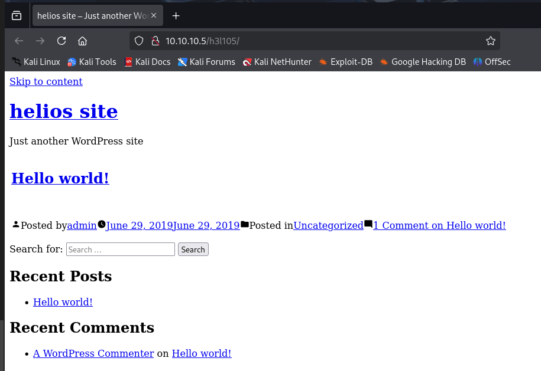

# Writeup del PC1

## Acceso al sistema

Partimos del [writeup anterior](../PC1/README.md).

Ahora tenemos que vuscar otros equipos en la red, empecemos viendo las interfaces que tiene la máquina:

Como podemos ver en la imágen, la máquina tiene 4 interfaces de red, solo nos interesan las 2 últimas, la _16_ y _17_, las cuales, para mantener la privacidad del cliente hemos censurado, mas la primera red se trata de la vista anteriormente **192.168.68.0/24** y la segunda la red **10.10.10.0/24**.

También podemos usar el siguiente módulo de metasploit para hacer exactamente lo mismo, pero lo guardamos en la sessión:

Es otra forma de ver las interfaces de red de la máquina vulnerada.
Ahora, con estas rutas podemos hacer un escaneo de equipos en esta nueva red. Para ellos usaremos el siguiente módulo:

Tras el escaneo, encontramos el equipo que estabamos buscando, y ahora que sabemos cual es, podemos hacer un scaneo completo:

A priorí, no se encuentras más puertos abiertos y solo podemos trabajar con estos.

Sabemos que el puerto 445 se trata del SMB. Podemos usar distintos mádulos para ver información del sistema:

Aquí intenté ver el sistema operativo instalado, pero dice que el _SO_ es deconocido, igualmente, podemos confirmar que tiene un SMB intalado y escuchando en la máquina.

Probemos usar otro módulo para listar los usuarios del SMB:

Encontramos un usario, igualmente censurado para mantener la privacidad. Con esto podríamos intentar realizar un fuerza bruta al servicio SMB:

> Aumentamos también los threads a 50.

El ataque de fuerza bruta a tenido existo, ahora podemos usar el siguiente módulo para vulnerar la máquina:

Dentro del SMB podemos encontrar varias carpetas compartidas:

Y en la carpeta _anonymous_ encontramos:

Y en la carpeta _helios_

Hemos encontrado varias cosas, posibles usuarios y contraseñas, vamos a crear un archivo con estos y vamos a intentar hacer fuerza bruta al _SSH_:

No funciona, en el archivo _todo.txt_ vimos tambien un directorio, probablemente del servicio web alojado en el puerto 80. Para esto vamos a necesitar hacer uso de la interfaz gráfica, por lo que tendremos que crear un proxy con el siguiente módulo:

Ahora si que podremos acceder al puerto 80 del segundo equipo, sin estar en la misma red:

Vemos que se trata de un wordpress, hagamos un escaneo:

