# Writeup del PC2

## Acceso al sistema

Partimos del [writeup anterior](../PC1/README.md).

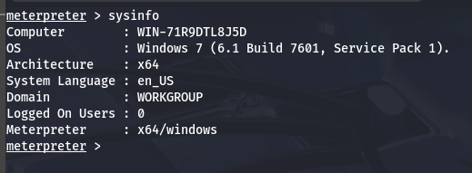

Ahora tenemos que vuscar otros equipos en la red, empecemos viendo las interfaces que tiene la máquina:

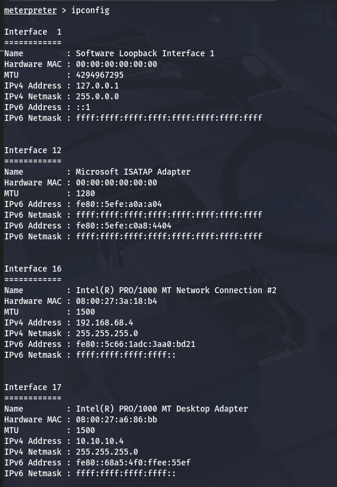

Como podemos ver en la imágen, la máquina tiene 4 interfaces de red, solo nos interesan las 2 últimas, la _16_ y _17_, las cuales, para mantener la privacidad del cliente hemos censurado, mas la primera red se trata de la vista anteriormente **192.168.68.0/24** y la segunda la red **10.10.10.0/24**.

También podemos usar el siguiente módulo de metasploit para hacer exactamente lo mismo, pero lo guardamos en la sessión:

Es otra forma de ver las interfaces de red de la máquina vulnerada.
Ahora, con estas rutas podemos hacer un escaneo de equipos en esta nueva red. Para ellos usaremos el siguiente módulo:

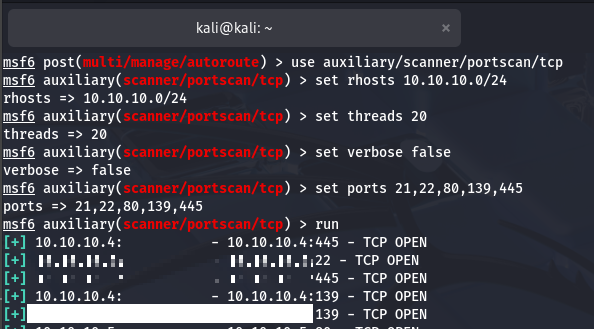

Tras el escaneo, encontramos el equipo que estabamos buscando, y ahora que sabemos cual es, podemos hacer un scaneo completo:

A priorí, no se encuentras más puertos abiertos y solo podemos trabajar con estos.

Sabemos que el puerto 445 se trata del SMB. Podemos usar distintos mádulos para ver información del sistema:

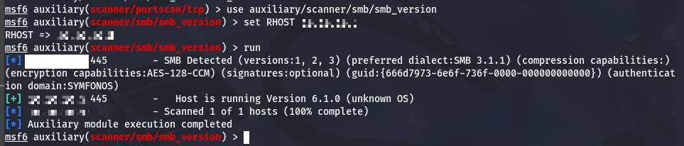

Aquí intenté ver el sistema operativo instalado, pero dice que el _SO_ es deconocido, igualmente, podemos confirmar que tiene un SMB intalado y escuchando en la máquina.

Probemos usar otro módulo para listar los usuarios del SMB:

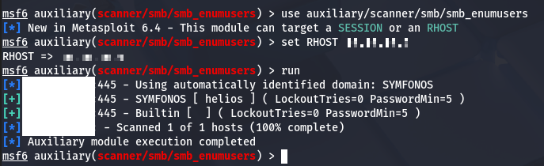

Encontramos un usario, igualmente censurado para mantener la privacidad. Con esto podríamos intentar realizar un fuerza bruta al servicio SMB:

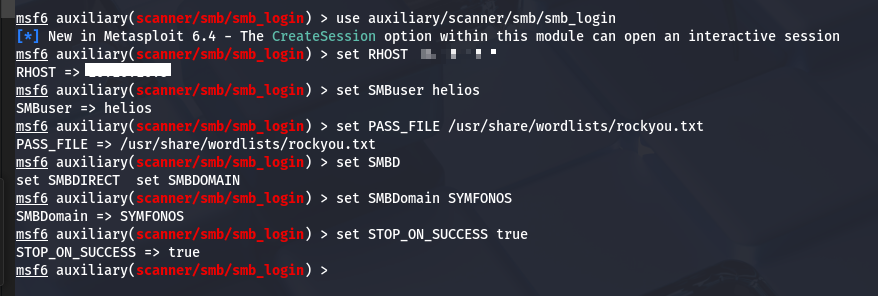
> Aumentamos también los threads a 50.

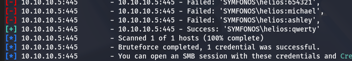

El ataque de fuerza bruta a tenido existo, ahora podemos usar el siguiente módulo para vulnerar la máquina:

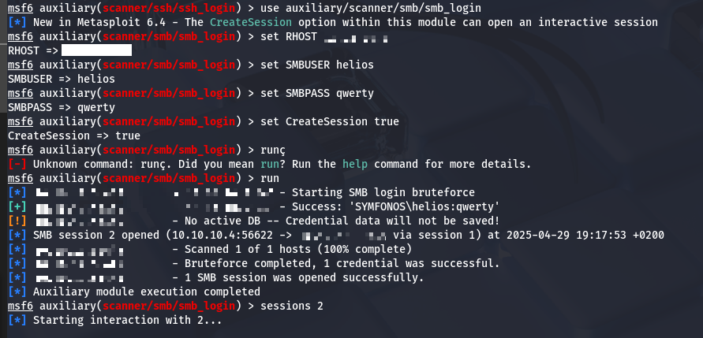

Dentro del SMB podemos encontrar varias carpetas compartidas:

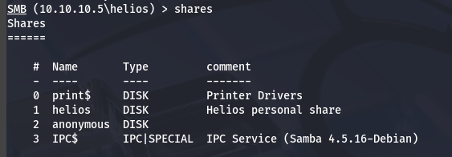

Y en la carpeta _anonymous_ encontramos:

Y en la carpeta _helios_

Hemos encontrado varias cosas, posibles usuarios y contraseñas, vamos a crear un archivo con estos y vamos a intentar hacer fuerza bruta al _SSH_:

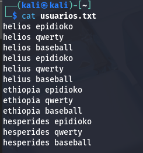

No funciona, en el archivo _todo.txt_ vimos tambien un directorio, probablemente del servicio web alojado en el puerto 80. Para esto vamos a necesitar hacer uso de la interfaz gráfica, por lo que tendremos que crear un proxy con el siguiente módulo:

Ahora si que podremos acceder al puerto 80 del segundo equipo, sin estar en la misma red:

Vemos que se trata de un wordpress, hagamos un escaneo:

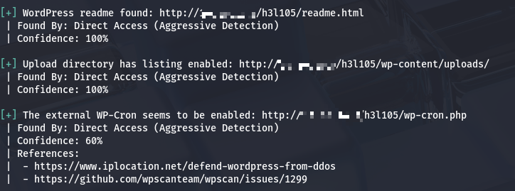

Encontramos todos estos directorios, y en _uploads_ vemos este **plugin**:

Buscando "site editor wordpress vulnerabilities" en google, encuentro este exploit:

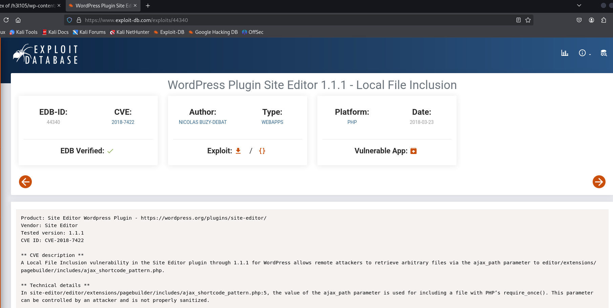

> El exploit permite ver archivos del sistema desde el navegador web.

No podemos conseguir nada relevante por aquí, probemos el puerto 25, el cual parece ser un telnet:

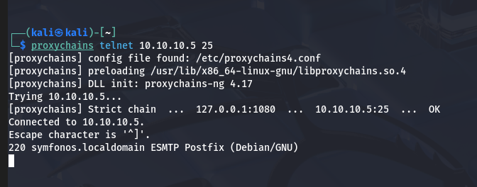

Probando, parece que acepta comandos relacionados al servidor SMPT:

De esta forma, hemos engañado al sistema de logs para inyectar código malicioso.

Si accedemos a la siguiente URL:

    http://symfonos.local/h3l105/wp-content/plugins/mail-masta/inc/campaign/count_of_send.php?pl=/var/mail/helios

Veremos el archivo _MAIL_ que acabamos de enviar:

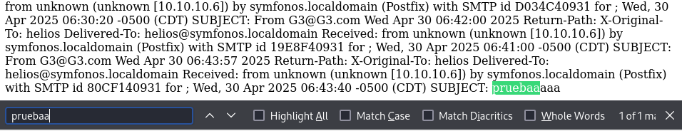

Y si, en la misma URL, añadimos:

    &cmd=(comando)

Se ejecutará ese comando en el sistema y se mostrará:

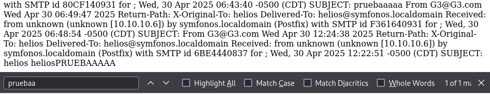

> Vemos que somos helios.

Podemos inyectar una reverse shell con la herramienta _netcat_:

Vale, problema, nosotros si que tenemos acceso a esta máquina, pero ella a nosotros no, tenemos que, desde PC1, reedirigir el tráfico de PC2 hasta nosotros.

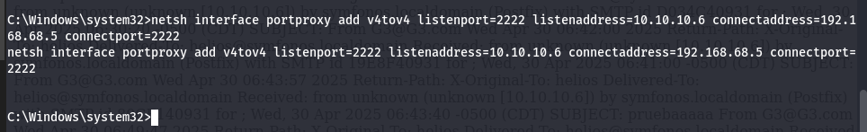

Tambien crearemos una regla en el firewall para permitir el tráfico:

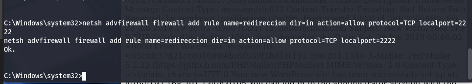

Ahora si que si, estamos dentro del sistema, tendremos que escalar privilegios para acceder como root y crear persistencia:

En el directorio del usurio solo encontramos la carpeta compartida en el smb.

No existe el comando _sudo_, por lo que tendremos que escalar de otra forma.

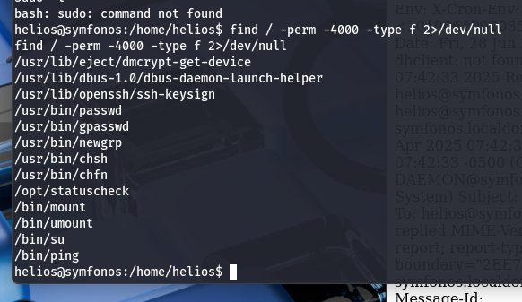

Todos estos archivos tienen activado el _SUID_, el único que destaca es el _statuscheck_. Al tratarse de un binario, tendremos que verlo con _strings_:

Esta línea suguiere que se está haciendo un CURL a las cabeceras de una URL(probablemente localhost), podriamos cambiar nuestro path para que, en lugar de ejecutar CURL, ejecute un archivo con el mismo nombre pero con el contenido que queramos.

Para no manchar la carpeta del usuario, vamos a crear los archivos necesarios en la carpeta /tmp:

Ahora, si ejecutamos el binario anterior, en luhar de usar curl, usará este escript con los permisos del root:

## Persistencia

Podemos hacerlo editando el _/etc/crontab_ del root, para que cada minuto ejecute una reverse shell, pero sería una shell muy tosca, vamos a incluir la RSA de nuestro PC en la lista de **hosts** permitidos del sistema:

Primero, tenemos que crear el par de claves en nuestra máquina kali:

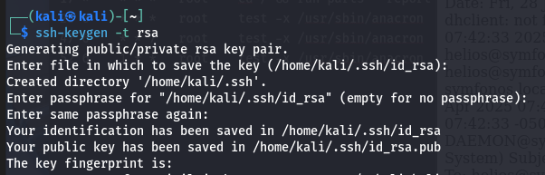

Se nos crearán 2 archivos, el que nos interesa es **/home/kali/.ssh/id_rsa.pub**, el contenido de esta lo tenemos que copiar en el archivo **/root/.ssh/authorized_keys** de la máquina:

Y ya estaría, hemos creado persistencia en la máquina y podemos acceder a ella siempre que queramos mediante ssh.