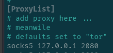
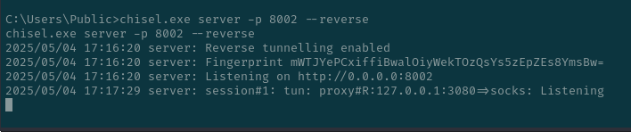
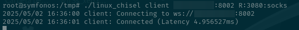
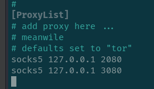
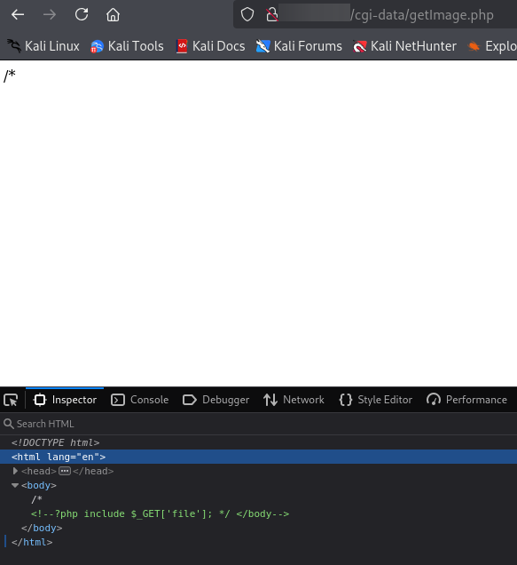

# Writeup del PC3

Partimos del [writeup anterior](../PC2/README.md)

Podemos acceder por ssh a la máquina por lo que nos vamos a instalar chisel, que convierte una máquina intermedia accesible solo por SSH en una puerta de entrada a una red que no puedes ver.
```
wget https://github.com/jpillora/chisel/releases/download/v1.10.1/chisel_1.10.1_linux_amd64.gz
gunzip chisel_1.10.1_linux_amd64.gz
mv chisel_1.10.1_linux_amd64 chisel
chmod +x chisel
```

Iniciamos el servidor en modo reverse SOCKS


Subimos mediante meterpreter el ejecutable chisel.exe a el pc1 

Desde ahí accedemos a la maquina de esta manera 


Cambiamos el archivo `/etc/proxychains4.conf` y ponemos el puerto que tienes abierto para el servidor de chisel en la kali



Comprobamos que funciona el tuenl , conectandonos por ssh a el pc2


>Vemos que el tunel ha funcionado correctamente

A continuación subimos el ejecutable chisel a el pc2 por scp


Creamos un servidor en la maquina windows (pc1)



y en el ssh creamos un acceso por cliente a el servidor de el pc1



Editamos el archivo `/etc/proxychains4.conf` y ponemos otra línea con el puerto que hemos abierto en el pc1. De forma que el archivo quede así



Comprobamos que el túnel ha sido exitoso, conectandonos por ssh a el pc3 y vemos que funciona perfectamente 


> Tenemos el pivoting hecho , ahora vamos a vulnerar la máquina

He empezado por un escaneo de inicio y ahora he puesto uno más profundo de los puertos que me dió


> Parece que tiene ssh y 4 servicios http, solo funciona ssh y el servidor http en el puerto 80 , los demas servicios te redirijen a paginas externas

He hecho un escaneo de directorios a el puerto 80


Se puede ver que hay dos carpetas y solo funciona una , ```cgi-data```.

Le he hecho otro fuzeo y sale un archivo que llamado  `getImage.php`, la cuál tiene un script en php que muestra archivos de el servidor.



Podemos ver el archivo de contraseñas


En estas contraseñas se puede ver dos usuarios

```
root
durian
```

Con esto podemos hacer una fuerza bruta a ssh y poder entrar en el sistema

No se puede sacar facilmente por lo que se me ha ocurrido envenenar con el user agent los logs de apache con ayuda de chatgpt