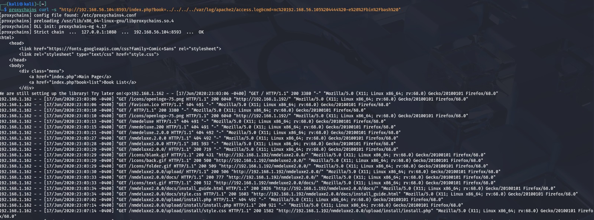
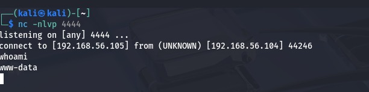
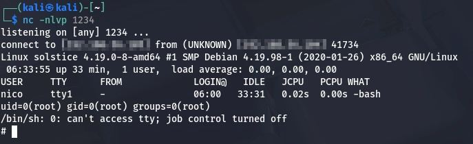
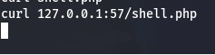
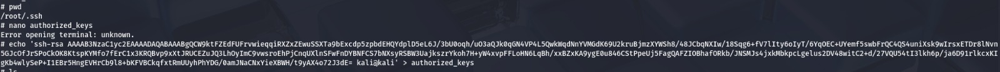
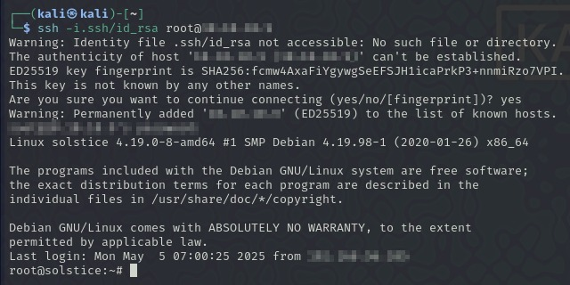

# Writeup PC4 - Israel Valderrama

## Pivoting

Una vez visto que tenemos una subred en el sistema que hemos vulnerado (PC1) lo que hacemos es escanear la nueva red para ver que puertos tiene abierto, y para ello usamos el siguiente modulo de metasploit `auxiliary/scanner/portscan/tcp` y configuramos los parametros.

Hemos visto que tiene varias ip asociadas a esa red:

- 10.10.10.4 -> 22, 21, 25, 80, 139, 445, 2121, 3128, 8593.
- 10.10.10.5 -> 135, 139, 445, 3389, (Esta es la ip del windows).  
- 10.10.10.2 -> 135, 445, 2179, 3306, 5040, 7070, 8733,9102, 9180.
- 10.10.10.1 -> 53

## Explotacion de PC4

Ahora hemos intentado saber que servicio hay en el puerto 8593 y lo que hemos probado es si hay un http y para ello le hemos hecho curl a esa dirección y hemos encontrado que hay una página detrás.

En el curl vemos que hay dos enlaces y vemos que hay una pagina que se llama `index.php` que contiene un parámetro book que lista los libros que hay. Entonces podemos probar ahora con esa url pero cambiando el parámetro de list por algún directorio de linux ya que sabemos que está alojado en un linux y por si podemos sacar algo de información.

Ahora intentamos meter en el user agent un payload de php malicioso

Ahora ponemos en escucha el puerto al que te quieras conectar con `nc -nlvp 4444` y en otra terminal ponemos lo siguiente.

Una vez dentro ponemos otro netcat en el puerto que quieras con `nc -nlvp 1234`. Y en la terminal que tenemos ya conectada la metemos un reverse shell de php que nos hemos descargado y la hemos guardado como `shell.php` y ahora ejecutamos el siguiente comando `curl 127.0.0.1:57/shell.php`.

Para ganar persistencia tenemos que crear una clave de ssh y copiamos la publica y la guardamos en `/root/.ssh/authorized_keys`

Una vez hecho eso ya probaríamos a iniciar sesión en ssh con el siguiente comando: `ssh -i  .ssh/id_rsa root@ip`, y ya estaríamos dentro.

## SAMBA

Hemos utilizado el samba para ver si podríamos conseguir acceso y para ello hemos utilizado el modulo  `scanner/smb/smb_login` de metasploit y hemos ajustados las opciones y hemos conseguido acceso a 17 sesiones de samba

