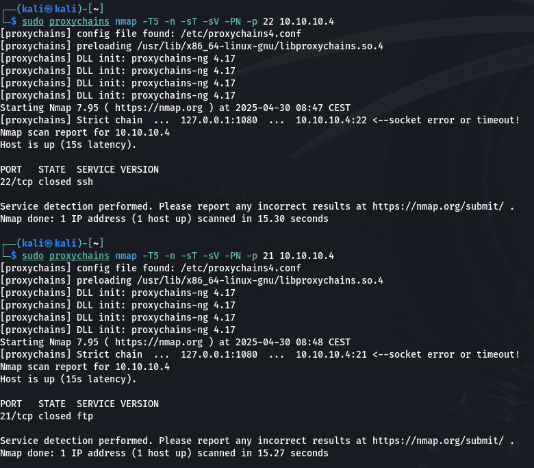

# Writeup PC4 - Israel Valderrama

## Pivoting

Una vez visto que tenemos una subred en el sistema que hemos vulnerado lo que hacemos es escanear la nueva red para ver que puertos tiene abierto, y para ello usamos el sisgueinte modulo de metasploit `auxiliary/scanner/portscan/tcp` y configuramos los parametros.

Hemos visto que tiene varias ip asociadas a esa red:

- 10.10.10.4 -> 139, 445, 80, 22, 21  
- 10.10.10.5 -> 445, 139 (Esta es la ip del windows) 
- 10.10.10.2 -> 445

## Explotacion de PC4

Utilizamos el puerto

Hemos intenado explotar el samba pero hemos visto que no tiene usuario y no tiene nada relevante el samba entonces ahora mirameos el http.

