# PC5 - Corrosion

- **Pentester**: Víctor Jiménez Corada

## Herramientas Utilizadas

- proxychains4
- nmap
- chisel
- msfvenom

## Pivoting

Para pivotar desde el PC4 al PC5 he creado un túnel usando Chisel que me permitirá poder escanear la red 10.10.30.0/24 en la que se encuentra el PC5. Para ello he descargado Chisel desde el [repositorio oficial](https://github.com/jpillora/chisel) y he levantado el servidor en el PC4 y el cliente en el PC1.

- PC1 (Windows):

  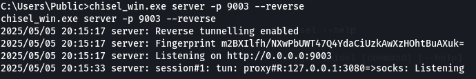

- PC4 (Linux):

  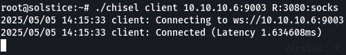

> [!IMPORTANT]  
> Podemos descargar Chisel en el PC4 usando `wget`, pero para el PC1 deberemos descargar el .exe en nuestra maquina y subirlo desde la shell de meterpreter.

Ademas de ello también sera necesario modificar la configuración en `/etc/proxychains4.conf`. El puerto 3080 sera a traves el cual conectaremos el PC1 y el PC4:

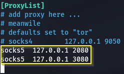

## Reconocimiento PC5

Escaneo el PC5 en busca de servicios a traves los cuales vulnerar la maquina:

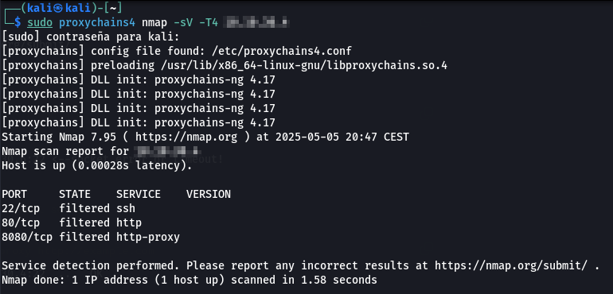

Decido escanear los directorios que pueden encontrarse en la web que se encuentra en el puerto 8080, donde encuentro el archivo `backup.zip`:

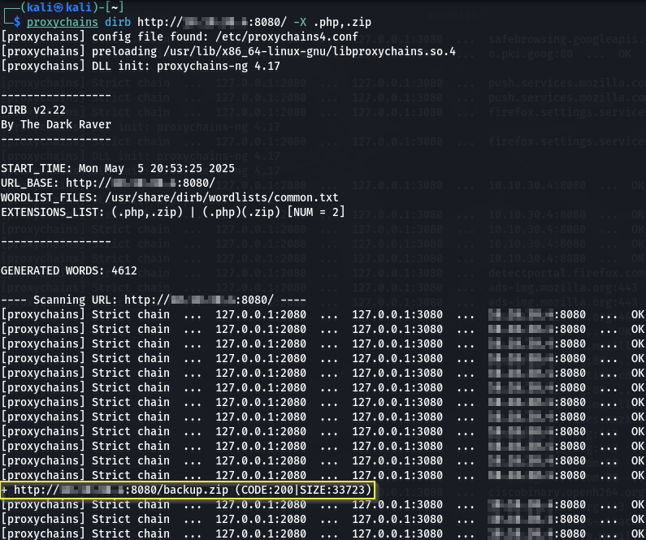

## Explotación PC5

### Apache Tomcat 9.0.53

[Descripción de la vulnerabilidad]

### Proceso de Explotación

1. Tras encontrar el archivo `backup.zip` listando los directorios de la web, intento romper su contraseña usando la herramienta fcrackzip:

   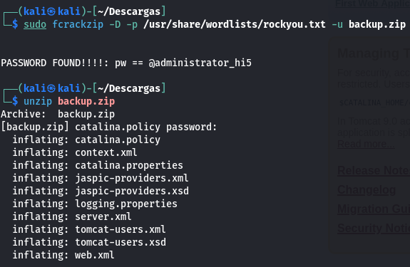

2. Tras descomprimir el zip, entre los archivos se encuentra uno llamado `tomcat-users.xml`:

   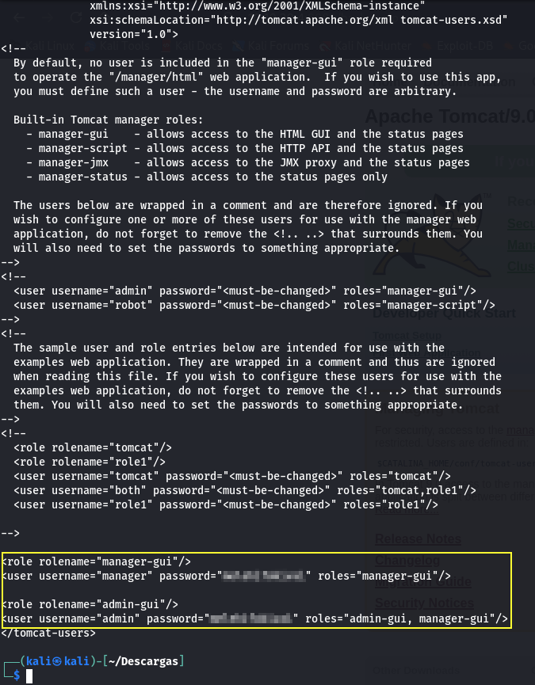

3. Tras obtener los datos de inicio de sesión del manager accedo a el desde el navegador:

   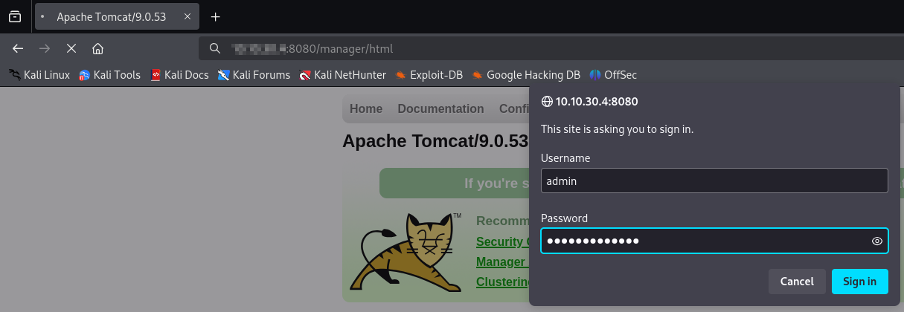
   

4. Creo un payload en formato .wav para poder desplegarlo en el tomcat y crear una reverse shell:

   - Creo el payload con msfvenom:

     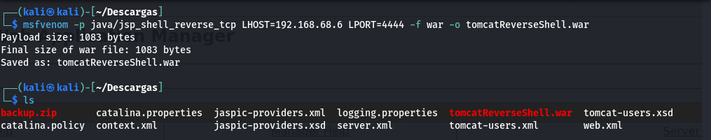

   - Lo subo a Tomcat desde el manager:

     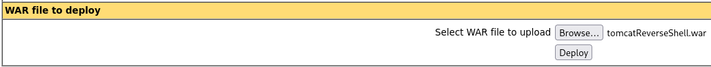
     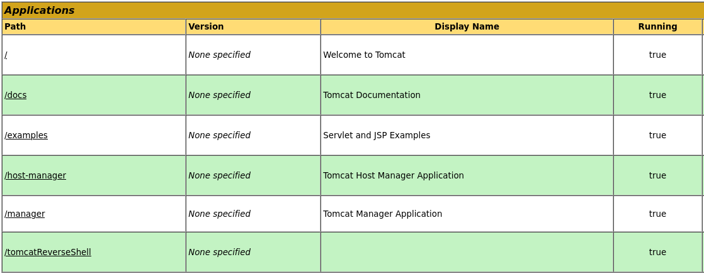

## Escalada de Privilegios

### Método de Escalada

[Descripción del método de escalada de privilegios]

### Procesos de Escalada

1. Paso 1
2. Paso 2
3. ...

## Persistencia

### Método Utilizado

[Descripción del método de escalada de privilegios]

### Procesos de Persistencia

1. Paso 1
2. Paso 2
3. ...
