# Toma de datos Windows (Alejandro S.)

> [!IMPORTANT]
> Este será mi writeup, donde iré recoginedo el proceso que he seguido para explotar las vulnerabilidades escaneadas. Ire poniendo la vulnerabilidad que estamos investigando y si hemos conseguido explotarla.

# Reparto de trabajo

Nico y yo nos hemos repartido cada nivel de vulnerabilidad de manera equitativa para que los dos hagamos las mismas críticas, altas, medias...

## Vulnerabilidades críticas

### MS11-030: Vulnerability in DNS Resolution Could Allow Remote Code Execution (2509553) (remote check)

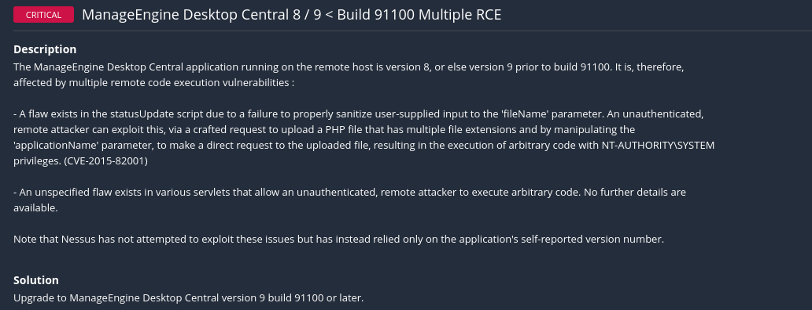

+ Descripción: es una falla crítica en la resolución DNS de Windows que permite la ejecución remota de código

+ CVE: CVE-2011-0657

+ CVSS: 10.0

+ Output

    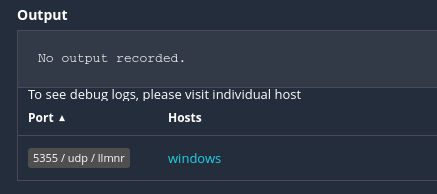

Hemos buscado en metaexploit por el nombre de la vulnerabilidad y solo nos sale una en común.

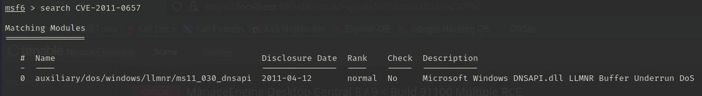

+ Options

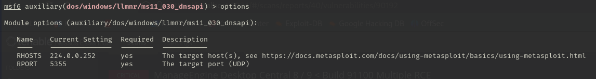

Configuramos las opciones con la IP del servidor y el puerto del servicio vulnerable.

Y por último ejetuamos el exploit.

Esto puede provocar una denegación del servicio DNS del servidor. En el mensaje nos dice que el servicio se reiniciará automaticamente 2 veces y que para asegurarnos de que esta completamente muerto esperemos 5 min y lo volvamos a ejecutar.

### ManageEngine Desktop Central 8 / 9 < Build 91100 Multiple RCE

+ Descripción: Esta vulnerabilidad afecta a ManageEngine Desktop Central versiones 8 y 9 anteriores a la compilación 91100, permitiendo la ejecución remota de código.
Estas vulnerabilidades son críticas ya que permiten la ejecución de código remoto sin necesidad de autenticación, otorgando al atacante control total del sistema afectado.

+ Output:

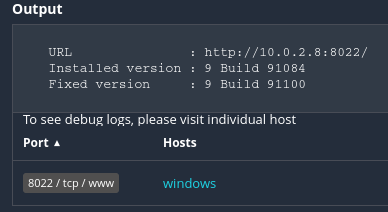

Al conectarnos vemos como efectivamente es la página del ManageEngine Desktop Central 9

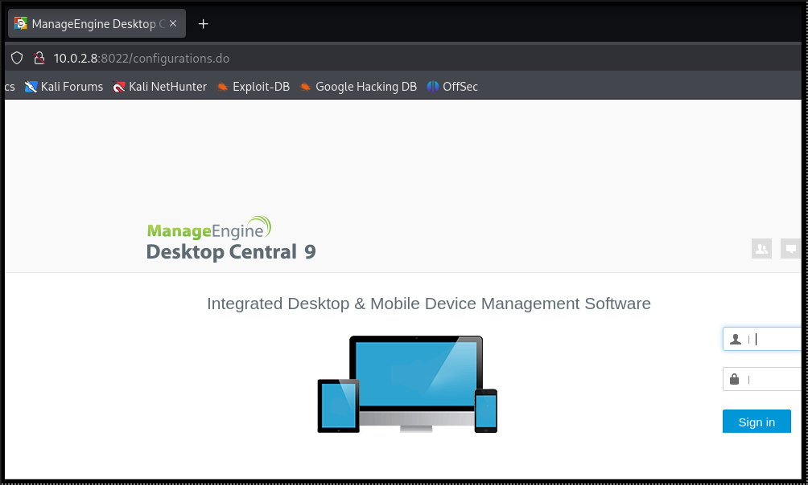

Sabiendo esto vamos a bucar en metaexploit ese nombre literalmente a ver si encontramos algo. Hay nos encuentra numerosos resultados pero hay uno que nos nombra la versión 9 por lo que vamos a utilizar ese.

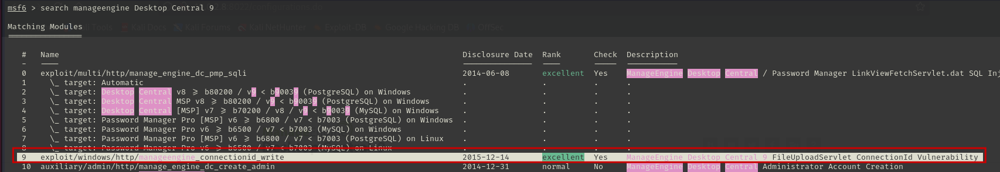

+ Options

+ Configuramos las opciones

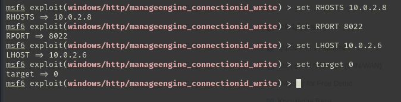

+ Ejecución exploit

Como podemos ver una vez ejecutado el exploit se introduce un payload con una reverse shell, lo que nos abre una consola con la que tenemos acceso al sistema. Hemos comprobado con que permisos y somos usuario autorizado del sistema por lo que tenemos permiso de administrador.

### Unsupported Windows OS (remote)

+ Descripción: esta vulnerabilidad indica que el sistema operativo ya no recibe actualizaciones de seguridad, lo que lo hace al servidor altamente vulnerable.

+ Output:

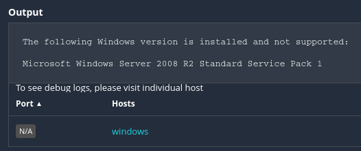

Vamos a buscar alguna vulnerabilidad que tenga relación con la version de Windows Server del servidor. En contramos un exploit de eternal blue el cuál nos permite seleccionar como target un Windows Server 2008 R2.

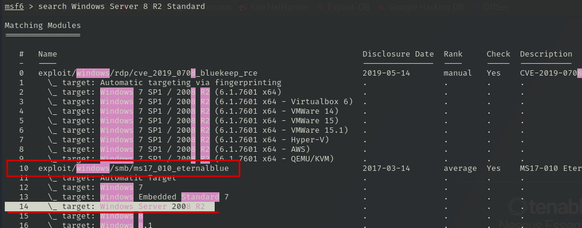

+ Options

+ Configuramos las opciones

+ Ejecución exploit

Con la ejecución del exploit conseguimos acceder al sistema a través de una payload con una reverse shell. Podemos ver que encima los permisos que nos otorga son los permisos de sistema.

### Microsoft RDP RCE (CVE-2019-0708) (BlueKeep) (uncredentialed check)

+ Descripción: esta vulnerabilidad permite ejecución remota de código (RCE) sin autenticación en versiones antiguas de Windows con RDP habilitado.

+ Output:

Vamos a buscar un exploit con el CVE que nos dan. Solo nos aparece una la cuál coincide ya que habla de BlueKeep. 

+ Options:

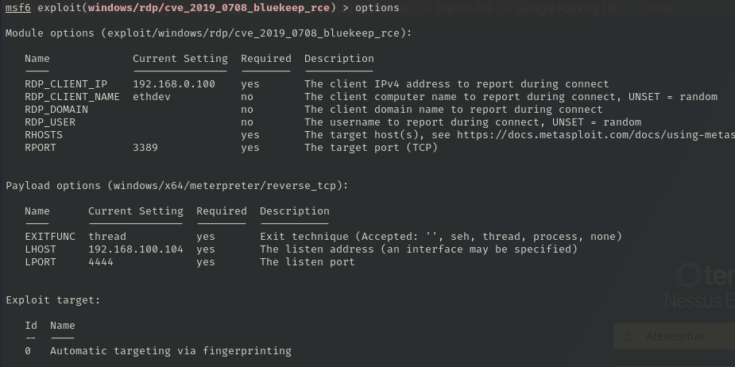

+ Configuramos las opciones:

+ Ejecutamos exploit:

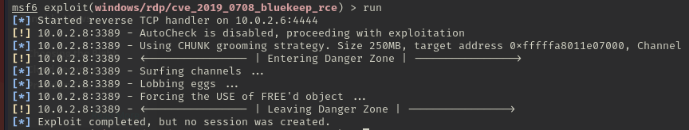

Parece ser que el exploit se ejecuta pero no nos crea ninguna sesión.

## Vulnerabilidades altas

### MS12-020: Vulnerabilities in Remote Desktop Could Allow Remote Code Execution (2671387) (uncredentialed check)

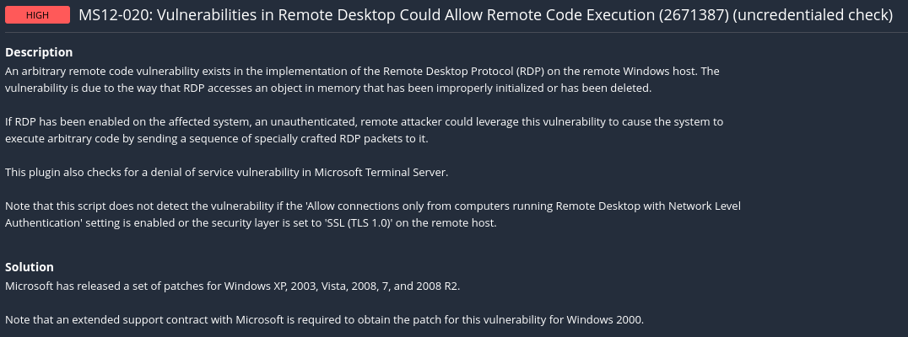

+ Descripción: esta vulnerabilidad nos permite ejecutar codigo remoto y poder hacer un ataque de denegación al servicio.
+ CVE: CVE-2012-0152, CVE-2012-0002

+ Output:

A través de los dos CVEs que nos proporcionan hemos encontrado un exploit el cuál nos permite hacer un ataque de denegación de servicio al servicio RDP.

+ Options:

+ Ejecutamos exploit:

### MS14-066: Vulnerability in Schannel Could Allow Remote Code Execution (2992611) (uncredentialed check)

+ Descripción: esta vulnerabilidad permite la ejecución de código remoto mediante paquetes TLS.
+ CVE: CVE-2014-6321

+ Output:

Hemos buscando algún exploit pero no hemos podido encontrar ninguno que se pueda ejecutar.

### 

+ Descripción: 
+ CVE: 

+ Output:

+ Options:

+ Configuramos las opciones:

+ Ejecutamos exploit: