# Toma de datos Windows (Nico)

> [!IMPORTANT]
> Vale a ver, este documento no es para entregar, es para recoger información acerca de las vulnerabilidades que vamos encontrando y viendo si son reales o no. Lo voy a hacer rollo *Write Up* de máquinas, un poco explicando que voy haciendo, como, si fallo y si lo consigo.

# Reparto de trabajo

Alenadro Seoane y yo, nos hemos dividido las vulnerabilidades encontradas de la siguiente manera:

- Vulnerabilidades críticas

- Vulnerabilidades altas

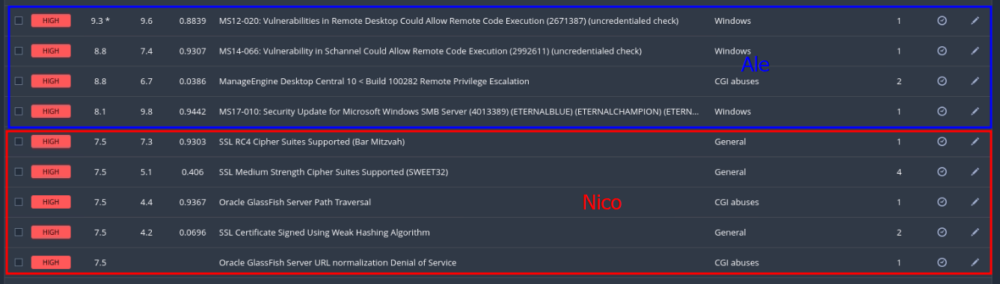

- Vulnerabilidades medias

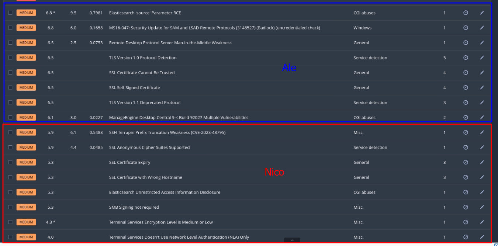

- Vulnerabilidades bajas

# Análisis

### Vulnerabilidades críticas

#### Apache Tomcat AJP Connector Request Injection (Ghostcat)

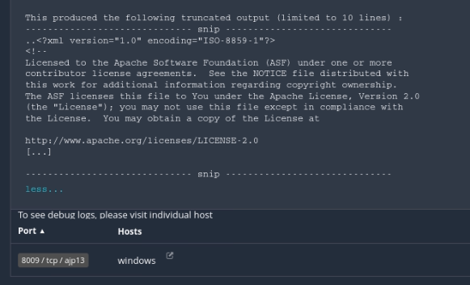

Esta vulnerabilidad permite subir archivos JavaServer Pages al servidor y poder así ejecutar código de manera remota. Busco la vulneravilidad en metasploitable:

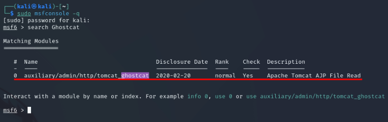

Esta es la única que aparece, miramos y cambiamos sus ajustes:

E iniciamos el exploit:

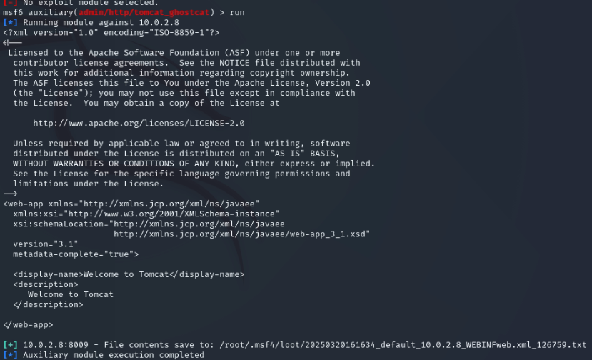
> Este contenido ya nos lo da el Nessus.

Voy a intentar subir un archivo, para ello voy a utilizar [ajpShooter.py](https://github.com/00theway/Ghostcat-CNVD-2020-10487.git)

Primero que nada, voy a crear un shell.jsp con la que voy a intentar ejecutar código en el sistema, y ahora la subo con el siguiente comando:

Parece que dan algunos errores, no consigo sacar nada de aquí.

#### Elasticsearch ESA-2015-06

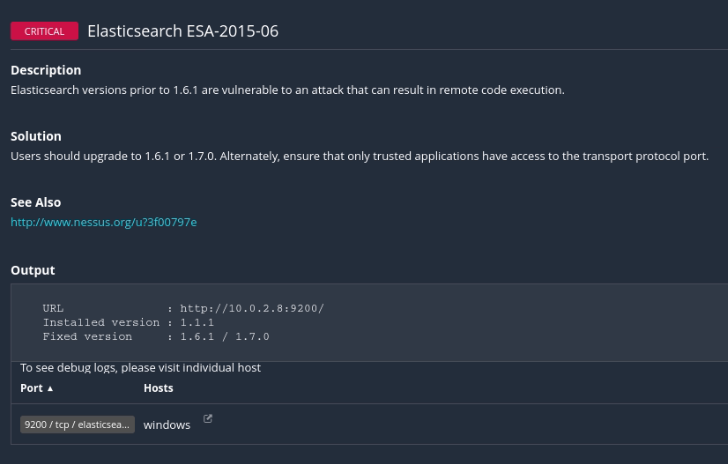

Esta vulnerabilidad nos permite ejecutar código de forma remota en el sistema a traves del protocolo Elasticsearch, lo primero que haré, es probar si el servicio está activo:

La petición nos devuelve un resultado, por lo que está funcionando. Uso mfsconsole para buscar algún módulo de expotación:

> Este es el único exploit que trata de ejecutar código de manera remota.

Ajustamos las opciones necesarias y arrancamos el exploit:

De esta forma, dmuestro que la vulnerabilidad es verídica y puede comprometer el sistema.

#### Elasticsearch Transport Protocol Unspecified Remote Code Execution

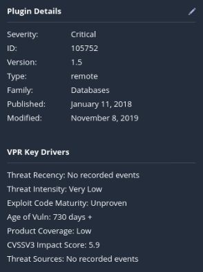
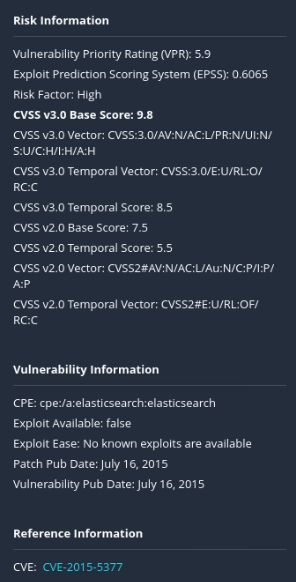

Esta vulnerabilidad se explota de la misma forma que la anterior vulnerabilidad, mismos exploits y resultados. 

#### ManageEngine Desktop Central < 10 Build 10.0.533 Integer Overflow

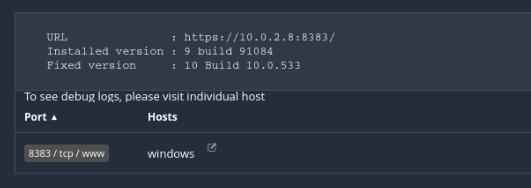

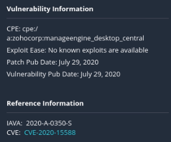

Esta vulnerabilidad permite, a traves del envío de peticiones HTTP, a los atacantes hacer una denegación de servicio o la ejecución de código arbitrário.

> [!WARNING]
> Tampoco consigo hacer nada

#### SSL RC4 Cipher Suites Supported (Bar Mitzvah)

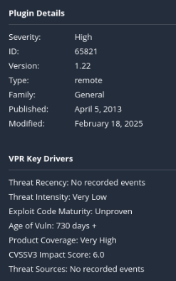

Esta vulnerabilidad explica que el host utiliza RC4 para cifrar los datos. RC4 tiene un fallo a la hora de cifrar, y es que no lo hace de manera 100% aleatoria, entonces, si pudieramos obtener miles de datos cifrados(por ejemplo cookies), podríamos llegar a descifrar todos los datos del servidor.

### Vulnerabilidades altas

#### SSL Medium Strength Cipher Suites Supported (SWEET32)

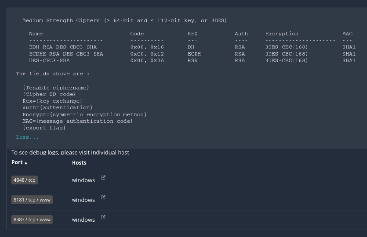

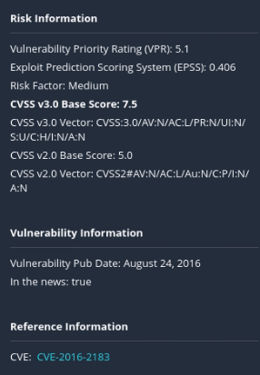

Esta vulnerabilidad explica que el host utiliza cifrado SSL de fuerza media, de 64 a 112 bits, o encriptación 3DES. Ambos son cifrados obsoletos e insuficientes.

#### Oracle GlassFish Server Path Traversal

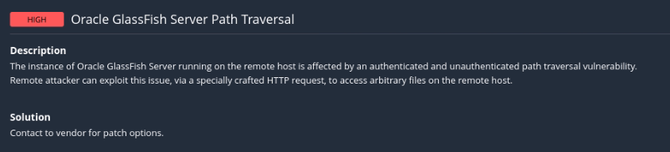
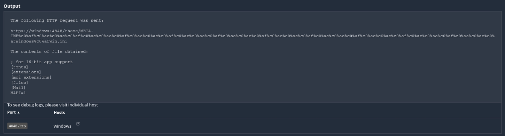

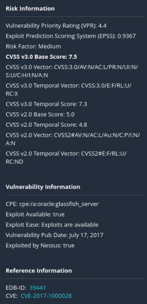

Esta vulnerabilidad permite a los atacantes acceder a archivos arbitrarios en el servidor, debido a una vulnerabilidad de cruce de rutas autenticadas y no autenticadas.

Utilizando el navegador y URLs como esta:
`https://windows:4848/theme/META-INF%c0%af%c0%ae%c0%ae%c0%af%c0%ae%c0%ae%c0%af%c0%ae%c0%ae%c0%af%c0%ae%c0%ae%c0%af%c0%ae%c0%ae%c0%af%c0%ae%c0%ae%c0%af%c0%ae%c0%ae%c0%af%c0%ae%c0%ae%c0%af%c0%ae%c0%ae%c0%af%c0%ae%c0%ae%c0%afusers`
podremos ver el contenido de la carpeta users:

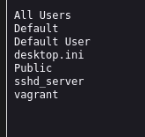

Si al final de la URL, le añadimos:
`%c0%afvagrant`
listaremos el contenido de la carpeta de `vagrant`

#### SSL Certificate Signed Using Weak Hashing Algorithm

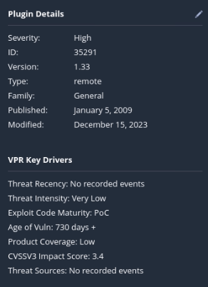

Esta vulnerabilidad explica que el host utiliza algoritmos criptográficos débiles, permitiendo a los atacantes falsificar certificados y hacerse pasar por el verdadero host.

#### Oracle GlassFish Server URL normalization Denial of Service

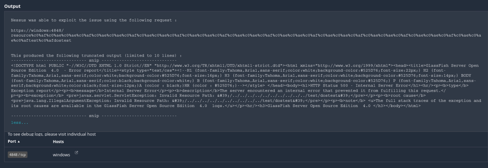
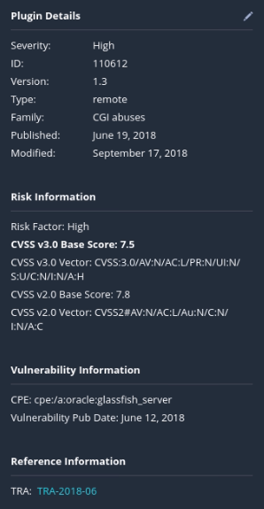

Esta vulnerabilidad detecta una falla de denegación de servicio en el servidor Oracle GlassFish. La vulneravilidad es el resultado de un loop infinito en la función normalize() y se puede explotar mandando peticioenes a la consola del administrador.

### Vulnerabilidades medias

#### SSH Terrapin Prefix Truncation Weakness (CVE-2023-48795)

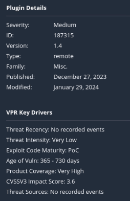
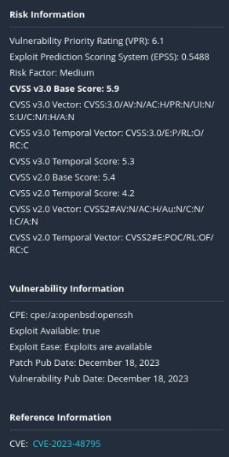

Esta vulnerabilidad explica que el servidor SSH es vulnerable a Terrapin, lo que permite ataques de man-in-the-middle.

#### SSL Anonymous Cipher Suites Supported

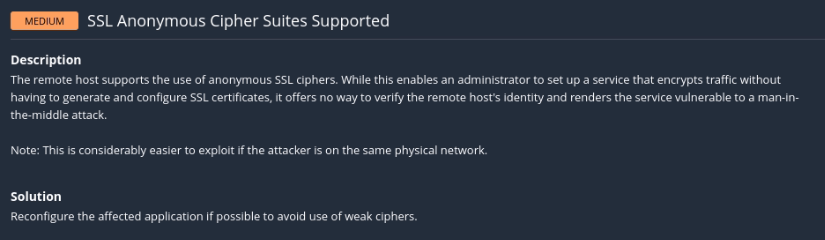

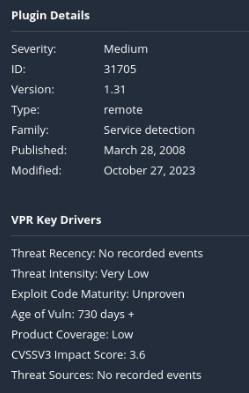

#### SSL Certificate Expiry

#### SSL Certificate with Wrong Hostname

#### Elasticsearch Unrestricted Access Information Disclosure

#### SMB Signing not required

#### Terminal Services Encryption Level is Medium or Low

#### Terminal Services Doesn't Use Network Level Authentication (NLA) Only