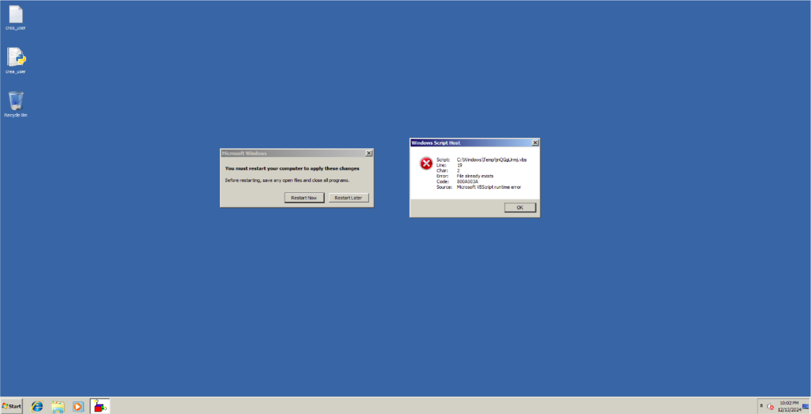

# Clasificación, valoración y documentación de incidentes

Hecho por:

- Víctor Jiménez
- Israel Valderrama
- Alejandro Seoane
- Nicolas Ruiz
- Alejandro Díaz

## Indice

1. [Introducción](#1-introducción)
2. [Estado inicial](#2-estado-y-contexto-inicial)
3. [Información técnica](#3-información-técnica)
4. [Evaluación del impacto](#4-evaluación-del-impacto)
5. [Acciones y contramedidas](#5-acciones-y-contramedidas)
6. [Anexos](#6-anexos)

## **1. Introducción**

Este documento recoge la imformación obtenida de los informes realizados por el grupo 3. Está basado en un incidente de ciberseguridad que hemos detectado en el departamento de IT, donde una máquina fue afectada por la instalación de un sistema operativo Windows "pirata" y por la instalación de un script malicioso y la explotación de una vulnerabilidad de un servicio Web para crear usuarios administradores. El objetivo es ver el impacto en la empresa y definir unas medidas que permitan mitigar esta vulnerabilidad para futuros incidentes y mejorar la seguridad la organización.

## **2. Estado y contexto inicial**

Somos citados por la empresa el día _13 de diciembre de 2024_ a las 09:00 de la mañana, nos informan que, un equipo del departamento de informática ha sido comprometido. Decidimos hablar con el dueño de la máquina, John Doe, el cual no nos aclara nada de lo que podría haber pasado en el equipo.

Al llegar al puesto de trabajo, nos lo encontramos el equipo de la siguiente manera:

Apreciamos varias cosas importantes:

- Dos archivos en el escritorio
- Una ventana que precisa reiniciar la máquina para aplicar la configuración
- Una ventana de error de un script en una carpeta temporal

## **3. Información técnica**

Estos son los incidentes que hemos encontrado y su información correspondiente

- Scripts maliciosos en carpeta temporal
- Explotación de vulnerabilidad web para crear usuarios administradores
- Activación de windows mediante KMSpico

| **Aspecto**         | **Scripts maliciosos en carpeta temporal**                                                   | **Explotación de vulnerabilidad web para crear usuarios administradores**                                                    | **Activación de Windows mediante KMSpico**                                                                             |
| ------------------- | -------------------------------------------------------------------------------------------- | ---------------------------------------------------------------------------------------------------------------------------- | ---------------------------------------------------------------------------------------------------------------------- |
| **Categoría**       | Contenido malicioso - Configuración de malware                                               | Ejecución remota de código (RCE)                                                                                             | Malware introducido por software no autorizado                                                                         |
| **Impacto**         | Bajo                                                                                         | Crítico                                                                                                                      | Crítico                                                                                                                |
| **Peligrosidad**    | Muy alta                                                                                     | Crítica                                                                                                                      | Crítica                                                                                                                |
| **Prioridad**       | Media                                                                                        | Emergencia                                                                                                                   | Emergencia                                                                                                             |
| **Detalles**        | Configuración no autorizada que permitió la introducción de código malicioso.                | El atacante empleó un payload malicioso mediante un desbordamiento de búfer para crear usuarios administradores.             | Introducción de malware a través de KMSpico, un software ilegal para activar Windows sin licencia.                     |
| **Causa principal** | Configuración insegura que permitió introducir scripts maliciosos en carpetas temporales.    | Vulnerabilidad en la biblioteca ImageLoad.dll que permitió el desbordamiento de búfer y ejecución de código remoto.          | Instalación de un sistema operativo no autorizado sin las actualizaciones de seguridad necesarias.                     |
| **Consecuencia**    | Ejecución de scripts maliciosos sin autorización.                                            | Creación de cuentas administradoras con acceso total al sistema comprometido.                                                | Introducción de malware que explotó vulnerabilidades conocidas.                                                        |
| **Riesgos**         | 1. Riesgo de ejecución adicional de código malicioso. 2. Posible escalada de privilegios. | 1. Riesgo de pérdida total del control del servidor. 2. Propagación del ataque hacia otros servicios y sistemas críticos. | 1. Alto riesgo de acceso no autorizado. 2. Posibilidad de propagación del ataque a otros sistemas dentro de la red. |

## **4. Evaluación del impacto**

El impacto del incidente fue significativo, afectando tanto la integridad como la confidencialidad de los datos corporativos. El atacante logró acceder a sistemas de la empresa, comprometiendo información sensible. Este ataque también representó un riesgo considerable para otros dispositivos conectados a la misma red interna, ya que podrían ser utilizados para infectar el malware a los otros equipos. El personal de IT, que tiene acceso a sistemas críticos, fue especialmente vulnerable durante el incidente. Este ataque destaca la necesidad de mejorar los controles internos y las prácticas de gestión de licencias para prevenir vulnerabilidades similares en el futuro.

## **5. Acciones y contramedidas**

Es necesario aislar completamente el equipo hasta asegurar que esté libre de malware que puedan comprometer los servicios de la empresa, hacer una limpieza exhaustiva del equipo para eliminar los archivos descubiertos en este análisis y concienciar al empleado del uso correcto de las herramientas de trabajo.

### Acciones en la contención del incidente

- Identificación y aislamiento del equipo: deberemos desconectar de la red el equipo para evitar la propagación del malware a otros sistemas de la empresa.   
Realizaremos un análisis para determinar el alcance del ataque y los archivos que están involucrados

- Análisis del malware: investigaremos sobre los scripts que se han encontrado en la carpeta temporal, donde los enviaremos a una máquina virtual para su análisis detallado.  
También hemos identificado en el script `create_user.py` realizaba conexiones al puerto 8089 por lo que en el firewall hemos bloqueado dicho puerto.

- Eliminar software no autorizado: desinstalaremos la aplicación KMSpico y el sistema Windows que activamos con dicha aplicación.  
Haremos una reinstalación de Windows autorizado con las últimas actualizaciones.

- Revisión y monitoreo del sistema: revisaremos en el servidor al que se conectaba si se han creado usuarios administradores de manera fraudulenta. Haremos si es preciso cambio de contraseñas.  
Implementaremos un servicio de monitoreo ante actividad inusual en el equipo y los sistemas de red de la empresa. 

### Contramedidas preventivas

- Gestión de licencias y software autorizado: implementaremos políticas de uso de softwares autorizados y con licencia. Se pueden realizar periodicamente auditorías para comprobar el cumplimiento de estas políticas.

- Actualización del sistema: establecer un proceso de actualizaciones del sistemas y las aplicaciones. 

- Capacitación del personal: establecer programas de formación a los empleados para concieciar sobre este tipo de malwares  y vulnerabilidades. 

- Plan de resiliencia: amte posibles ataques lo ideal es tener un plan de resiliencia para evitar la interrupción de la acitividad (realizar copias de seguridad podría ser un ejemplo). 

## **6. Anexos**

- [Informe Nicolás Ruiz](./Informe%20Incidentes%20Nicolas.pdf)
- [Informe Víctor Jiménez](./VictorJimenez.md)
- [Informe Alejandro Seoane](./AlejandroSeoane.md)
- [Informe Israel Valderrama](IsraelValderrama.md)
- [Informe Alejandro Díaz](AlejandroDiaz.md)

## **Implementación de Consejos**

| **Consejo**                                 | **Aplicación en el Informe**                                                                                                                     |
| ------------------------------------------- | ------------------------------------------------------------------------------------------------------------------------------------------------ |
| Definir una estructura base                 | El informe está organizado en secciones claras como "Introducción", "Evaluación del impacto" y "Acciones y contramedidas"                        |
| Distinguir hechos de hipótesis              | Se incluyen los "aspectos clave para notificar" y "evaluación del impacto", las hipótesis y recomendaciones están en "Acciones y contramedidas". |
| Documentar todas las actividades realizadas | Se dice cada acción, desde la identificación hasta la recuperación, en "acciones y contramedidas" y "anexos".                                    |
