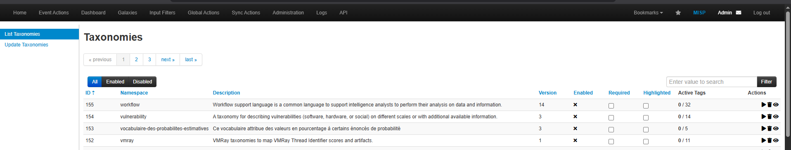
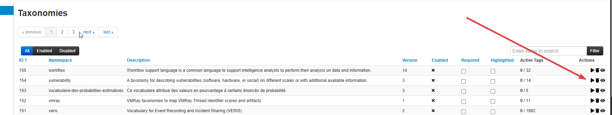
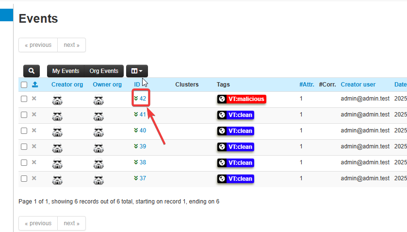
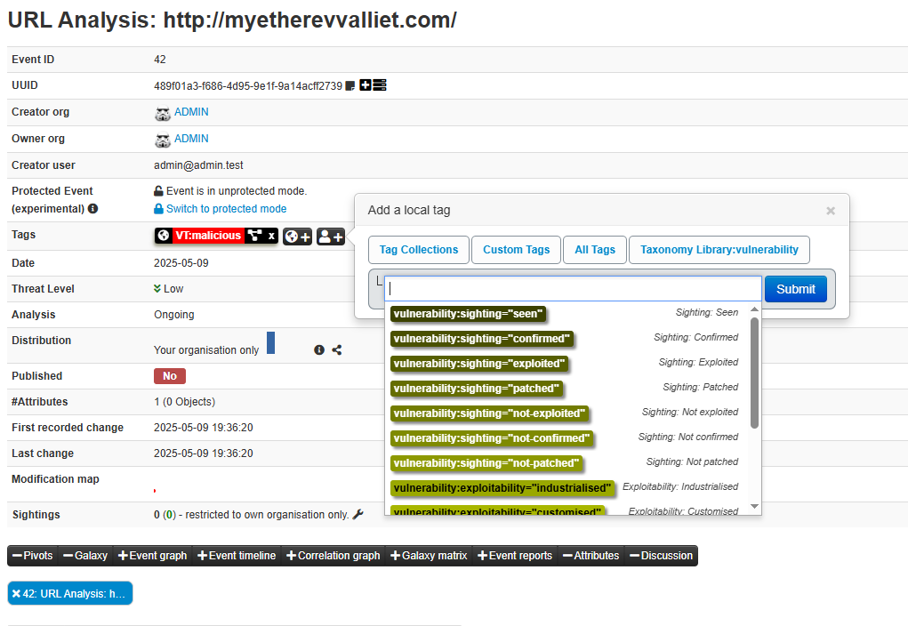
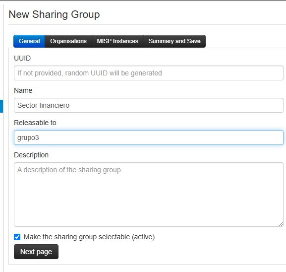
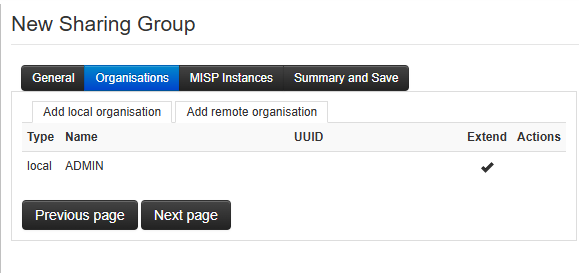
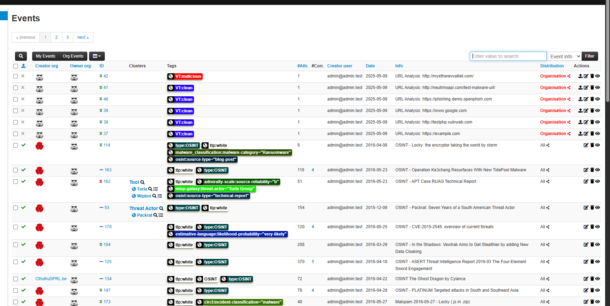
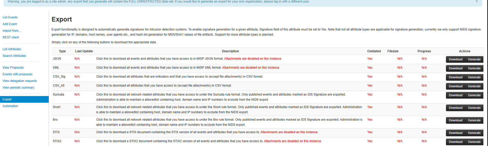
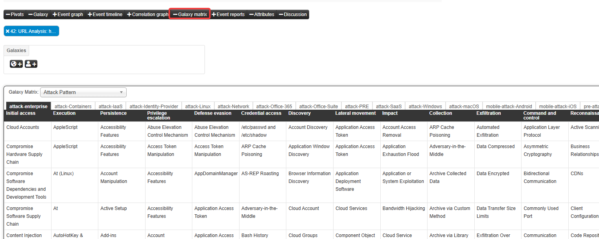

# MISP

Herramienta de Threat intelligence


**Por defecto**
- correo : admin@admin.test
- contra : admin

### Crear usuarios

Vamos a `Administration -> List Users -> Add User`


> Podemos ver los usuarios en `Administration -> List Users -> List Users`

### Taxonomías

Son unas clasificaciones que están definidas en la propia herramienta, que te dan un estándar de como etiquetar cada incidente. Esto sirve para que a la hora de compartir tus incidentes con la comunidad, haya una forma que te entiendan solo por ese atributo.

> Event Actions -> List Taxonomies



Le damos al play a vulnerability por ejemplo



Si nos vamos ahora a `Event Actions -> List Tags`

Ahora podemos ir a el id de un evento



y podemos añadir las etiquetas de la taxonomía que nos hemos descargado



### Compartir a la comunidad eventos

Nos vamos a `Global Actions -> List Sharing Groups`






### Importar feeds

Para probar vamos a importar estos feeds 

```
https://www.botvrij.eu/data/feed-osint/01ae246a-a5af-4f86-94b4-b574812e56e9.json
```

Nos vamos a `Sync Actions -> Feeds -> Import Feeds from JSON`

Le pegamos el json y nos dirijimos a home para ver los nuevos eventos 



**Exportar eventos**




### Galaxy matrix

Si nos vamos a un evento pinchando en su id y nos vamos a galaxy matrix podemos añadirle la matriz attakc que usarnon

