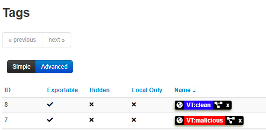
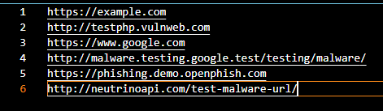

# Script MISP

Este script automatiza el análisis de URLs sospechosas con VirusTotal y meter directamente los resultados en MISP. Esto permite reducir la carga de los analistas de seguridad, mejorar la velocidad de respuesta y garantiza una trazabilidad de los indicadores de compromiso (IoC).

## Requisitos

- Python3
- Cuenta en [VirusTotal](https://www.virustotal.com/) con clave API
- Instancia de [MISP](https://www.misp-project.org/) accesible

## Instalación y configuración

### 1. Configura las variables de entorno

Copia y modifica el archivo template.env y dejalo con el nombre de .env

```bash
cp template.env .env
```

Edita el archivo `.env`:

```env
MISP_URL=https://localhost
MISP_KEY=tu_clave_api_de_misp
MISP_VERIFYCERT=False
VT_API_KEY=tu_clave_api_de_virustotal
URLS_TXT=C:\Users\juan\GRUPO_3\Incidentes Cibersguridad\misp\urls.txt
```

> Para crear la `MISP_KEY` tienes que ir a tu web de misp , vas a admin > Auth keys > Add authentication key

> Si usas un certificado autofirmado, deja `MISP_VERIFYCERT=False`.

## Uso

**Crear dos tags para poder añadirle etiquetas a las url revisadas**



> Se hace en `https://localhost/tags/add`

**Se insertan las urls a analizar en el archivo `urls.txt`**



#### Para windows

El script `windows_start.bat` automatiza todo el proceso:

1. Instala dependencias.
2. Ejecuta el script Python con la URL indicada.

**Ejecuta así:**

```bash
windows_start.bat
```

Asegúrate de que `windows_start.bat` tenga configurada la ruta correcta del proyecto:

```bash
set SCRIPT_DIR=C:\Users\juan\Desktop\Incidentes Cibersguridad\misp
```

#### Para linux

El script `linux_start.sh` automatiza todo el proceso:

1. Crea el entorno virtual (si no existe).
2. Instala dependencias.
3. Ejecuta el script Python con la URL indicada.

**Ejecuta así:**

```bash
bash linux_start.sh
```

Asegúrate de que `linux_start.sh` tenga configurada la ruta correcta del proyecto:

```bash
SCRIPT_DIR="/home/alejandro/Escritorio/misp"
```

## Ejemplo de salida

```
Ejecutando análisis para: https://ejemplo.com
🔍 Analizando la URL con VirusTotal: https://ejemplo.com
✅ Evento creado con ID: 12
⚠️ VirusTotal detecta 2 motores que marcaron esta URL como maliciosa.

📋 Lista de eventos en MISP:
🆔 ID: 12 | 📅 Fecha: 2025-04-22 | 📝 Info: URL Analysis: https://ejemplo.com | 🔢 Atributos: 1
...
```

> Revisar en la web de misp si todo ha funcionado perfectamente