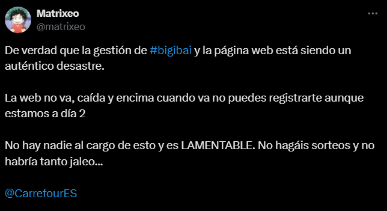
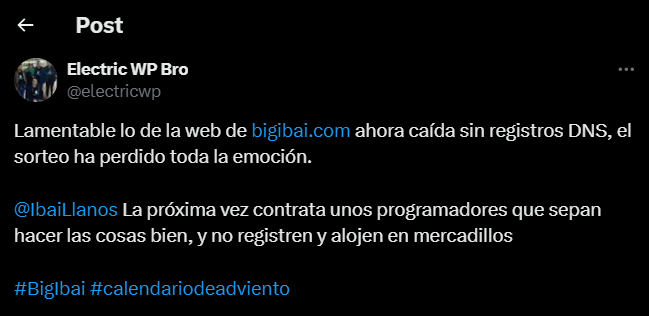

# Análisis de incidente desde la perspectiva de puesta en producción

Hecho por:

- Víctor Jiménez (Punto 2)
- Israel Valderrama (Punto 4)
- Alejandro Seoane (Punto 3)

## Indice

1. [Introducción](#1-introducción)
2. [Análisis previo a la puesta en producción del proyecto](#2-análisis-previo-a-la-puesta-en-producción-del-proyecto)
3. [Análisis del incidente](#3-análisis-del-incidente)
4. [Puesta en marcha del sistema tras el incidente](#4-puesta-en-marcha-del-sistema-tras-el-incidente)

## 1. Introducción

Este trabajo se centra en el proyecto del "Calendario de Adviento" de Ibai Llanos. Analizaremos primero el proceso previo a la puesta en producción, donde se consideraron aspectos clave para garantizar su éxito. Luego, explicaremos el incidente del ataque de bots que afectó la accesibilidad de la web, lo que generó importantes desafíos para los usuarios. Finalmente, examinaremos las acciones implementadas para la recuperación del sistema, incluyendo la creación de una nueva web más segura y la extensión del periodo de registro. A través de este análisis, se busca ofrecer una visión clara sobre la gestión de proyectos digitales y la respuesta a incidentes en el entorno actual.

## 2. Análisis previo a la puesta en producción del proyecto

La puesta en producción de un sitio web basado en WordPress debe considerar estrategias específicas para mitigar riesgos asociados a ataques de denegación de servicio (DoS) y denegación de servicio distribuido (DDoS). Tras analizar el caso, estos son los pasos a seguir para una puesta en producción segura del proyecto:

### 1. Evaluación inicial del entorno

- **Revisión de infraestructura**: Identificar el entorno donde será desplegado (hosting compartido, VPS, servidores dedicados o cloud). Los entornos en la nube como AWS, Azure o Google Cloud ofrecen herramientas específicas para mitigar ataques DDoS.
- **Evaluación de amenazas**: Identificar posibles vectores de ataque (bots, tráfico malicioso, abuso de recursos) y calcular el impacto de un ataque en términos de disponibilidad, reputación y costos.
- **Análisis de dependencia**: Evaluar plugins, temas y configuraciones de WordPress que puedan convertirse en puntos débiles si reciben demasiado tráfico.

### 2. Implementación de medidas de mitigación

#### a) Red e infraestructura

- **Uso de un WAF (Web Application Firewall)**: Configurar un WAF como Cloudflare, Sucuri o el propio AWS Shield para filtrar tráfico malicioso antes de que llegue al servidor.
- **Capas de protección DDoS**: Utilizar servicios anti-DDoS proporcionados por proveedores (p. ej., Cloudflare Advanced DDoS Protection o Akamai).
- **Rate limiting y throttling**: Implementar límites en el número de peticiones permitidas por IP en un periodo de tiempo.
- **Balanceo de carga y redundancia**: Si el tráfico esperado es elevado, emplear un balanceador de carga para distribuir el tráfico entre múltiples servidores

#### b) Servidor

- **Seguridad en el servidor web**:
  - Asegurarse de que el servidor esté configurado para resistir grandes volúmenes de tráfico (ajuste de parámetros como _max_connections_, _timeout_, etc.).
  - Activar módulos como `mod_evasive` en Apache o configuraciones similares en Nginx para bloquear ataques de fuerza bruta HTTP.
- **Monitorización en tiempo real**:
  - Implementar sistemas de monitoreo de tráfico (Zabbix, Nagios o herramientas específicas del proveedor cloud) para detectar picos anormales en tiempo real.
- **Aislamiento de recursos**:
  - Si el WordPress comparte servidor con otras aplicaciones, aislar los recursos para evitar que un ataque afecte todo el entorno.

#### c) Aplicación

- **Endurecimiento de WordPress**:
  - Desactivar XML-RPC si no es absolutamente necesario (ataques vía `xmlrpc.php` son comunes en WordPress).
  - Limitar las solicitudes REST API a direcciones IP confiables.
  - Proteger archivos críticos como `wp-config.php` y deshabilitar el acceso al listado de directorios.
- **Plugins de seguridad**: Instalar y configurar plugins como Wordfence o iThemes Security, que permiten bloquear tráfico sospechoso automáticamente.

## 3. Análisis del incidente

El 1 de diciembre de 2024, la web de [bigibai.com](https://www.bigibai.com/) la cuál era destinada al registro de los participantes del calendario de adviento de Ibai LLanos sufrió un DDoS (ataque de denegación de servicio distribuido) donde millones de bots generaron un volumen masivo de solicitudes web. Este ataque colisionó con el lanzamiento de calendario el cual hizo ventas de aproximadamente 100.000 unidades. 

### Impacto del ataque
Este ataque generó un gran impacto debido a la interrupción de los servicios generó un aumento del plazo de registro debido a que la gente no pudo registrarse en los días planificados. Por lo que hubo retraso en la entrega de los premios que se sorteaban generando así un malestar entre los compradores del producto los cuales tuvieron numerosos problemas para registrarse y tuvieron que esperar a que se solucionasen todos los problemas.

Estas son algunas imágenes en redes sociales del malestar de los compradores: 

Esto obviamente se ha podido solucionar desarrollando una nueva infraestructura para la página y aumentando los plazos de registro pero también ha ocasionado algunos daños como puede ser la imagen del propio Ibai Llanos el cuál tuvo que hacer un video explicativo a través de sus redes sociales pidiendo perdón por los fallos de la página y su actual situación, y que estaban trabajando con su equipo para poder solventarlo lo más rápido posible. 

## 4. Puesta en marcha del sistema tras el incidente

Después del ataque DDoS que afectó la página web del calendario de Adviento de Ibai Llanos, el equipo tuvo que tomar varias medidas para solucionar los problemas y asegurar que los usuarios pudieran participar sin inconvenientes. Estas acciones incluyeron cambios en los plazos, mejoras en la tecnología y mantener a los compradores informados. A continuación, se explican las principales decisiones que tomaron para superar esta situación y volver a la normalidad.

### Extensión del plazo de registro

Debido a los problemas técnicos causados por el ataque DDoS, los administradores decidieron alargar el plazo de registro hasta el 8 de diciembre. Esto causó algo de problemas entre los compradores, que esperaban que el registro comenzara el 1 de diciembre como se había anunciado.

### Retraso en la entrega de premios

Como resultado de la extensión del registro, la entrega de premios se retrasó hasta el 9 de diciembre. Esta decisión se tomó para asegurarse de que todos los compradores tuvieran la oportunidad de participar en los sorteos.

### Desarrollo de una nueva plataforma

Ibai Llanos anunció que su equipo estaba trabajando duro para crear una nueva página web desde cero. Los principales objetivos eran:

- Aumentar la seguridad para evitar ataques DDoS en el futuro.
- Asegurarse de que la página pudiera soportar a todos los usuarios, ya que se vendieron más de 100,000 calendarios.

### Comunicación con los usuarios

Ibai utilizó sus redes sociales, especialmente Instagram, para mantener informados a los compradores sobre lo que estaba pasando. Explicó el problema del ataque y las soluciones que estaban implementando.

### Flexibilidad en los plazos

Si los problemas continuaban, Ibai dejó abierta la posibilidad de retrasar aún más la entrega de premios. Esto se hizo para garantizar que todos los compradores pudieran participar en los sorteos.

### Aumento de la capacidad del sistema

El equipo de Ibai trabajó para mejorar la tecnología detrás de la página y así manejar mejor el alto número de visitantes. Mencionaron que estaban creando una plataforma con "cinco veces más seguridad" para prevenir futuros ataques y asegurar un funcionamiento estable.

