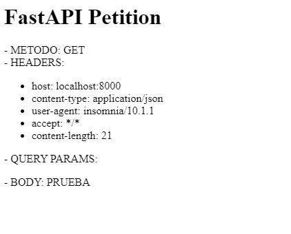
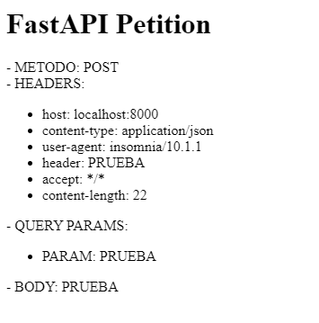
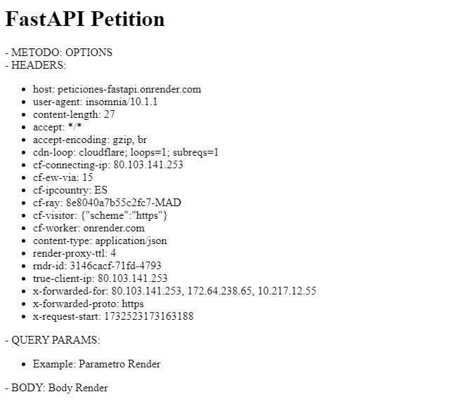
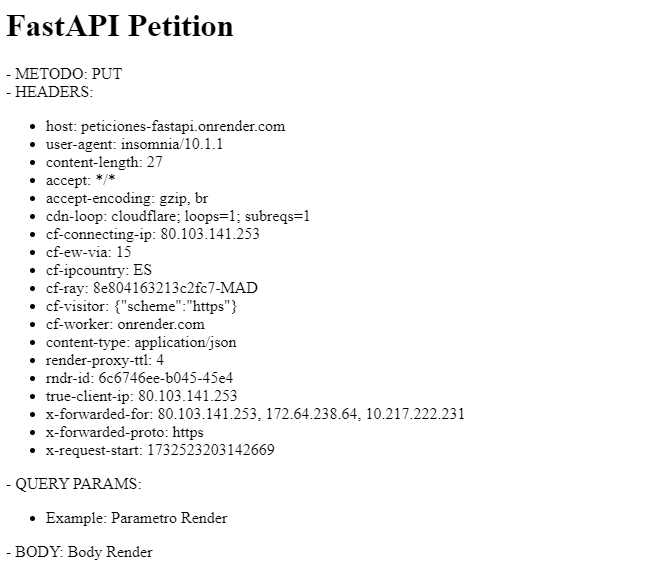
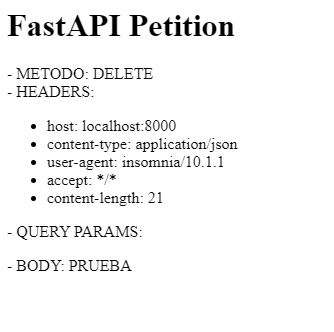

# Análisis del protocolo http

## Requisitos

Para la realización de este proyecto tenemos que tener instalado la versión minima de python 3.7.

Además tenemos que instalar la dependencia de FastAPI para poder crear una api a la que le haremos los diferentes métodos.

Tendremos que configurar una cuenta en [render.com](https://render.com/).

Otro de los requisitos mínimos es tener instalado *Postman* o *Insomnia* para poder hacer las pruebas de la API. En nuestro caso nos hemos decidido por Insomnia.

## Código de la aplicación web

Para la realización de nuestra aplicación web hemos decidido utilizar el lenguaje de programación Python con el framework FastAPI ya que es un framework que facilita el desarrollo de las APIs.

Para la instalación de FastAPI tenemos que seguir los siguientes comandos: 

```bash
pip install "fastapi[all]"
```

```bash
pip install "uvicorn[standard]"
```
Creamos un archivo que se llama [petitionRoutes.py](https://github.com/IES-Rafael-Alberti/GRUPO_3/blob/main/Puesta%20producci%C3%B3n%20segura/Analisis_protocolo_http/peticiones-fastAPI/routers/petitionRoutes.py)
```python
from fastapi import APIRouter, Request
from fastapi.responses import HTMLResponse
from models.Petition import Petition

router = APIRouter()

@router.get("/petition", response_class=HTMLResponse)
@router.post("/petition", response_class=HTMLResponse)
@router.options("/petition", response_class=HTMLResponse)
@router.put("/petition", response_class=HTMLResponse)
@router.patch("/petition", response_class=HTMLResponse)
@router.delete("/petition", response_class=HTMLResponse)
async def handle_petition(request: Request, petition: Petition):
    if request.method in ["POST", "PUT", "PATCH"]:
        if petition is None:
            raise HTTPException(status_code=422, detail="Petition data is required")
        data = petition.dict()
    else:
        data = None

    headers_html = "".join([f"<li>{key}: {value}</li>" for key, value in request.headers.items()])
    query_params_html = "".join([f"<li>{key}: {value}</li>" for key, value in request.query_params.items()])

    return f"""
      <html>
        <head>
            <title>FastAPI Petition</title>
        </head>
        <body>
            <h1>FastAPI Petition</h1>
            <div>
              - METODO: {request.method} <br>
              - HEADERS: <ul>{headers_html}</ul>
              - QUERY PARAMS: <ul>{query_params_html}</ul>
              - BODY: {petition.body}
            </div>
        </body>
      </html>
    """

```

## Pruebas funcionales con insomnia

Para las pruebas a la aplicación web vamos a utilizar la aplicación de Insomnia. Insomnia es una herramienta de software que se utiliza para trabajar con APIs. Permite realizar diferentes tipos de peticiones HTTP y probar el comportamiento de una API de manera rápida, sencilla y organizada. Es ideal para desarrolladores que necesitan interactuar con APIs en sus proyectos.

Insomnia podemos usarla para: 
- Probar APIs: Puedes enviar peticiones como GET, POST..., para verificar que una API funcione correctamente.
- Depuración: Permite analizar las respuestas de las APIs, detectar errores y asegurarse de que el formato de los datos sea el esperado.
- Automatización: Puedes reutilizar configuraciones, autenticarte automáticamente...

### GET
El método **GET** se utiliza para recuperar información de un servidor. Es una operación de solo lectura, lo que significa que no modifica datos en el servidor. Los datos solicitados generalmente se envían como parte de la URL. Por ejemplo ver los detalles de un producto de una página web. 
 

### POST
El método **POST** se utiliza para enviar datos al servidor y generalmente crea nuevos recursos o ejecuta procesos en el servidor. Los datos se envían en el cuerpo de la solicitud. Por ejemplo cunado creamos un usuario en una web.   


### OPTIONS
El método **OPTIONS** se utiliza para que los usuarios descubrar que opciones de comunicación tienen con un servidor. Por ejemplo esta petición la envía un usuario a un servidor para verificar que métodos de HTTP (GET, POST, PUT, DELETE, etc.) están permitidos por el servidor antes de realizar cualquier petición.   


### PUT
El método **PUT** se utiliza para crear o reemplazar un recurso completo en el servidor. Si el elemento existe se sobreescribirá y si no se crea. Por ejemplo cambiar toda la información de tu usuario en una web.  


### PATCH
El método PATCH se utiliza para modificar un recurso que ya exite. Es parecido a PUT pero solo altera el campo que se especifíca. Por ejemplo cambiar especificamente la fecha de nacimiento de un usuario.   


### DELETE
El método DELETE se utiliza para eliminar recursos en el servidor. Por ejemplo borrar una cuenta de usuario.  


