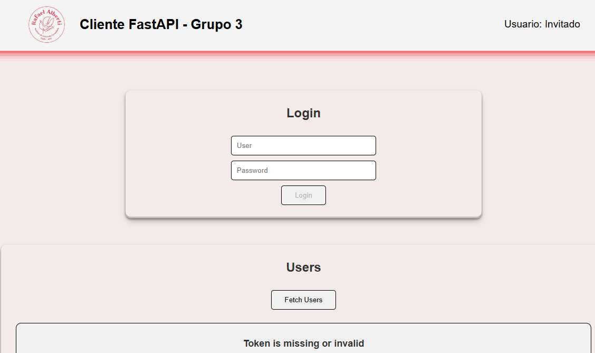
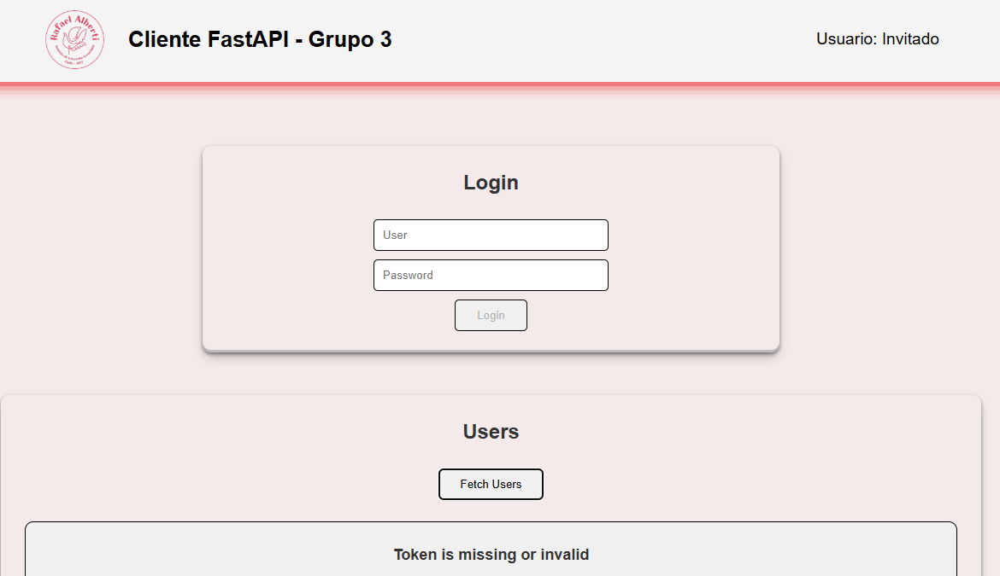
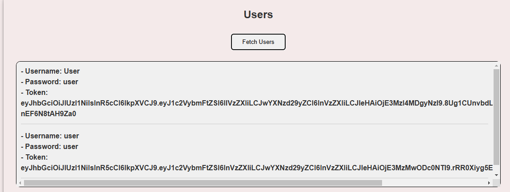

# API web con CORS, seguridad (JWT) y cliente (React o Vue)

Hecho por:

- Víctor Jiménez
- Israel Valderrama
- Alejandro Seoane

## Indice

1. [Asegurar la API(CORS y Token JWT)](#1-asegurar-la-api-cors-y-token-jwt)
2. [Desarrollo del cliente (VUE)](#2--desarrollo-del-cliente-vue)
3. [Definición de conceptos](#3-definición-de-conceptos)
4. [Desarrollo de código](#4-desarrollo-de-código)
5. [Repositorios](#5-repositiorios)
6. [Despliegue](#6-despliegue)
7. [Pruebas](#7-pruebas)
8. [Bibliografía](#8-bibliografía)

## 1. Asegurar la API (CORS y Token JWT)

- JWT:

  Función que crea los tokens a los usuarios con JWT ([utils.py](peticiones-fastAPI\utils\utils.py))

      def create_access_token(data: dict, expires_delta: timedelta = None):
          to_encode = data.copy()
          if expires_delta:
              expire = datetime.utcnow() + expires_delta
          else:
              expire = datetime.utcnow() + timedelta(minutes=60)
          to_encode.update({"exp": expire})
          encoded_jwt = jwt.encode(to_encode, SECRET_KEY, algorithm=ALGORITHM)
          return encoded_jwt

- CORS

  Implementacion CORS ([main.py](peticiones-fastAPI\main.py))

      app.add_middleware(
          CORSMiddleware,
          allow_origins=["https://fastapi-client.netlify.app"],
          allow_credentials=True,
          allow_methods=["*"],
          allow_headers=["*"],
      )

## 2.  Desarrollo del cliente (Vue)

Estructura del cliente:

        |-- src
            |-- assets (CSS e imagenes)
            |-- components
                |-- Header.vue (Componente del header de la página)
                |-- Footer.vue (Componente del footer de la página)
            |-- router
                |-- index.js (Crear rutas de la página)
            |-- stores
                |-- userStore.js (Donde se guarda la info del usuario que tiene la sesion iniciada, lo mas importante el token)
            |-- views
                |-- HomeView.vue (Vista de la página, donde esta el html y toda la logica)
        main.js (js que Vue usa para montar la app)
        App.vue (archivo principal donde de agrupa todo: Header, RouterView (en este caso solo la vista del home) y Footer)


## 3. Definición de conceptos.

- JWT, o JSON Web Token, es un estándar abierto que permite la transmisión segura de información entre dos partes utilizando un objeto JSON. Este método se utiliza principalmente para la autenticación y autorización en aplicaciones web y móviles, ofreciendo una forma compacta y autónoma de representar datos.
Un JWT está compuesto por tres partes esenciales. Primero, el encabezado (Header), que proporciona información sobre el tipo de token y el algoritmo de firma que se emplea. Luego, está la carga útil (Payload), donde se incluyen las afirmaciones (claims) sobre el usuario y otros metadatos relevantes. Por último, se encuentra la firma (Signature), que asegura la integridad del token y verifica que no haya sido modificado.

    El proceso de funcionamiento de JWT comienza cuando un usuario proporciona sus credenciales al servidor. Este último verifica las credenciales y, si son correctas, genera un JWT. A continuación, el servidor envía este token al cliente, quien lo almacena, generalmente en el almacenamiento local o como una cookie.

- CORS: es un mecanismo de seguridad implementado en los navegadores para controlar cómo se permite el acceso a recursos desde un dominio distinto al dominio de origen de una solicitud.
Por defecto, los navegadores bloquean las solicitudes de recursos entre dominios diferentes para proteger a los usuarios de ataques XSS. En el caso de nuestra API, se utiliza para permitir que el cliente web alojado en https://fastapi-client.netlify.app/ pueda interactuar con la API alojada en https://peticiones-fastapi.onrender.com/.

- Vue.js es un framework progresivo de JavaScript de código abierto para construir interfaces de usuario y aplicaciones de una sola página (SPA).Vue se caracteriza por su enfoque en la capa de visualización y su diseño incremental, lo que permite integrarlo fácilmente en proyectos existentes o utilizarlo como base para aplicaciones complejas.

    Una de las características más notables de Vue es su capacidad para realizar renderización declarativa. Esto permite a los desarrolladores procesar datos de manera intuitiva, utilizando una sintaxis de plantilla sencilla que facilita la manipulación del DOM. Además, Vue está estructurado en torno a un sistema de componentes que promueve la creación de elementos reutilizables e independientes, lo que mejora la organización y mantenibilidad del código.

    La arquitectura adaptable de Vue permite escalar desde pequeñas mejoras hasta aplicaciones completas, lo que lo convierte en una herramienta versátil para diferentes tipos de proyectos. Su curva de aprendizaje es suave, lo que lo hace accesible incluso para aquellos que tienen experiencia básica en HTML, CSS y JavaScript.

    El sistema de reactividad de Vue hace que la interfaz se actualice automáticamente cuando los datos cambian, ofreciendo así una experiencia fluida al usuario.

## 4. Desarrollo de Código.

### Para el frontend:

#### [HomeView.vue](https://github.com/vjimcor955/fastAPI-client/blob/main/src/views/HomeView.vue)
```JavaScript
<script>
import { useUserStore } from "../stores/userStore.js";

export default {
  name: "HomeView",
  data() {
    return {
      userStore: useUserStore(),
      user: {
        username: "",
        password: "",
      },
      errors: {
        username: "",
        password: "",
      },
      isLogged: false,
      usersList: [],
    };
  },
  computed: {
    isFormValid() {
      return this.user.username && this.user.password;
    },
  },
  methods: {
    validateUsername() {
      if (!this.user.username) {
        this.errors.username = "Username is required";
      } else {
        this.errors.username = "";
      }
    },
    validatePassword() {
      if (!this.user.password) {
        this.errors.password = "Password is required";
      } else {
        this.errors.password = "";
      }
    },
    async login() {
      this.validateUsername();
      this.validatePassword();
      if (!this.errors.username && !this.errors.password) {
        const response = await fetch(
          "https://peticiones-fastapi.onrender.com/login",
          {
            method: "POST",
            headers: {
              "Content-Type": "application/json",
            },
            body: JSON.stringify(this.user),
          }
        );
        const data = await response.json();
        this.userStore.login(data);
        this.user = {
          username: "",
          password: "",
        };
      }
    },
    async fetchUsers() {
      const response = await fetch(
        "https://peticiones-fastapi.onrender.com/users",
        {
          method: "GET",
          headers: {
            Authorization: `Bearer ${this.userStore.user.token}`,
            "Content-Type": "application/json",
          },
        }
      );
      const data = await response.json();
      if (data.error) {
        alert(data.error);
      }
      this.usersList = data;
    },
  },
};
</script>

<template>
  <div class="home">
    <div class="login">
      <h2 class="title">Login</h2>
      <form class="form" @submit.prevent="login">
        <input
          type="text"
          v-model="user.username"
          placeholder="User"
          @blur="validateUsername"
        />
        <span v-if="errors.username">{{ errors.username }}</span>

        <input
          type="password"
          v-model="user.password"
          placeholder="Password"
          @blur="validatePassword"
        />
        <span v-if="errors.password">{{ errors.password }}</span>

        <button type="submit" :disabled="!isFormValid">Login</button>
      </form>
    </div>

    <div class="users">
      <h2 class="title">Users</h2>
      <button class="button" @click="fetchUsers">Fetch Users</button>
      <div class="content">
        <ul v-if="!usersList.detail">
          <li v-for="user in usersList" :key="user.id">
            - Username: {{ user.username }}
            <br />
            - Password: {{ user.password }}
            <br />
            - Token: {{ user.token }}
            <span class="separator"></span>
          </li>
        </ul>
        <p v-else>{{ usersList.detail }}</p>
      </div>
    </div>
  </div>
</template>

<style lang="scss">
.home {
  min-height: inherit;
  display: flex;
  justify-content: center;
  align-items: center;
  flex-direction: column;
  padding: 75px 0;
  gap: 50px;
  background-color: rgba(240, 46, 46, 0.05);

  .users {
    width: 85%;
    height: 60vh;
    display: flex;
    flex-direction: column;
    align-items: center;
    justify-content: start;
    gap: 25px;
    border-radius: 10px;
    box-shadow: rgba(0, 0, 0, 0.4) 0px 2px 4px,
      rgba(0, 0, 0, 0.3) 0px 7px 13px -3px,
      rgba(0, 0, 0, 0.2) 0px -3px 0px inset;
    padding: 25px 0;

    .title {
      font-size: 1.5rem;
      font-weight: bold;
    }

    .content {
      width: 95%;
      height: 80%;
      overflow-y: auto;
      border: 1px solid #000;
      border-radius: 10px;
      background-color: #f0f0f0;
      overflow-y: auto;

      ul {
        padding: 10px;
        list-style: none;
        display: flex;
        flex-direction: column;
        gap: 5px;

        li {
          width: 100%;
          font-weight: bold;
        }

        .separator {
          display: block;
          height: 1px;
          background: #ccc;
          margin: 10px 0;
        }
      }

      p {
        text-align: center;
        font-size: large;
        font-weight: bold;
        padding: 25px;
      }
    }

    .button {
      padding: 10px 25px;
      border: 1px solid #000;
      border-radius: 5px;
      background-color: #f0f0f0;
      cursor: pointer;
    }
    .button:hover {
      background-color: #e0e0e0;
    }
  }

  .login {
    width: 50%;
    display: flex;
    flex-direction: column;
    align-items: center;
    justify-content: center;
    padding: 25px 0;
    gap: 25px;
    border-radius: 10px;
    box-shadow: rgba(0, 0, 0, 0.4) 0px 2px 4px,
      rgba(0, 0, 0, 0.3) 0px 7px 13px -3px,
      rgba(0, 0, 0, 0.2) 0px -3px 0px inset;

    .title {
      font-size: 1.5rem;
      font-weight: bold;
    }

    .form {
      width: 50%;
      display: flex;
      flex-direction: column;
      align-items: center;
      gap: 10px;

      input {
        width: 75%;
        padding: 10px;
        border: 1px solid #000;
        border-radius: 5px;
      }

      button {
        padding: 10px 25px;
        border: 1px solid #000;
        border-radius: 5px;
        background-color: #f0f0f0;
        cursor: pointer;
      }
      button:hover {
        background-color: #e0e0e0;
      }
    }
  }
}
</style>
``` 

#### [UserStore.js](https://github.com/vjimcor955/fastAPI-client/blob/main/src/stores/userStore.js)

```JavaScript

import { defineStore } from "pinia";

export const useUserStore = defineStore("user", {
  state: () => ({
    user: {
      username: "",
      password: "",
      token: "",
    },
    isLogged: false,
  }),
  actions: {
    login(user) {
      this.user = user;
      this.isLogged = true;
    },
    logout() {
      this.user = {
        username: "",
        password: "",
        token: "",
      };
      this.isLogged = false;
    },
  },
  persist: {
    enabled: true,
    strategies: [
      {
        key: "user",
        storage: localStorage,
      },
    ],
  },
});

export default useUserStore;
```

### Para la parte del backend:

#### [Utils.py](https://github.com/vjimcor955/peticiones-fastAPI/blob/main/utils/utils.py)
```Python
import jwt
from datetime import datetime, timedelta

# Secret key to encode the JWT
SECRET_KEY = "SECRET_KEY"
ALGORITHM = "HS256"

def create_access_token(data: dict, expires_delta: timedelta = None):
    to_encode = data.copy()
    if expires_delta:
        expire = datetime.utcnow() + expires_delta
    else:
        expire = datetime.utcnow() + timedelta(minutes=60)
    to_encode.update({"exp": expire})
    encoded_jwt = jwt.encode(to_encode, SECRET_KEY, algorithm=ALGORITHM)
    return encoded_jwt

```
#### [userRouters.py](https://github.com/vjimcor955/peticiones-fastAPI/blob/main/routers/userRoutes.py)

```Python

from fastapi import APIRouter, HTTPException, Depends
from models.User import User
import json
from typing import List
from fastapi.security import OAuth2PasswordBearer, OAuth2PasswordRequestForm
from utils.utils import create_access_token
from datetime import timedelta
from fastapi.responses import JSONResponse
from fastapi import status


router = APIRouter()
oauth2_scheme = OAuth2PasswordBearer(tokenUrl="token")

# Path to the JSON file storing users
USER_DB_PATH = "users.json"

def load_users():
    try:
        with open(USER_DB_PATH, "r") as file:
            return json.load(file)
    except FileNotFoundError:
        return []

def save_users(users):
    with open(USER_DB_PATH, "w") as file:
        json.dump(users, file, indent=4)

@router.post("/login")
async def login(user: User):
    users = load_users()
    existing_user = next((u for u in users if u["username"] == user.username), None)
    if existing_user:
        return existing_user
    
    user_data = {"username": user.username, "password": user.password}
    user.token = create_access_token(user_data, expires_delta=timedelta(minutes=60))
    new_user = {"username": user.username, "password": user.password, "token": user.token}
    users.append(new_user)
    save_users(users)
    return new_user

@router.get("/users")
async def get_users(token: str = Depends(oauth2_scheme)):
    if not token or token == "undefined":
        raise HTTPException(
            status_code=status.HTTP_401_UNAUTHORIZED,
            detail="Token is missing or invalid"
        )
    
    users = load_users()
    if not users:
        raise HTTPException(
            status_code=status.HTTP_401_UNAUTHORIZED,
            detail="Not authorized"
        )
    return users
```

## 5. Repositiorios

- API: [peticiones-fastAPI](https://github.com/vjimcor955/peticiones-fastAPI)
- Cliente: [fastAPI-client](https://github.com/vjimcor955/fastAPI-client)

## 6. Despliegue

- API: https://peticiones-fastapi.onrender.com/
- Cliente: https://fastapi-client.netlify.app/


## 7. Pruebas
Para hacer las pruebas nos meteremos en el cliente. Podremos ver una interfaz donde nos sale un LOGIN donde acceder con nuestro usuarios y contraseña.  
Abajo sale un botón donde pone "*Fecth Users*". Si pulsamos nos saldrá en el campo de abajo la información de la petición. 

- Si le damos sin estar logueados, es decir, en modo *Invitado* nos dirá el siguiente mensaje: **Token is missing or invalid**. Esto se debe a que no nos hemos logueado por lo que no se ha generado un token. 



- Si nos registramos con el usuario *User*, al darle al botón si que nos saldrá la información: 



## 8. Bibliografía

[JWT token](https://es.wikipedia.org/wiki/JSON_Web_Token)
[Vue](https://aws.amazon.com/es/what-is/cross-origin-resource-sharing/)
[¿Qué es Cors?](https://aws.amazon.com/es/what-is/cross-origin-resource-sharing/)
