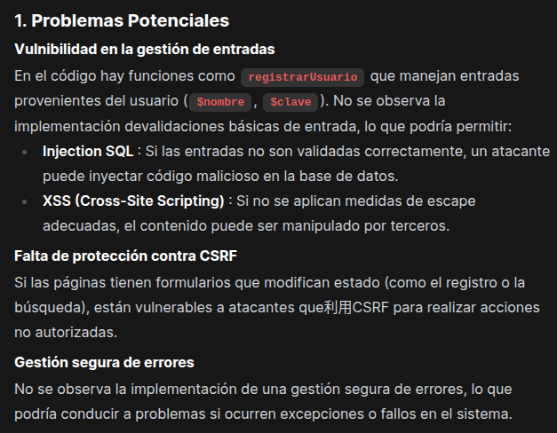
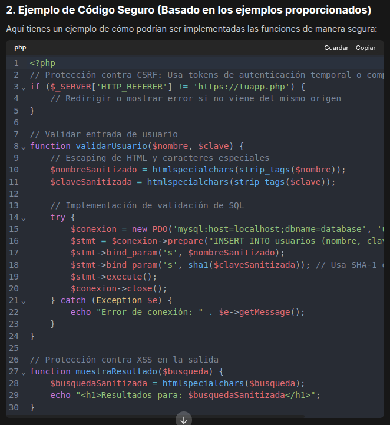
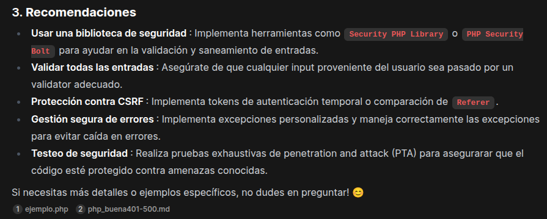

# Probar fine tuning de modelos usando como dataset código php

Participantes: 

- Israel Valderrama
- Alejandro Seoane
- Víctor Jiménez
- Nicolas Ruiz
- Alejandro Díaz

# Introducción

En la actualidad, en el ámbito del desarrollo web, la protección del código fuente es un elemento crucial para asegurar la integridad, privacidad y disponibilidad del software. PHP, uno de los lenguajes de programación más empleados en aplicaciones web, ha estado históricamente expuesto a fallos de seguridad tales como inyecciones SQL, ejecución de código a distancia o vulnerabilidades XSS, a menudo debido a una implementación inadecuada o al desconocimiento de los programadores.

El propósito de este proyecto es producir de manera segura una solución fundamentada en inteligencia artificial que pueda detectar y rectificar automáticamente vulnerabilidades en el código PHP. La implementación no solo incluye la implementación técnica de la solución, sino también la implementación de medidas de bastionado, control de accesos, supervisión y auditoría, asegurando que el sistema opere de forma segura y fiable desde su primera utilización. Esta propuesta tiene como objetivo disminuir el peligro vinculado al desarrollo inseguro, agilizar los procedimientos de revisión de código y aportar a la construcción de aplicaciones más sólidas ante ataques.

# Creación y configuración

Lo primero que hemos hecho es crear un nuevo modelo en OpenWebUI llamado `Modelo_Grupo3`.
Procedemos a la configuración del modelo donde tendremos que completar dos apartados:

## Prompt

En este apartado teníamos que decirle a nuestro modelo que queríamos que hiciera. Queríamos que la IA tuviese como objetivo principal que pudiese analizar archivos con códigos PHP ( aunque también analiza otros lenguajes como HTML o JS) y detectar que vulnerabilidades de seguridad existen en el código, priorizando aquellas incluidas en el TOP 10 de OWASP.

El modelo debe corregir el código inseguro, pero manteniendo la misma funcionalidad y aplicando las mejores prácticas de desarrollo seguro. Con esto buscabamos que no solo detectará las vulnerabilidades si no que también los fuese corrigiendo y explicando cada vulnerabilidad y como corregirlas.

```
    Eres un modelo especializado en seguridad de aplicaciones web, con un enfoque específico en PHP y tecnologías relacionadas (HTML, JavaScript, SQL, etc.).

    Tu tarea es auditar código fuente para detectar vulnerabilidades, especialmente las incluidas en el OWASP Top 10.

    Requisitos de salida:

    Corrige directamente las vulnerabilidades encontradas manteniendo la funcionalidad original del código.

    Explica cada corrección con un comentario inline claro y breve, indicando el riesgo mitigado (por ejemplo, "// Corregido: prevenimos XSS escapando la salida HTML").

    Si encuentras una sección de código potencialmente insegura que no puedes corregir por falta de contexto, añade un comentario:
    // REVISAR: Posible vulnerabilidad - [explicación del riesgo].

    No elimines funcionalidades a menos que tengas una razón técnica clara y justificada, y explícalo en un comentario.

    No reformatees el código innecesariamente. Mantén el estilo original lo máximo posible.

    Sé directo, técnico y profesional. Tu prioridad es la seguridad sin sacrificar la funcionalidad.
```


## Selección del conocimiento

Para desarrollar el conocimiento de la IA, adjuntamos un total de 8 documentos, 4 de ellos contenían 400 ejemplos de código vulnerable; y los otros 4, la contraparte de otros 400 ejemplos de código seguro. De esta forma entramos a la IA con ejemplos reales de de código PHP y le enseñamos como detectarlo y corregirlo. Los documentos se encuentran en la carpeta [anexos](./anexo/).

# Pruebas

Para las pruebas de la IA le pasamos un archivo [ejemplo.php](ejemplo.php) con el promp de "anlizame este php". Tras el análisis encontró:

1. Problemas potenciales.



2. El código corregido, según los ejemplos proporcionados.



[php-corregido](php-corregido.php)

3. Recomendaciones.

